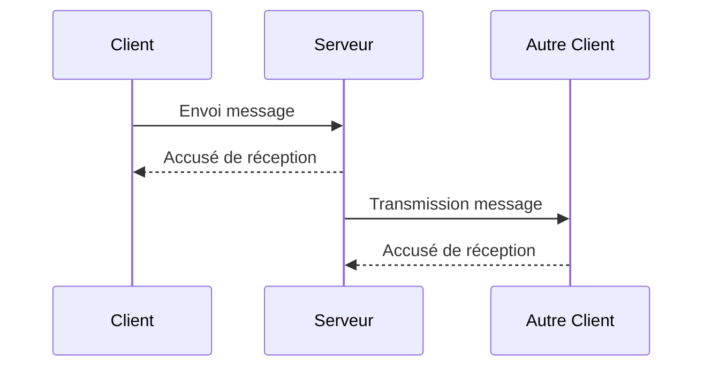
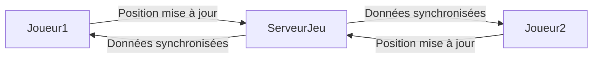

# Introduction aux applications temps réel et technologies fondamentales

## Théorie : Qu'est-ce qu'une application temps réel ?

### Définitions

Une application temps réel est un système logiciel qui permet la transmission et la réception de données immédiatement après leur production, avec un délai minimal perceptible par l'utilisateur. Contrairement aux applications classiques où la latence (délai entre l'action et la réaction) peut être plus longue, les applications temps réel se caractérisent par des interactions quasi-instantanées, nécessaires pour assurer une réponse rapide et souvent critique.

Ces applications sont conçues pour maintenir une communication bidirectionnelle continue entre le serveur et le client, souvent via des protocoles spécialisés comme WebSocket qui évitent le surcoût des requêtes HTTP classiques, en maintenant une connexion persistante.

### Cas d'usage

Les applications temps réel sont présentes dans de nombreux domaines, notamment :

1. **Chat en ligne** : Par exemple, les messageries instantanées comme WhatsApp, Messenger ou Slack utilisent le temps réel pour assurer que les messages s’affichent immédiatement à l’arrivée, et les notifications push informent l’utilisateur sans délai notable.

2. **Jeux en ligne** : Les jeux multi-joueurs comme Fortnite ou League of Legends exigent une synchronisation parfaite entre les actions des joueurs à travers le réseau. Le moindre retard peut entraîner des désavantages compétitifs ou rendre le jeu désagréable.

3. **Collaborations en temps réel** : Les outils comme Google Docs ou Microsoft Teams permettent à plusieurs utilisateurs d’éditer simultanément un document, de discuter et de visualiser les modifications en direct, rendant la collaboration plus fluide et efficace.

4. **Trading boursier** : Les plateformes financières utilisent le temps réel pour transmettre immédiatement les mouvements du marché et permettre les décisions d’achat ou de vente en fonction des données les plus récentes. Dans ce contexte, chaque milliseconde compte, car les retards peuvent entraîner des pertes financières.

### Illustrations avec des exemples concrets

Pour donner un aperçu pratique, prenons l'exemple simplifié d'une application de chat temps réel.

Ce diagramme montre comment un message envoyé par un client est immédiatement reçu par le serveur, qui le retransmet sans délai significatif à l'autre participant, assurant ainsi une conversation fluide.

Un autre exemple peut être celui des jeux temps réel, où les positions des joueurs doivent être constamment synchronisées.

### Technologies clés utilisées

- **WebSocket** : Protocole permettant d'établir une communication bidirectionnelle et persistante, idéale pour les applications temps réel.
- **Event Streaming (ex: Apache Kafka)** : Gestion des flux de données en temps réel à grande échelle.
- **Protocoles temps réel spécialisés** (RTC pour communication vidéo, MQTT pour IoT, etc.)

### Synthèse

Les applications temps réel sont indispensables dans de nombreux secteurs, car elles permettent une interaction fluide, instantanée et synchronisée entre les acteurs du système. Leurs usages vont du simple chat à la collaboration professionnelle, jusqu’aux systèmes critiques de trading où la performance temporelle est cruciale.

---

### Sources

- [WebSocket et Au-delà: L'Évolution du Web en Temps Réel - W3r.one](https://w3r.one/fr/blog/web/technologies-standards-emergents/real-time-web-protocoles-emergents/websocket-et-au-dela-evolution-web-temps-reel)
- [API Gateway WebSocket APIs - AWS Documentation](https://docs.aws.amazon.com/fr_fr/apigateway/latest/developerguide/apigateway-websocket-api.html)
- [Protocole WebSocket : une analyse approfondie de son fonctionnement - AppMaster](https://appmaster.io/fr/blog/protocole-websocket-comment-ca-marche)