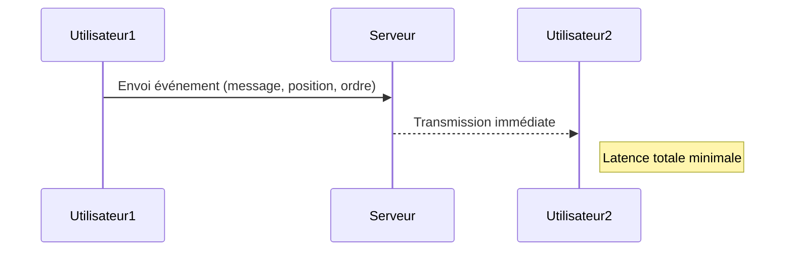
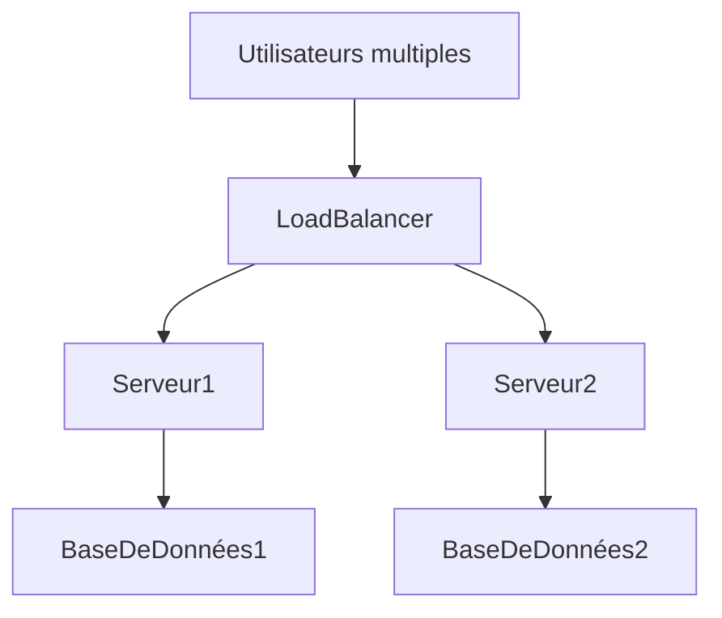

# Les défis du temps réel : latence, persistance, scalabilité

## Introduction

Les applications temps réel imposent des contraintes spécifiques liées à la nature même des interactions qu’elles gèrent. Trois principaux défis se détachent clairement : la latence, la persistance des données et la scalabilité. Ces enjeux déterminent la qualité de l’expérience utilisateur et la stabilité du système face à des charges variables.

## 1. La latence : minimiser le délai de transmission

La latence désigne le temps écoulé entre l’émission d’un événement (ex. : envoi d’un message) et sa réception par le destinataire. Dans les applications temps réel, la latence doit être la plus faible possible, souvent inférieure à quelques millisecondes.

**Enjeux :**  
- Dans les jeux en ligne compétitifs, une latence élevée provoque un décalage gênant entre l’action du joueur et la réaction du jeu (phénomène de “lag”), impactant négativement l’expérience.
- En trading algorithmique, une latence trop importante peut signifier une perte d’opportunités financières.

**Exemple :**



**Techniques pour réduire la latence :**  
- Utilisation de protocoles comme WebSocket pour établir des connexions persistantes évitant le temps de la négociation HTTP.
- Hébergement des serveurs au plus proche géographiquement des utilisateurs (Edge Computing).
- Utilisation de CDN et optimisation du routage des paquets.

---

## 2. La persistance : garantir la fiabilité des données

La persistance concerne la capacité à stocker et retrouver les données échangées pour assurer leur fiabilité et la continuité des échanges.

**Enjeux :**  
- Messages dans les chats doivent être conservés et accessibles ultérieurement.
- États du jeu ou des documents collaboratifs doivent être sauvegardés pour reprise en cas de déconnexion.
- En trading, un historique fiable doit être accessible pour analyse.

**Exemple :**

```mermaid
graph LR
    Client --> Serveur : Envoi données
    Serveur --> BaseDeDonnées : Sauvegarde persistante
    BaseDeDonnées --> Serveur : Confirmation sauvegarde
    Serveur --> Client : Accusé réception fiable
```

**Solutions courantes :**  
- Bases de données NoSQL en temps réel (ex: Firebase Realtime Database, MongoDB avec change streams).
- Systèmes de journalisation et files d'attente garantissant l’ordre des messages.
- Mécanismes de reprise automatique en cas de coupure réseau.

---

## 3. La scalabilité : gérer la montée en charge

La scalabilité est la capacité d’un système temps réel à supporter l’augmentation du nombre d’utilisateurs ou d’événements sans dégrader la qualité du service.

**Enjeux :**  
- Une application de chat doit pouvoir accueillir des milliers, voire millions d’utilisateurs simultanés.
- Les plateformes de streaming ou de collaboration doivent maintenir des échanges rapides même sous forte sollicitation.

**Approches pour assurer la scalabilité :**  
- Architecture microservices permettant l’ajout dynamique de serveurs.
- Partitionnement des données (sharding) pour répartir la charge.
- Utilisation de brokers de messages distribués (ex: Apache Kafka) pour équilibrer les flux.

**Exemple :**



---

## Conclusion

Les applications temps réel exigent une gestion précise et rigoureuse de la latence, de la persistance des données et de la scalabilité pour fonctionner efficacement. Comprendre et maîtriser ces défis conditionne le succès des systèmes et l’expérience utilisateur.

---

## Sources

- Mozilla Developer Network, [Real-time communication between browsers](https://developer.mozilla.org/en-US/docs/Web/API/WebSockets_API)
- AWS Documentation, [Scaling Real-time Web Applications](https://aws.amazon.com/blogs/architecture/scaling-real-time-web-applications/)
- Google Cloud, [Designing scalable real-time data solutions](https://cloud.google.com/solutions/scalable-real-time-data-processing)
- Heartbeat, [Reducing Latency in Real-time Applications](https://heartbeat.fritz.ai/how-to-reduce-latency-in-your-real-time-web-application-7e0e50a2c21b)