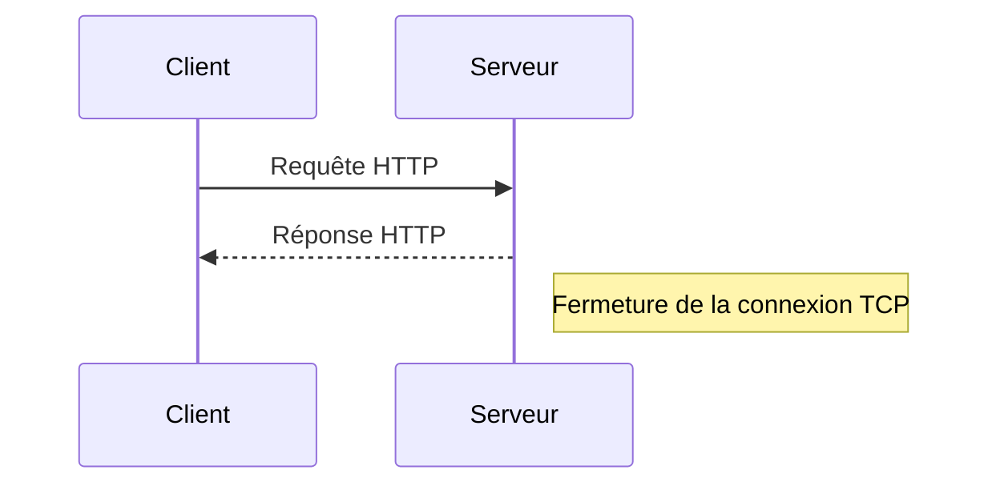
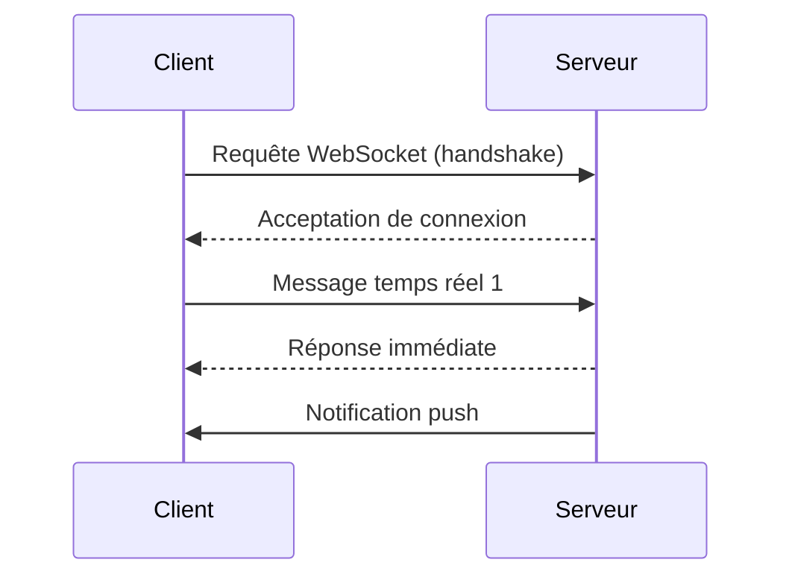

# Évolution des communications web : HTTP traditionnel vs connexions persistantes

## Introduction

La communication sur le web a profondément évolué pour répondre aux besoins croissants d’interaction temps réel, de rapidité et d’efficacité des échanges entre clients et serveurs. Cette évolution se cristallise principalement dans la transition entre les protocoles basés sur HTTP traditionnel et les technologies de connexions persistantes, qui permettent d’améliorer sensiblement la performance et l’expérience utilisateur.

## 1. Le HTTP traditionnel : modèle requête-réponse stateless

Le protocole HTTP (HyperText Transfer Protocol), dans ses premières versions (HTTP/1.0, HTTP/1.1), fonctionne sur un modèle **stateless** et en mode **requête-réponse** :

- Le client envoie une requête au serveur (exemple : demander une page web).
- Le serveur traite la requête, envoie la réponse puis ferme la connexion.
- Pour chaque interaction, une nouvelle connexion TCP est ouverte, ce qui génère un certain coût en termes de temps et de ressources.

**Conséquences** :  
- Latence additionnelle liée à l’ouverture et la fermeture répétées des connexions TCP.
- Inefficacité pour les applications temps réel nécessitant des échanges fréquents et rapides (exemple : chat, jeux, notifications).

### Exemple simplifié de communication HTTP traditionnel

## 2. Les connexions persistantes : WebSocket et HTTP/2

Pour dépasser les limitations du HTTP traditionnel, plusieurs technologies ont été développées permettant d’établir des **connexions persistantes**.

### WebSocket : communication full-duplex en temps réel

Le protocole WebSocket, normalisé en 2011 (RFC 6455), permet d’établir une connexion TCP persistante et bidirectionnelle entre client et serveur. Une fois la connexion initiale établie via une requête HTTP spéciale, elle reste ouverte, permettant aux deux parties d’envoyer des messages à tout moment sans avoir à réouvrir une nouvelle connexion.

#### Schéma simplifié d’une communication WebSocket

### HTTP/2 : multiplexage et connexions durables

HTTP/2 améliore HTTP/1.1 en autorisant le **multiplexage**, c’est-à-dire la possibilité d’envoyer plusieurs requêtes/réponses sur une même connexion TCP sans attente séquentielle. Cette technologie réduit la latence et améliore le débit des échanges.

---

## 3. Comparaison rapide

| Critère            | HTTP traditionnel            | Connexions persistantes (WebSocket / HTTP/2)                  |
|--------------------|-----------------------------|---------------------------------------------------------------|
| Gestion connexion   | Connexion TCP courte durée  | Connexion TCP longue durée                                    |
| Latence            | Relativement élevée          | Très faible                                                   |
| Sens des messages  | Requête => réponse unidirectionnelle | Full duplex (WebSocket) ou multiplexé (HTTP/2)           |
| Utilisation        | Transfert de contenu statique | Applications temps réel (chat, jeu, trading, notifications) |

---

## 4. Impact sur les applications temps réel

Les connexions persistantes constituent la base technique pour développer des applications performantes en temps réel. Par exemple :

- Dans une messagerie instantanée, WebSocket permet d’envoyer et recevoir des messages sans délai, contrairement à des requêtes HTTP classiques qui multiplient le temps de chargement.
- Dans le trading en ligne, HTTP/2 réduit les délais entre les requêtes et les réponses, permettant de refléter plus vite les fluctuations du marché.

---

## Conclusion

L’évolution des communications web depuis le HTTP traditionnel vers des connexions persistantes comme WebSocket ou HTTP/2 répond aux exigences croissantes de réactivité et d’interactivité. Ce changement fondamental apporte à la fois une réduction drastique de la latence et une meilleure gestion des échanges, conditions sine qua non du temps réel sur le web.

---

## Sources

- RFC 6455 – The WebSocket Protocol : https://datatracker.ietf.org/doc/html/rfc6455  
- Mozilla Developer Network (MDN) Web Docs – WebSocket API : https://developer.mozilla.org/en-US/docs/Web/API/WebSockets_API  
- Google Developers – Introduction to HTTP/2 : https://developers.google.com/web/fundamentals/performance/http2  
- Cloudflare Blog – What is HTTP/2? : https://blog.cloudflare.com/what-is-http-2/