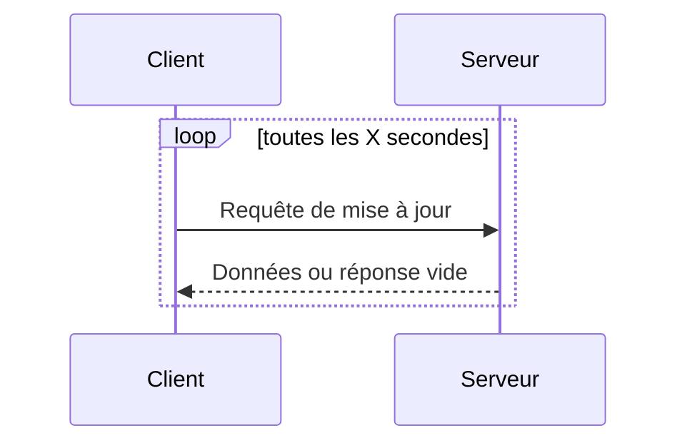
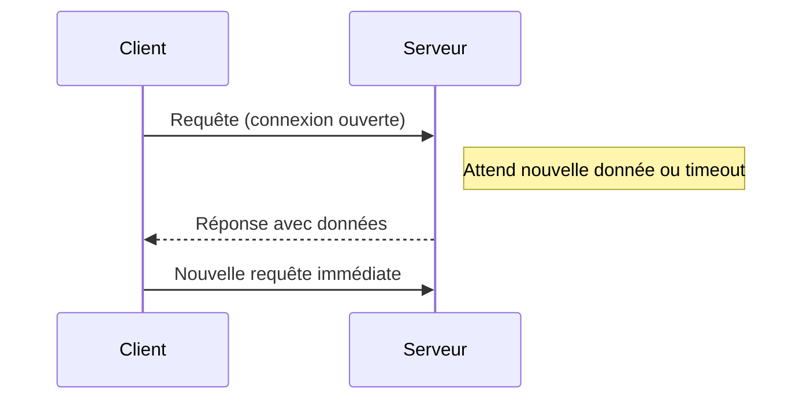

# Polling et Long Polling : principes, avantages et inconvénients

## Introduction

Dans le contexte des applications web temps réel, la mise à jour dynamique des données entre le client et le serveur est fondamentale. Avant l’avènement des technologies plus modernes comme WebSocket, deux paradigmes classiques étaient largement utilisés : le **polling** et le **long polling**. Ces méthodes permettent au client de récupérer des informations actualisées, chacune avec ses caractéristiques spécifiques.

---

## 1. Polling : requêtes périodiques simples

### Principe

Le polling consiste à envoyer des requêtes répétées à intervalle régulier par le client vers le serveur pour demander s’il y a de nouvelles données.

- Le client envoie périodiquement une requête HTTP.
- Le serveur répond immédiatement, avec des données s’il y en a, ou un message vide sinon.
- Le client attend un nouvel intervalle avant d’envoyer une autre requête.

### Illustration

### Avantages

- Simplicité d’implémentation, compatible avec tous les navigateurs.
- Fonctionne sans connexion persistante, sans besoin de protocoles spécifiques.

### Inconvénients

- Charge réseau élevée, surtout lorsque les requêtes sont fréquentes, provoquant une consommation inutile de bande passante et des ressources serveur.
- Latence élevée : entre deux requêtes il peut y avoir un délai important pour recevoir une mise à jour.

---

## 2. Long Polling : attente prolongée de réponse

### Principe

Le long polling est une amélioration du polling, permettant de maintenir la connexion ouverte en attendant l’arrivée de données. Le serveur retarde la réponse jusqu’à ce qu’une donnée soit disponible ou qu’un timeout soit atteint.

- Le client envoie une requête.
- Le serveur conserve la connexion ouverte, ne répondant que lorsqu’il a des données à envoyer ou à l’expiration d’un délai.
- Dès la réponse reçue, le client envoie immédiatement une nouvelle requête pour rétablir la connexion.

### Illustration

### Avantages

- Réduction de la latence : le serveur pousse les données dès qu’elles sont disponibles.
- Moins de requêtes inutiles que le polling classique, ce qui économise les ressources.

### Inconvénients

- Toujours basé sur HTTP ; la connexion est relancée après chaque réponse, ce qui induit une certaine surcharge.
- Plus complexe à gérer côté serveur.
- Limites en nombre de connexions concurrentes selon les serveurs ou navigateurs.

---

## 3. Comparaison des deux paradigmes

| Critères        | Polling                       | Long Polling                     |
|-----------------|------------------------------|---------------------------------|
| Latence         | Variable, souvent élevée      | Faible, quasi-instantanée       |
| Charge réseau   | Élevée (requêtes fréquentes) | Modérée, connexion persistante temporaire |
| Complexité      | Faible                       | Moyenne (gestion connexions ouvertes) |
| Compatibilité   | Totale                      | Totale (HTTP standard)            |

---

## 4. Cas d’usage et perspectives

- Le polling reste adapté aux scénarios où les mises à jour sont peu fréquentes ou la simplicité première.
- Le long polling est un compromis avant l’utilisation des connexions persistantes modernes (WebSocket), notamment dans les chats ou notifications push.
- Aujourd’hui, le long polling est encore utilisé dans des environnements contraints ou pour assurer la compatibilité descendante.

---

## Sources

- MDN Web Docs, [HTTP polling and long polling](https://developer.mozilla.org/en-US/docs/Web/HTTP/Long_Polling)  
- Webopedia, [What's the Difference Between Polling and Long Polling?](https://www.webopedia.com/insights/polling-vs-long-polling/)  
- Cloudflare, [Real-time Data with Long Polling](https://blog.cloudflare.com/real-time-data-with-long-polling/)  

---

Cet éclairage sur le polling et le long polling met en lumière leur fonctionnement, leurs points forts et leurs limites, facilitant ainsi le choix adapté selon les besoins d’une application temps réel.