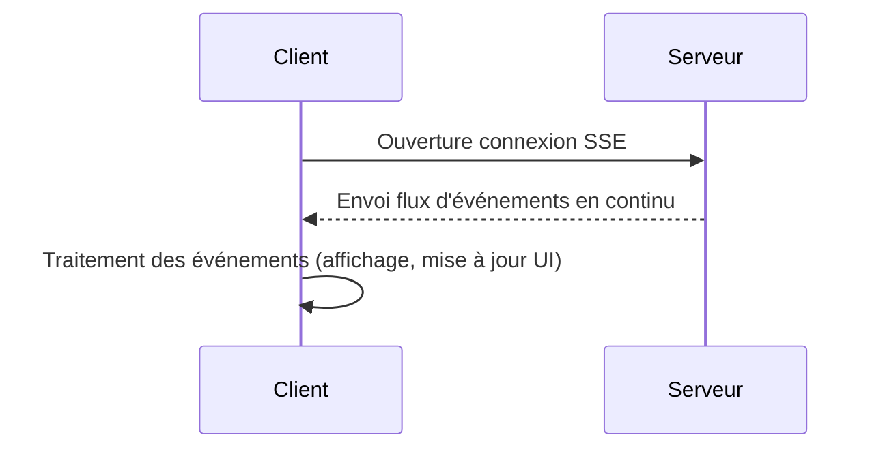

# Server-Sent Events (SSE) : communication unidirectionnelle du serveur au client

## Introduction

Server-Sent Events (SSE) est une technologie web permettant au serveur d’envoyer des mises à jour en temps réel de manière unidirectionnelle vers le client via une connexion HTTP persistante. SSE s’inscrit comme une solution simple et efficace pour délivrer des flux de données en continu sans que le client ait à interroger régulièrement le serveur.

---

## 1. Principe des Server-Sent Events

SSE utilise une connexion HTTP classique qui reste ouverte indéfiniment, permettant au serveur d’émettre des événements textuels dans un format simple, encodé dans le flux de réponse. Le client, généralement un navigateur web, écoute ces messages grâce à l’interface JavaScript **EventSource**.

**Fonctionnement simplifié :**

- Le client ouvre une connexion HTTP via `new EventSource(url)`.
- Le serveur garde cette connexion ouverte et envoie des données sous forme d’événements au fur et à mesure.
- Le client traite les messages en temps réel, sans renvoyer de requêtes supplémentaires.

---

## 2. Exemple de flux SSE

### Exemple serveur (en pseudo-code HTTP)

```
HTTP/1.1 200 OK
Content-Type: text/event-stream
Cache-Control: no-cache
Connection: keep-alive

data: {"message": "Hello at " + currentTime()}

data: {"message": "Update received at " + currentTime()}
```

Chaque message envoyé par le serveur est précédé de `data: `, suivi d’une nouvelle ligne, et séparé par une ligne vide.

### Exemple client en JavaScript

```javascript
const evtSource = new EventSource("https://exemple.com/sse-endpoint");

evtSource.onmessage = function(event) {
    console.log("Nouveau message:", event.data);
};

evtSource.onerror = function(err) {
    console.error("Erreur SSE:", err);
};
```

---

## 3. Avantages et limites

### Avantages

- **Simplicité d’implémentation** : SSE utilise HTTP/1.x, accessible via API native browser sans besoin de bibliothèques externes.
- **Connexion unidirectionnelle optimisée** : serveur vers client uniquement, idéale pour les flux de notifications, actualités, mises à jour en direct.
- **Reconnexion automatique** : la gestion automatique des déconnexions est intégrée dans `EventSource`.
- **Faible coût en ressources par rapport au polling** : la connexion persistante évite les requêtes répétées.

### Limites

- **Unidirectionnel** : aucune possibilité d’envoyer des données du client vers le serveur via SSE. Pour cela, il faut un mécanisme séparé (exemple : requêtes AJAX).
- **Support limité sur certains environnements** : bien supporté dans la plupart des navigateurs modernes, mais absent ou limité dans certains navigateurs anciens ou spécifiques (ex : absence native dans Internet Explorer).
- **Pas adapté aux applications nécessitant une communication bidirectionnelle, comme les jeux en ligne**.

---

## 4. Cas d’usage typiques

- **Notifications en temps réel** : mises à jour d’état, alertes systèmes.
- **Flux d’informations** : actualités, résultats sportifs, données boursières.
- **Dashboards temps réel** : affichage de métriques ou données de monitoring.

### Diagramme simplifié du flux SSE



---

## Sources

- MDN Web Docs, [Server-Sent Events](https://developer.mozilla.org/en-US/docs/Web/API/Server-sent_events)
- HTML Living Standard, [Server-sent events](https://html.spec.whatwg.org/multipage/server-sent-events.html)
- Web.dev, [Introduction to Server-Sent Events](https://web.dev/serve-sent-events/)
- IBM Developer, [Use Server-Sent Events for real-time messaging](https://developer.ibm.com/articles/server-sent-events/)

---

Server-Sent Events représentent une technique efficace pour la diffusion de données en temps réel dans un sens unique du serveur vers le client, optimisant les ressources réseau tout en restant simple à mettre en œuvre.