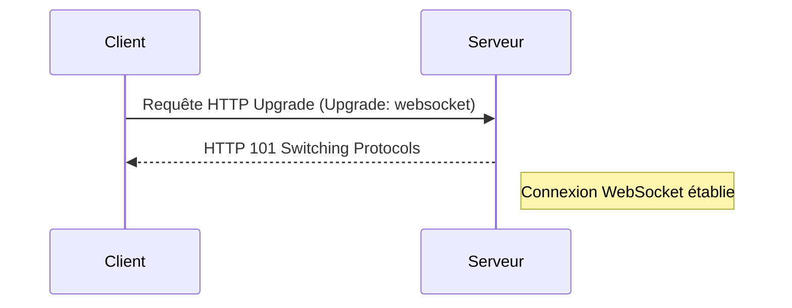
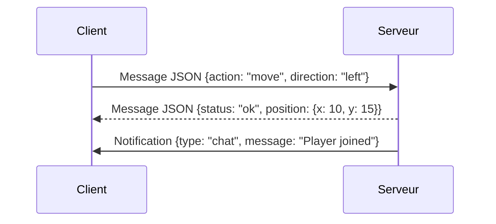

# WebSockets : communication bidirectionnelle full-duplex, handshake, avantages clés

## Introduction

WebSocket est un protocole de communication permettant une interaction **bidirectionnelle en temps réel** entre un client (souvent un navigateur web) et un serveur via une connexion unique, persistante et full-duplex. Contrairement aux méthodes traditionnelles basées sur HTTP, WebSocket établit un canal de communication efficace, supprimant les allers-retours répétés au serveur.

---

## 1. Fonctionnement et handshake WebSocket

Pour initier une communication WebSocket, un mécanisme de "handshake" est réalisé sur une connexion HTTP standard :

- Le client envoie une requête HTTP spéciale avec l’en-tête `Upgrade: websocket`, demandant au serveur de basculer du protocole HTTP vers WebSocket.
- Le serveur, s’il accepte, répond avec un code 101 Switching Protocols, confirmant la montée de la connexion en WebSocket.
- La connexion TCP reste alors ouverte, permettant un échange simultané de données dans les deux sens, indépendamment du modèle requête-réponse classique.

### Diagramme du handshake WebSocket



---

## 2. Communication full-duplex avec WebSocket

Une fois la connexion établie :

- Le client et le serveur peuvent envoyer des messages à tout moment, indépendamment l’un de l’autre.
- La communication est asynchrone et en temps réel, sans attendre de requête préalable.
- Elle permet l’échange de messages textuels ou binaires.

### Exemple simple d’échange de messages



---

## 3. Avantages clés des WebSockets

| Avantage                      | Description |
|-------------------------------|-------------|
| **Latence réduite**           | Pas de multiples requêtes HTTP, la connexion reste ouverte pour un échange direct immédiat. |
| **Communication bidirectionnelle** | Le client et serveur communiquent sans contrainte d’origine du message. |
| **Réduction de la surcharge réseau** | Élimination de l’en-tête HTTP répétitif pour chaque message après handshake. |
| **Adapté aux applications temps réel** | Chat, jeux en ligne, trading, visualisation collaborative, etc. |
| **Support natif des navigateurs modernes** | API simple (`WebSocket` en JavaScript) intégrée aux navigateurs. |

---

## 4. Cas d’usage typiques

- **Jeux multijoueurs en ligne** : synchronisation instantanée des états des joueurs.
- **Applications de messagerie instantanée** : échanges rapides et simultanés.
- **Tableaux de bord temps réel** : mise à jour des données affichées en continu.
- **Trading haute fréquence** : transmission rapide des ordres et des données de marché.

---

## 5. Code d’exemple simple en JavaScript

```javascript
const socket = new WebSocket("wss://example.com/socket");

// Connexion ouverte
socket.addEventListener('open', function (event) {
    socket.send(JSON.stringify({ type: "greet", payload: "Hello Server!" }));
});

// Écoute des messages du serveur
socket.addEventListener('message', function (event) {
    console.log('Message du serveur:', event.data);
});

// Gestion des erreurs
socket.addEventListener('error', function (event) {
    console.error('Erreur WebSocket:', event);
});
```

---

## Sources

- IETF RFC 6455 - The WebSocket Protocol : https://datatracker.ietf.org/doc/html/rfc6455  
- MDN Web Docs - WebSocket API : https://developer.mozilla.org/en-US/docs/Web/API/WebSocket  
- WebSocket.org - Introduction and Tutorials : https://www.websocket.org/  
- Cloudflare Learning Center - What are WebSockets? : https://www.cloudflare.com/learning/ddos/glossary/websocket/  

---

WebSocket offre une solution robuste et efficace pour les besoins de communication temps réel, combinant faible latence, bidirectionnalité et simplicité d’implémentation, ce qui en fait une pierre angulaire des applications interactives modernes.