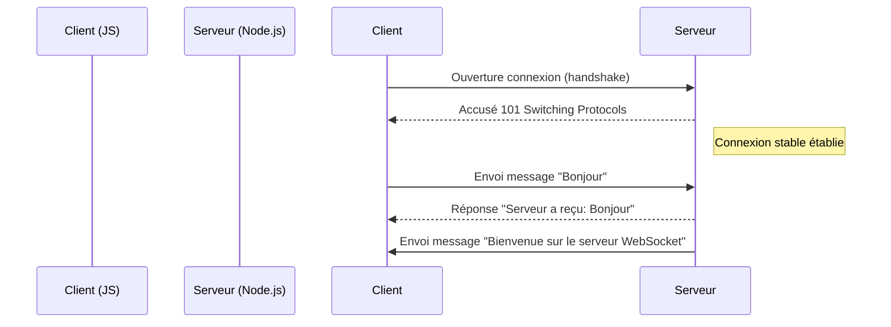

# Utilisation des API WebSocket côté client (JavaScript) et côté serveur (Node.js avec `ws`)

## Introduction

Le protocole WebSocket permet une communication bidirectionnelle et persistante entre un client et un serveur. L'accès à WebSocket se fait via des API standardisées, que ce soit côté client dans un navigateur JavaScript, ou côté serveur avec des bibliothèques comme `ws` pour Node.js.

---

## 1. API WebSocket côté client (JavaScript)

### Création et gestion d’une connexion WebSocket

En JavaScript, l’interface native `WebSocket` est utilisée pour ouvrir, gérer et fermer une connexion.

```javascript
// Initialisation
const socket = new WebSocket('wss://example.com/socket');

// Événement connexion établie
socket.addEventListener('open', (event) => {
    console.log("Connexion WebSocket établie");
    socket.send('Bonjour serveur !');
});

// Réception d’un message serveur
socket.addEventListener('message', (event) => {
    console.log("Message reçu :", event.data);
});

// Gestion des erreurs
socket.addEventListener('error', (event) => {
    console.error("Erreur WebSocket :", event);
});

// Fermeture de la connexion
socket.addEventListener('close', (event) => {
    console.log("Connexion WebSocket fermée");
});
```

### Points clés

- Connexion instanciée avec une URL commençant par `ws://` (non sécurisé) ou `wss://` (chiffré).
- Les événements standards sont `open`, `message`, `error` et `close`.
- `send()` permet d’envoyer des données (chaîne de caractères ou `Blob`).

---

## 2. API WebSocket côté serveur avec Node.js et la bibliothèque `ws`

### Installation

```bash
npm install ws
```

### Exemple minimal de serveur WebSocket

```javascript
const WebSocket = require('ws');

const wss = new WebSocket.Server({ port: 8080 });

wss.on('connection', (ws) => {
    console.log('Client connecté');

    // Réception d’un message
    ws.on('message', (message) => {
        console.log('Message reçu:', message);

        // Echo : renvoyer le même message au client
        ws.send(`Serveur a reçu: ${message}`);
    });

    ws.on('close', () => {
        console.log('Client déconnecté');
    });

    // Envoi d’un message dès la connexion
    ws.send('Bienvenue sur le serveur WebSocket');
});
```

### Fonctionnement

- `WebSocket.Server` crée un serveur WebSocket écoutant sur un port donné.
- L’événement `'connection'` est déclenché à chaque nouvelle connexion avec un objet `ws` représentant le client.
- Les événements `'message'` et `'close'` sont gérés côté serveur pour interagir avec le client.

---

## 3. Schéma simplifié d’échange WebSocket



---

## 4. Bonnes pratiques

- **Gérer la reconnexion automatique** côté client en cas de coupure.
- **Valider et filtrer les messages** côté serveur pour éviter les injections ou erreurs.
- **Utiliser des canaux thématiques ou rooms** (via Socket.IO ou gestion personnalisée) pour multicaster.
- **Protéger les connexions** avec TLS (`wss://`) en production.

---

## Sources

- MDN Web Docs, [WebSocket API](https://developer.mozilla.org/fr/docs/Web/API/WebSocket)  
- Documentation officielle de `ws` : https://github.com/websockets/ws  
- Node.js official docs : https://nodejs.org/en/docs/  
- WebSocket.org, [WebSocket introduction](https://www.websocket.org/)  

---

Ce double éclairage client-serveur avec les API WebSocket démontre comment établir une communication bidirectionnelle performante, en maîtrisant les événements et le cycle de vie d’une connexion WebSocket.