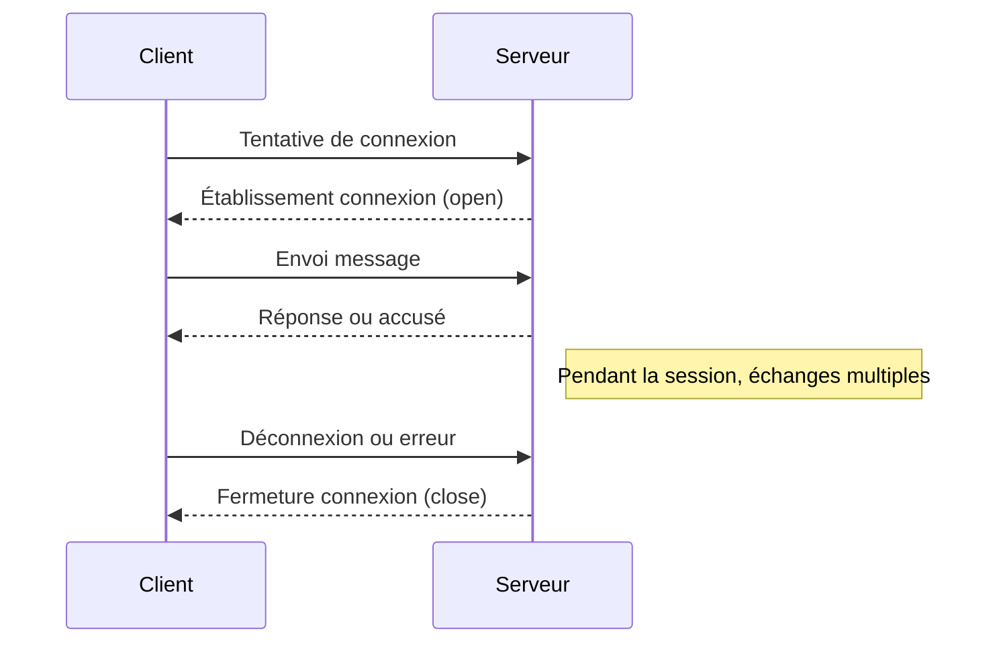

# Gestion des événements de connexion, déconnexion et message avec WebSockets

## Introduction

La gestion des connexions dans une application WebSocket repose principalement sur la gestion d’événements clés : **connexion**, **déconnexion** et **réception de messages**. Ces événements permettent de piloter la communication, gérer les ressources et répondre aux échanges en temps réel.

---

## 1. Événements fondamentaux dans WebSocket

### Côté client (JavaScript)

Voici les événements standards auxquels le client WebSocket doit répondre :

- **open** : déclenché lorsque la connexion est établie.
- **close** : déclenché lorsque la connexion est fermée (volontairement ou suite à une erreur).
- **message** : capturant les messages reçus du serveur.
- **error** : détecte les erreurs de communication.

**Exemple de gestion d’événements client en JavaScript :**

```javascript
const socket = new WebSocket('wss://example.com/socket');

socket.addEventListener('open', () => {
    console.log('Connexion ouverte');
    socket.send('Bonjour serveur!');
});

socket.addEventListener('message', (event) => {
    console.log('Message reçu:', event.data);
});

socket.addEventListener('close', (event) => {
    console.log('Connexion fermée:', event.code, event.reason);
});

socket.addEventListener('error', (error) => {
    console.error('Erreur WebSocket:', error);
});
```

---

### Côté serveur (Node.js avec la bibliothèque `ws`)

Sur le serveur, la gestion des connexions et messages s’appuie également sur des événements :

- **connection** : nouvel utilisateur connecté.
- **message** : message reçu depuis un client.
- **close** : déconnexion d’un client.
- **error** : erreur sur la connexion.

**Exemple minimal côté serveur avec `ws` :**

```javascript
const WebSocket = require('ws');
const wss = new WebSocket.Server({ port: 8080 });

wss.on('connection', (ws) => {
    console.log('Nouveau client connecté');
    
    ws.on('message', (message) => {
        console.log('Message reçu:', message);
        ws.send(`Serveur a reçu : ${message}`);
    });
    
    ws.on('close', () => {
        console.log('Client déconnecté');
    });
    
    ws.on('error', (error) => {
        console.error('Erreur:', error);
    });

    ws.send('Bienvenue sur le serveur WebSocket');
});
```

---

## 2. Cycle de vie d’une connexion WebSocket – schéma



---

## 3. Conseils pour une gestion efficace

- **Valider les données reçues** pour éviter failles de sécurité (injection, surconsommation mémoire).
- **Gérer les erreurs proprement** pour informer les clients et éviter des fuites de ressources.
- **Mettre en place une reconnexion automatique** côté client pour maintenir la communication.
- **Suivre l’état des connexions** côté serveur pour pouvoir répartir la charge ou diffuser des messages.

---

## Sources

- MDN Web Docs, [WebSocket API](https://developer.mozilla.org/en-US/docs/Web/API/WebSocket)  
- Documentation officielle `ws`, [GitHub Repository](https://github.com/websockets/ws)  
- WebSocket.org, [WebSocket Introduction](https://www.websocket.org/aboutwebsocket.html)  

---

La maîtrise des événements `connection`, `message` et `close` est essentielle pour construire des systèmes WebSocket performants permettant d’offrir des communications temps réel stables, efficaces et sûres.