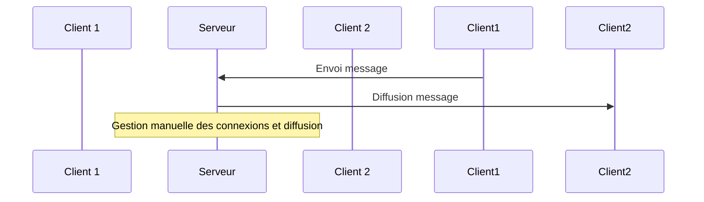

# Problématiques des WebSockets natifs : reconnexion, fallbacks et diffusion

## Introduction

Les WebSockets natifs offrent une communication bidirectionnelle efficace entre client et serveur, mais leur utilisation directe soulève plusieurs problématiques importantes : la gestion de la reconnexion automatique, l’absence de mécanismes de secours (fallbacks) en cas d’incompatibilités, et la diffusion efficace des messages à plusieurs clients. Comprendre ces limites est indispensable pour concevoir des applications temps réel robustes.

---

## 1. Gestion de la reconnexion automatique

### Limite native

L’API WebSocket standard ne fournit pas nativement de gestion de reconnexion automatique en cas de perte de connexion (timeout, interruption réseau, etc.). Le développeur doit donc la coder manuellement.

### Exemple simple de reconnexion côté client

```javascript
function connect() {
    const socket = new WebSocket('wss://example.com/socket');

    socket.onopen = () => {
        console.log('Connecté');
    };

    socket.onclose = (event) => {
        console.log('Déconnecté, tentative de reconnexion dans 3s...');
        setTimeout(connect, 3000);  // tentative de reconnexion
    };

    socket.onerror = (error) => {
        console.error('Erreur WebSocket', error);
        socket.close();
    };

    socket.onmessage = (event) => {
        console.log('Message:', event.data);
    };
}

connect();
```

Cette gestion basique peut devenir complexe dans des cas réels (backoff exponentiel, gestion des erreurs spécifiques, nettoyage des anciennes connexions).

---

## 2. Fallbacks : absence de mécanismes intégrés

### Problème

Le protocole WebSocket nécessite que le client et le serveur supportent WebSocket. En cas d’incompatibilité (navigateurs anciens, restrictions réseau via proxies ou firewalls bloquant WebSocket), la connexion échoue. Le WebSocket natif ne propose pas de solution de secours qui permette d’utiliser une autre méthode (polling, long polling).

### Solutions alternatives

- **Bibliothèques tiers**, comme [Socket.IO](https://socket.io/), qui encapsulent WebSocket et fournissent automatiquement des fallbacks vers d’autres méthodes de communication (HTTP long-polling, etc.).
- **Détection côté client** et mise en place de stratégies personnalisées.

---

## 3. Diffusion des messages à plusieurs clients

### Limite classique

Avec l’API WebSocket basique, le serveur gère une liste de connexions et doit implémenter manuellement la diffusion (broadcast) des messages à plusieurs clients. Ceci n’est pas intégré et peut rapidement devenir complexe à gérer lorsque le nombre de connexions augmente.

### Exemple de broadcasting côté serveur avec `ws`

```javascript
const WebSocket = require('ws');
const wss = new WebSocket.Server({ port: 8080 });

wss.on('connection', (ws) => {
    ws.on('message', (message) => {
        // Diffusion à tous les clients sauf émetteur
        wss.clients.forEach(client => {
            if (client !== ws && client.readyState === WebSocket.OPEN) {
                client.send(message);
            }
        });
    });
});
```

---

## 4. Diagramme synthétique



---

## 5. Résumé des contraintes et remèdes

| Problématique         | Description                         | Solutions courantes                          |
|-----------------------|-----------------------------------|---------------------------------------------|
| Reconnexion           | Pas de mécanisme natif lié à la reconnexion automatique | Implémentation manuelle ou utilisation de bibliothèques comme Socket.IO |
| Fallbacks             | Pas de solution en cas d’incompatibilité WebSocket | Utilisation de bibliothèques (Socket.IO) gérant fallback vers HTTP |
| Diffusion / Broadcast | Nécessite gestion manuelle des connexions et diffusion | Implémentation côté serveur ou usage de frameworks dédiés |

---

## Sources

- MDN Web Docs, [WebSocket API](https://developer.mozilla.org/en-US/docs/Web/API/WebSocket)  
- Socket.IO documentation, [Fallbacks and reconnects](https://socket.io/docs/v4/client-initialization/#reconnection)  
- GitHub `ws` package, [Broadcast sample](https://github.com/websockets/ws#broadcast-example)  

---

Pour construire des applications temps réel robustes, la compréhension de ces limitations natives des WebSockets est indispensable, et l’usage de frameworks comme Socket.IO permet souvent de contourner ces problèmes en proposant des solutions clés en main.