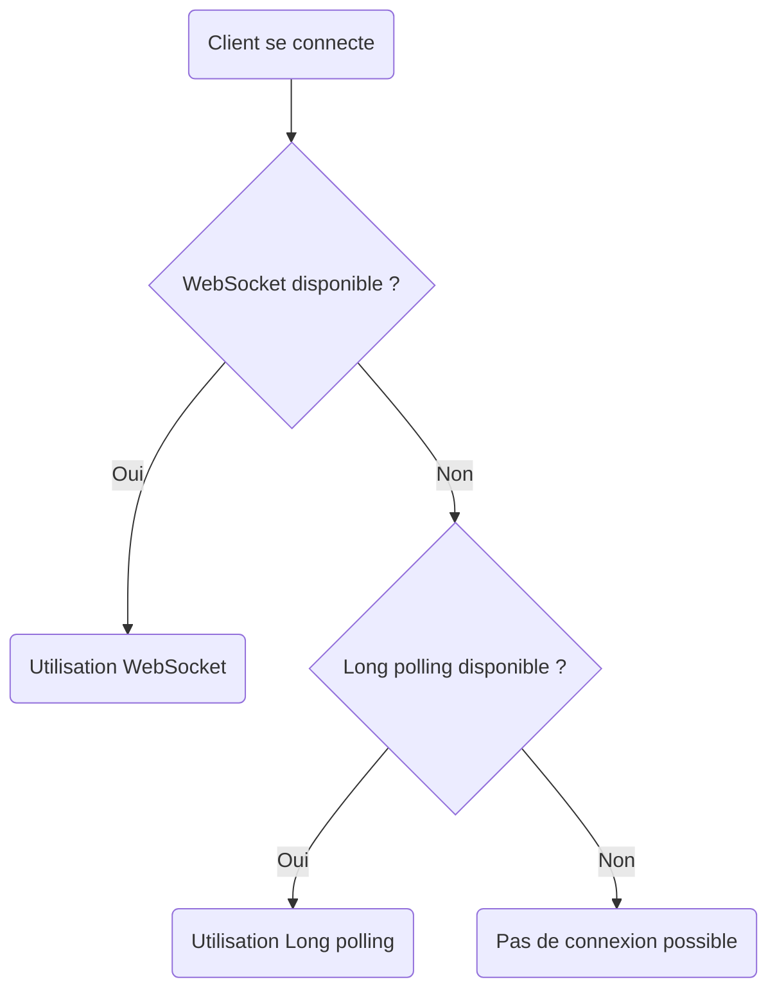

# Pourquoi Socket.IO ? Fiabilité, reconnexion automatique et transport fallbacks

## Introduction

Socket.IO est une bibliothèque JavaScript largement utilisée pour faciliter la communication en temps réel entre clients et serveurs. Elle s’appuie sur WebSocket mais offre des fonctionnalités supplémentaires qui pallient plusieurs limites du protocole WebSocket natif : fiabilité renforcée, reconnexion automatique, et gestion automatique des fallbacks.

---

## 1. Fiabilité améliorée par Socket.IO

### Problématiques des WebSockets natifs

- La connexion WebSocket peut être interrompue pour diverses raisons (perte réseau, timeout, pare-feu).
- Pas de garantie intrinsèque de retransmission ou d’état de connexion persistante.

### Solution Socket.IO

Socket.IO intègre un protocole propre qui garantit la livraison des messages dans l’ordre, avec confirmation côté client, et gère automatiquement la reconnexion et la reprise de session.

---

## 2. Reconnexion automatique simplifiée

Socket.IO implémente nativement une stratégie de reconnexion automatique, qui tente de rétablir la connexion en cas d’interruption, avec gestion de backoff exponentiel et limites configurables.

**Exemple de reconnexion automatique par défaut côté client :**

```javascript
const socket = io('https://example.com', {
    reconnection: true,
    reconnectionAttempts: 5,
    reconnectionDelay: 1000,
});
```

La reconnexion est donc automatique, évitant au développeur d’implémenter manuellement ce mécanisme complexe.

---

## 3. Fallbacks sur plusieurs transports

WebSocket seul nécessite que la connexion soit prise en charge par le client et le serveur, et que le réseau ne bloque pas ce protocole. Dans les cas où WebSocket est indisponible, Socket.IO peut basculer sur d’autres transports :

- **HTTP long-polling** : le client effectue régulièrement des requêtes HTTP pour récupérer les mises à jour.
- **XHR polling** ou JSONP polling dans les environnements très contraints.

Cette capacité de fallback est transparente pour le développeur, garantissant une compatibilité large même avec des navigateurs anciens ou des réseaux restrictifs.

### Diagramme de sélection du transport



---

## 4. Exemple minimal d’utilisation de Socket.IO (serveur + client)

### Serveur (Node.js)

```javascript
const io = require('socket.io')(3000);

io.on('connection', (socket) => {
    console.log('Client connecté');

    socket.on('message', (msg) => {
        console.log('Message reçu:', msg);
        socket.emit('response', `Serveur a reçu: ${msg}`);
    });

    socket.on('disconnect', () => {
        console.log('Client déconnecté');
    });
});
```

### Client (JavaScript navigateur)

```javascript
const socket = io('http://localhost:3000');

socket.on('connect', () => {
    console.log('Connecté au serveur');
    socket.send('Bonjour serveur');
});

socket.on('response', (msg) => {
    console.log('Réponse serveur:', msg);
});

socket.on('disconnect', () => {
    console.log('Déconnecté du serveur');
});
```

---

## 5. Sources

- Socket.IO Official Documentation, [Introduction](https://socket.io/docs/v4/)  
- MDN Web Docs, [WebSocket API](https://developer.mozilla.org/en-US/docs/Web/API/WebSocket)  
- Node.js Socket.IO examples, [GitHub Repository](https://github.com/socketio/socket.io/tree/main/examples)  

---

Socket.IO simplifie la création d’applications temps réel en garantissant des connexions persistantes, fiables, et compatibles avec un grand nombre d’environnements grâce à ses mécanismes intégrés de reconnexion automatique et de fallback transport.