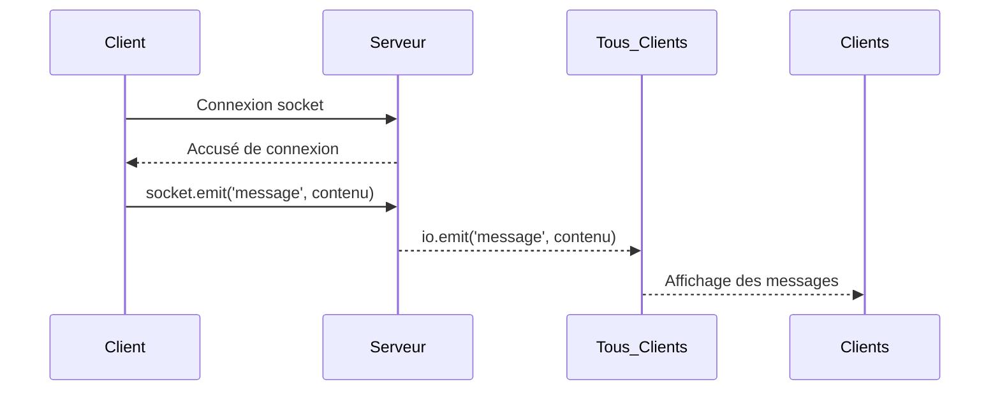

# Construction d'une application de chat temps réel avec Socket.IO  
## 1. Initialisation du serveur et du client Socket.IO

Socket.IO facilite la mise en place d’applications temps réel en abstraisant la complexité des WebSockets et en proposant une interface simple, avec des fonctionnalités robustes comme la reconnexion automatique et la gestion des rooms. Ce tutoriel présente la configuration initiale d’un serveur et d’un client Socket.IO pour une application de chat.

---

## 1. Initialisation du serveur Socket.IO

### Installation

Utilisez Node.js et installez Socket.IO via npm :

```bash
npm install socket.io
```

### Code serveur minimal

Voici un exemple simple d'un serveur WebSocket avec Socket.IO écoutant sur le port 3000 :

```javascript
const { createServer } = require('http');
const { Server } = require('socket.io');

const httpServer = createServer();
const io = new Server(httpServer, {
    // options (facultatif)
    cors: {
        origin: "*",  // Pour autoriser toutes les origines (à configurer en prod)
    }
});

io.on('connection', (socket) => {
    console.log('Un client est connecté, id:', socket.id);

    socket.on('message', (data) => {
        console.log('Message reçu:', data);
        io.emit('message', data); // diffusion du message à tous les clients
    });

    socket.on('disconnect', () => {
        console.log('Client déconnecté', socket.id);
    });
});

httpServer.listen(3000, () => {
    console.log('Serveur Socket.IO démarré sur le port 3000');
});
```

---

## 2. Initialisation du client Socket.IO

### Installation côté client

Inclure Socket.IO dans une page HTML peut se faire via CDN :

```html
<script src="https://cdn.socket.io/4.5.1/socket.io.min.js"></script>
```

### Code client minimal

```html
<!DOCTYPE html>
<html lang="fr">
<head>
    <meta charset="UTF-8" />
    <title>Chat Socket.IO</title>
</head>
<body>
    <input id="input" placeholder="Votre message" autocomplete="off"/>
    <button id="send">Envoyer</button>
    <ul id="messages"></ul>

<script>
    // Connexion au serveur
    const socket = io('http://localhost:3000');

    const input = document.getElementById('input');
    const sendBtn = document.getElementById('send');
    const messages = document.getElementById('messages');

    // Envoi du message au serveur
    sendBtn.addEventListener('click', () => {
        if(input.value) {
            socket.emit('message', input.value);
            input.value = '';
        }
    });

    // Réception des messages du serveur
    socket.on('message', (msg) => {
        const li = document.createElement('li');
        li.textContent = msg;
        messages.appendChild(li);
    });
</script>
</body>
</html>
```

---

## 3. Diagramme Mermaid du fonctionnement initial



---

## 4. Points à considérer

- **CORS** : dans un environnement de développement, on autorise souvent toutes les origines (`origin: "*"`) ; en production, il faudra restreindre cela aux domaines autorisés.
- **Sécurité** : valider/sanitiser les messages afin d’éviter les injections XSS côté client et attaques serveur.
- **Scalabilité** : lors de montée en charge, la diffusion via `io.emit` peut nécessiter un adaptateur Redis pour gérer plusieurs instances Socket.IO.
- **Connexion** : Socket.IO gère automatiquement la reconnexion et la sélection du transport (WebSocket ou fallback).

---

## Sources

- Socket.IO documentation officielle, [Getting Started](https://socket.io/docs/v4/)  
- MDN Web Docs, [WebSocket API](https://developer.mozilla.org/en-US/docs/Web/API/WebSocket)  
- Exemple d’application chat simple, [Socket.IO chat example GitHub](https://github.com/socketio/socket.io/tree/main/examples/chat)

---

Cette première étape met en place la fondation d’une application temps réel. Elle permet l’émission et la réception basique de messages entre clients via un serveur Socket.IO, prêt à être enrichi avec des fonctionnalités comme les rooms, namespaces et authentifications.