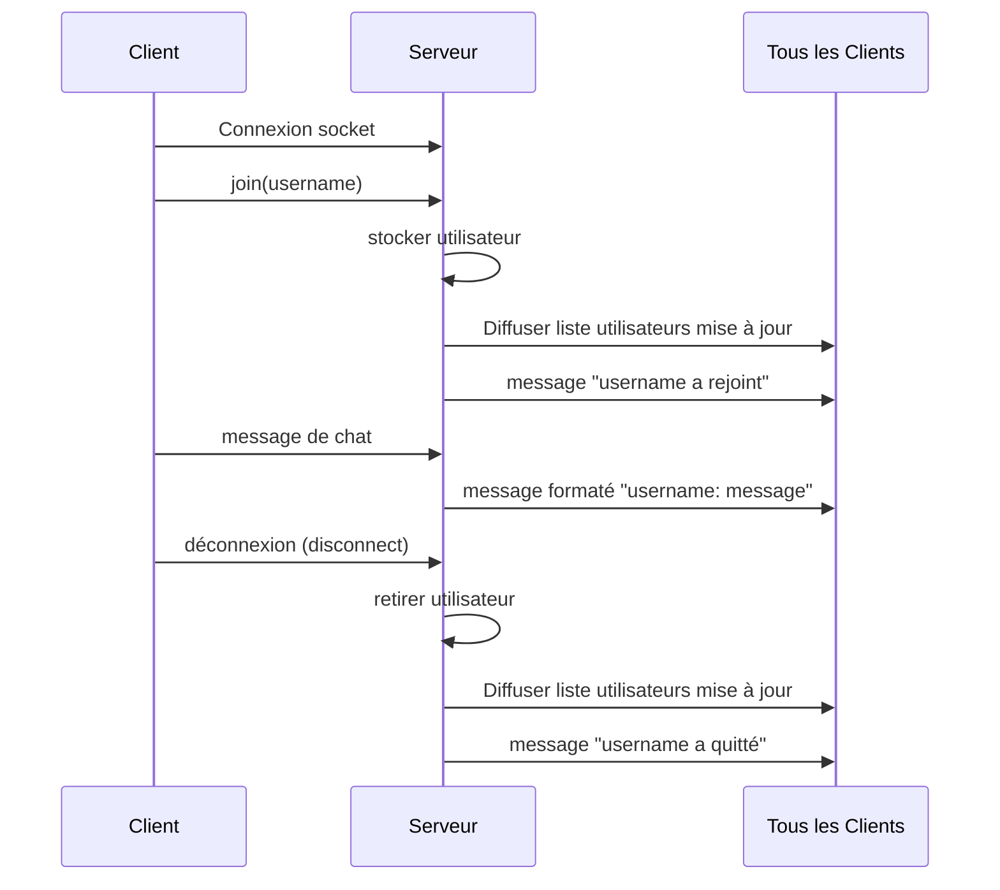

# Gestion des utilisateurs et de leur présence dans une application de chat avec Socket.IO

## Introduction

Au-delà de la simple diffusion de messages, une application de chat temps réel doit gérer efficacement les utilisateurs connectés et leur présence. Cela implique d’identifier chaque utilisateur, de suivre leurs connexions/déconnexions, et de diffuser ces informations à tous les participants. Socket.IO facilite cette gestion grâce à ses événements de connexion, à ses mécanismes de stockage en mémoire, et à l’utilisation des rooms pour segmenter les utilisateurs.

---

## 1. Identification des utilisateurs

Contrairement à HTTP classique, la communication WebSocket par Socket.IO ne gère pas automatiquement un concept d’utilisateur identifié. Il est courant de demander à l’utilisateur de fournir un nom, un pseudonyme, ou d’utiliser une authentification préalable.

### Exemple simple d’identification par pseudonyme côté client

```javascript
// Lors de la connexion, l’utilisateur envoie son pseudonyme
const username = prompt("Entrez votre pseudonyme");
const socket = io('http://localhost:3000');

socket.emit('join', username);
```

---

## 2. Gestion du serveur : suivi des utilisateurs connectés

On peut stocker en mémoire les informations des utilisateurs avec leur socket.id pour savoir qui est en ligne.

### Exemple serveur : stockage des utilisateurs et gestion de leur présence

```javascript
const users = new Map();

io.on('connection', (socket) => {
    console.log(`Socket connectée: ${socket.id}`);

    socket.on('join', (username) => {
        users.set(socket.id, username);
        // Informer tous les clients de la liste mise à jour
        io.emit('users', Array.from(users.values()));
        io.emit('message', `${username} a rejoint le chat`);
    });

    socket.on('disconnect', () => {
        const username = users.get(socket.id);
        if(username) {
            users.delete(socket.id);
            io.emit('users', Array.from(users.values()));
            io.emit('message', `${username} a quitté le chat`);
        }
        console.log(`Socket déconnectée: ${socket.id}`);
    });

    socket.on('message', (msg) => {
        const username = users.get(socket.id) || 'Anonyme';
        io.emit('message', `${username} : ${msg}`);
    });
});
```

---

## 3. Côté client : affichage de la liste des utilisateurs connectés

```javascript
socket.on('users', (userList) => {
    const userListElement = document.getElementById('user-list');
    userListElement.innerHTML = '';
    userList.forEach(user => {
        const li = document.createElement('li');
        li.textContent = user;
        userListElement.appendChild(li);
    });
});
```

---

## 4. Diagramme Mermaid : cycles connexion et présence utilisateur



---

## 5. Points d’amélioration et bonnes pratiques

- **Persistance des utilisateurs** : pour une application évoluée, les utilisateurs peuvent être persistés en base de données avec authentification.
- **Gestion des collisions de pseudonymes** : prévoir une vérification pour éviter les doublons d’identifiants.
- **Rooms privées ou groupes** : pour chats privés, on peut attribuer les sockets à des rooms et gérer la présence par groupe.
- **Gestion des statuts** : en plus de la connexion, le statut (en ligne, occupé, absent) peut être géré pour plus d’interactivité.

---

## Sources

- Socket.IO Documentation – [Introduction et Gestion des événements](https://socket.io/docs/v4/)  
- Tutoriel Medium – [Créer un chat avec Node.js et Socket.IO](https://medium.com/swlh/build-real-time-chat-app-in-node-js-socket-io-4bb804df0045)  
- GitHub Exemple Chat Socket.IO – [socket.io/examples/chat](https://github.com/socketio/socket.io/tree/main/examples/chat)  

---

La gestion de la présence utilisateur donne vie à une application de chat en temps réel. Stocker les utilisateurs, diffuser leur état, et gérer dynamiquement les listes connectées assure une expérience interactive fluide et engageante pour tous les participants.