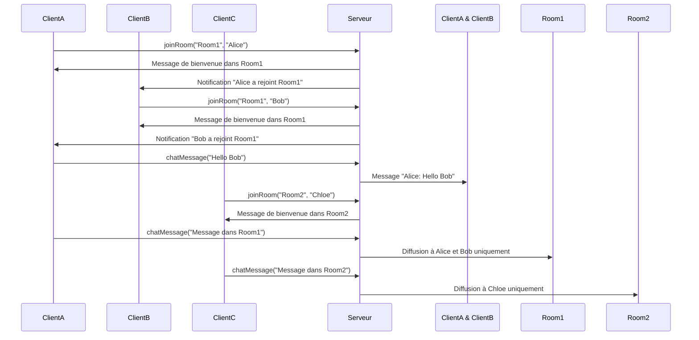

# Envoi et réception de messages dans des salons (rooms) avec Socket.IO

## Introduction

Les salons (ou *rooms*) dans Socket.IO sont des mécanismes puissants permettant de segmenter les utilisateurs au sein d’un même namespace et de diffuser des messages uniquement à un groupe ciblé. Cette fonctionnalité est essentielle pour construire des applications de chat multi-canaux ou des environnements collaboratifs où différents groupes échangent en parallèle.

---

## 1. Concept de rooms dans Socket.IO

Une **room** est un label arbitraire auquel un ou plusieurs sockets peuvent adhérer. Un socket peut appartenir à plusieurs rooms simultanément.

### Avantages

- Diffusion ciblée à un sous-ensemble d’utilisateurs.
- Isolation logique des conversations ou ateliers.
- Gestion facile sans infrastructures supplémentaires.

---

## 2. Création et gestion des rooms côté serveur

### Rejoindre une room

```javascript
io.on('connection', (socket) => {

    socket.on('joinRoom', (roomName) => {
        socket.join(roomName);
        socket.to(roomName).emit('message', `Un nouvel utilisateur a rejoint la room ${roomName}`);
    });

});
```

### Quitter une room

```javascript
socket.leave(roomName);
```

---

## 3. Diffusion de messages dans une room

La diffusion dans une room s’effectue via :

- `socket.to(roomName).emit(...)` : à tous les membres sauf l’émetteur.
- `io.in(roomName).emit(...)` : à tous les membres, émetteur inclus.

### Exemple d’envoi de message dans une room

```javascript
socket.on('chatMessage', ({ roomName, message }) => {
    const username = getUsernameFromSocket(socket);
    io.in(roomName).emit('message', {
        user: username,
        text: message,
        time: new Date().toLocaleTimeString()
    });
});
```

---

## 4. Exemple complet serveur

```javascript
const users = new Map();

io.on('connection', (socket) => {
    
    socket.on('joinRoom', ({username, roomName}) => {
        users.set(socket.id, { username, roomName });
        socket.join(roomName);

        // Message de bienvenue au nouvel arrivant seulement
        socket.emit('message', `Bienvenue dans la room ${roomName}, ${username}!`);

        // Notification aux autres membres de la room
        socket.to(roomName).emit('message', `${username} a rejoint la room`);
    });

    socket.on('chatMessage', (msg) => {
        const user = users.get(socket.id);
        if (!user) return;

        io.in(user.roomName).emit('message', {
            user: user.username,
            text: msg,
            time: new Date().toLocaleTimeString()
        });
    });

    socket.on('disconnect', () => {
        const user = users.get(socket.id);
        if (user) {
            io.in(user.roomName).emit('message', `${user.username} a quitté la room`);
            users.delete(socket.id);
        }
    });
});
```

---

## 5. Exemple côté client

```javascript
const socket = io('http://localhost:3000');

const username = prompt('Votre nom');
const roomName = prompt('Quel salon souhaitez-vous rejoindre ?');

socket.emit('joinRoom', { username, roomName });

socket.on('message', (msg) => {
    console.log(`[${msg.time || ''}] ${msg.user || 'Système'} : ${msg.text || msg}`);
});

// Envoi de messages
document.getElementById('send').addEventListener('click', () => {
    const message = document.getElementById('input').value;
    socket.emit('chatMessage', message);
});
```

---

## 6. Diagramme Mermaid : communication dans des rooms



---

## 7. Sources

- Socket.IO Documentation – [Rooms](https://socket.io/docs/v4/rooms/)  
- Socket.IO GitHub Examples – [Chat room example](https://github.com/socketio/socket.io/tree/main/examples/chat)  
- MDN Web Docs – [Using WebSocket](https://developer.mozilla.org/en-US/docs/Web/API/WebSocket)  

---

Le système de rooms permet de structurer la communication dans des groupes définis, améliorant ainsi la souplesse et la scalabilité des applications temps réel. En maitrisant ce mécanisme, il devient simple de créer des salons de discussion indépendants ou des espaces collaboratifs multi-utilisateurs.