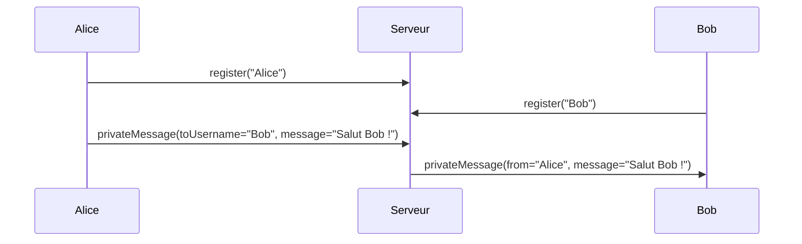

# Implémentation de messages privés avec Socket.IO

## Introduction

Dans une application de chat temps réel, la fonctionnalité de messages privés permet à deux utilisateurs d’échanger directement sans que les autres participants soient impliqués. Socket.IO facilite cette communication ciblée grâce à son système de sockets uniques identifiés par un `socket.id`, et à son API pour envoyer directement vers un socket spécifique.

---

## 1. Principes des messages privés

- Chaque utilisateur connecté possède un identifiant unique `socket.id`.
- Pour envoyer un message privé, l’émetteur doit connaître l’`id` du destinataire.
- Le serveur sert d'intermédiaire, réceptionne le message, puis envoie uniquement au socket ciblé.

### Gestion d’utilisateurs avec mapping

Pour retrouver facilement le socket d’un utilisateur, on crée une structure de données côté serveur qui associe un identifiant (pseudo, userId) à un `socket.id`.

---

## 2. Exemple de code serveur pour messages privés

```javascript
const users = new Map(); // userId (pseudo) => socket.id

io.on('connection', (socket) => {
    // Enregistrement utilisateur
    socket.on('register', (username) => {
        users.set(username, socket.id);
        socket.username = username;
        console.log(`${username} connecté avec id ${socket.id}`);
    });

    // Envoi message privé
    socket.on('privateMessage', ({ toUsername, message }) => {
        const targetSocketId = users.get(toUsername);
        if(targetSocketId) {
            io.to(targetSocketId).emit('privateMessage', {
                from: socket.username,
                message: message,
                time: new Date().toLocaleTimeString()
            });
        } else {
            socket.emit('errorMessage', `Utilisateur ${toUsername} non trouvé`);
        }
    });

    socket.on('disconnect', () => {
        if(socket.username) {
            users.delete(socket.username);
            console.log(`${socket.username} déconnecté`);
        }
    });
});
```

---

## 3. Exemple client d’envoi/réception de messages privés

```javascript
// Connexion
const socket = io('http://localhost:3000');
const username = prompt('Votre pseudo');
socket.emit('register', username);

// Envoi d'un message privé
function sendPrivateMessage(toUsername, message) {
    socket.emit('privateMessage', { toUsername, message });
}

// Réception d’un message privé
socket.on('privateMessage', ({ from, message, time }) => {
    console.log(`Message privé de ${from} à ${time} : ${message}`);
});

// Gestion d’erreur
socket.on('errorMessage', (msg) => {
    console.error(msg);
});
```

---

## 4. Diagramme Mermaid : communication des messages privés



---

## 5. Points d’attention

- **Authentification** : dans une app réelle, il faut authentifier et sécuriser la correspondance entre utilisateur et socket.
- **Gestion des déconnexions** : nettoyer le mapping `users` pour éviter des erreurs.
- **Respect de la vie privée** : messages privés doivent être chiffrés côté client et éventuellement stockés de façon sécurisée.
- **Cas d'usage évolué** : ajout de statuts (lu/non lu), accusés de réception, historique.

---

## Sources

- Socket.IO : [Emitting events to specific sockets](https://socket.io/docs/v4/emitting-events/#sending-to-a-socket-id)  
- Medium – [Private Chat with Socket.io](https://medium.com/swlh/how-to-create-a-private-chat-app-with-socket-io-94fcb96217a2)  
- GitHub socket.io/examples : [private-messaging example](https://github.com/socketio/socket.io/tree/main/examples/private-chat)  

---

L’implémentation des messages privés exploite la granularité des sockets dans Socket.IO. Le modèle "user-to-socket.id" permet une messagerie ciblée, garantissant la confidentialité des échanges entre deux utilisateurs.