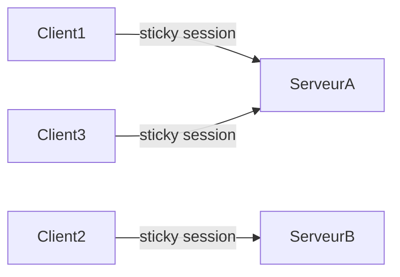
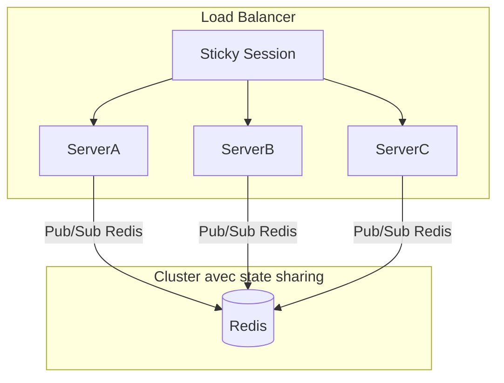

# Défis de la scalabilité horizontale : sticky sessions vs. state sharing

## Introduction

La scalabilité horizontale consiste à ajouter des serveurs pour gérer une charge croissante d’utilisateurs ou de connexions. Dans le temps réel, notamment avec des technologies comme WebSockets et Socket.IO, cette approche soulève des défis spécifiques liés à la gestion de l’état des sessions et des connexions persistantes. Deux approches principales existent pour résoudre ces défis : **sticky sessions** et **state sharing**.

---

## 1. Sticky sessions (affinité de session)

### Principe

Le load balancer dirige toujours les requêtes d'un même client vers le même serveur backend, garantissant que la connexion WebSocket (état associé) reste localisée sur un seul serveur.

### Avantages

- Simplicité d’implémentation.
- Pas besoin de synchroniser l’état entre serveurs.
- Bon fonctionnement pour des sessions initiales longues.

### Inconvénients

- Moins résilient : si un serveur tombe, les clients doivent se reconnecter ailleurs.
- Charge potentiellement déséquilibrée, serveur avec plus de connexions saturé.
- Scalabilité limitée par la capacité individuelle des nœuds.

### Exemple

Supposons un cluster de 3 serveurs et un load balancer configuré avec affinité sur cookie ou IP.



---

## 2. State sharing (partage d’état)

### Principe

L’état des connexions et sessions est partagé ou accessible entre tous les serveurs du cluster via une couche commune (ex : Redis, base de données en mémoire).

### Avantages

- Tolérance aux pannes améliorée : si un serveur meurt, un autre peut prendre le relais avec l’état partagé.
- Répartition plus flexible de la charge.
- Permet la diffusion d’événements à tous les clients, indépendamment du serveur.

### Inconvénients

- Complexité accrue car nécessité d’un mécanisme de synchronisation faible latence.
- Dépendance à une couche externe (Redis, etc.) qui peut être un point de défaillance.
- Latence supplémentaire induite par les échanges d’état.

### Exemple avec Socket.IO et Redis Adapter

```javascript
const io = require("socket.io")(httpServer);
const redisAdapter = require("socket.io-redis");
io.adapter(redisAdapter({ host: "localhost", port: 6379 }));
```

Ce setup partage les infos de rooms et sockets sur tous les serveurs.

---

## 3. Comparaison synthétique

| Critère                | Sticky Sessions                        | State Sharing                             |
|------------------------|--------------------------------------|------------------------------------------|
| **Complexité**         | Faible                               | Élevée                                  |
| **Résilience aux pannes** | Limitée                             | Élevée                                  |
| **Équilibrage de charge**| Moins flexible, balancement par session | Plus flexible, meilleur équilibrage    |
| **Gestion de l'état**   | Local au serveur                     | Centralisé / partagé                     |
| **Cas d’usage**         | Petits clusters, apps simples        | Clusters larges, besoins HA              |

---

## 4. Diagramme Mermaid : architectures scalables



---

## 5. Solutions hybrides

Il est possible de combiner les deux approches avec par exemple un équilibre de charge sticky pour limiter la latence, tout en partageant des informations d’état critiques via Redis.

---

## Sources

- Socket.IO Official Docs – [Scaling Socket.IO](https://socket.io/docs/v4/scaling/)
- NGINX – [Session persistence (Sticky Sessions)](https://docs.nginx.com/nginx/admin-guide/load-balancer/http-load-balancer/#sticky-sessions)
- Redis Labs – [Using Redis for Pub/Sub in WebSocket apps](https://redis.io/topics/pubsub)
- InfoQ – [Scalable WebSocket Architectures](https://www.infoq.com/articles/scalable-websocket-architecture/)

---

La scalabilité horizontale des architectures temps réel impose un choix entre simplicité via sticky sessions, et robustesse via partage d’état. Selon les exigences techniques et métier, la bonne approche peut varier, mais la maîtrise de ces concepts permet de concevoir des solutions adaptées à de fortes charges et nécessitant haute disponibilité.