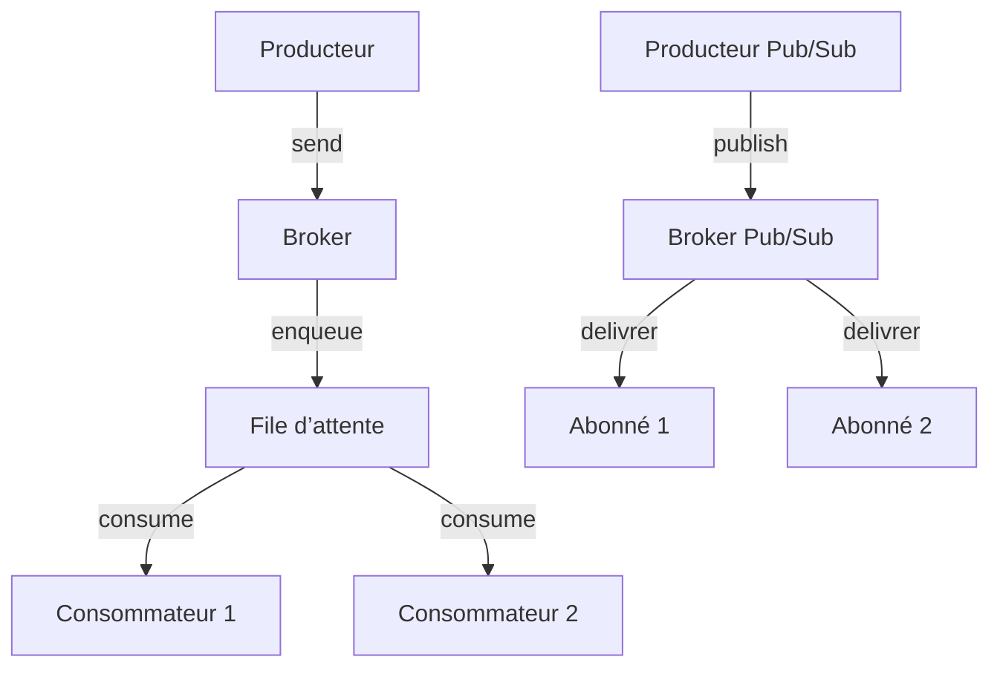

# Introduction aux Brokers de messages : files d’attente et modèle Publish/Subscribe

## 1. Qu’est-ce qu’un broker de messages ?

Un **broker de messages** est un système logiciel qui facilite l’échange de messages entre producteurs (éditeurs) et consommateurs (abonnés) de manière asynchrone et découplée. Il joue un rôle d’intermédiaire permettant de gérer la distribution, la persistance, la livraison et parfois la transformation des messages dans des architectures distribuées.

---

## 2. Pourquoi utiliser un broker de messages ?

- **Découplage** : producteurs et consommateurs ne communiquent pas directement, ce qui facilite l’évolution et la maintenabilité.
- **Résilience** : les messages peuvent être mis en file d’attente pour une livraison ultérieure, même en cas d’indisponibilité temporaire du consommateur.
- **Scalabilité** : gestion efficace des pics de charge en équilibrant la consommation.
- **Modelage flexible des flux** : supporte plusieurs paradigmes, notamment la file d’attente (queue) et le publish/subscribe (pub/sub).

---

## 3. Deux paradigmes essentiels

### 3.1 Files d’attente (Message Queues)

Dans ce modèle, un producteur envoie un message dans une file spécifique. Un ou plusieurs consommateurs lisent ces messages, généralement en s’assurant qu’un message est traité une seule fois.

- **Caractéristiques** :  
  - Transmission point-à-point.  
  - Traitement de message garanti (souvent avec accusé de réception).  
  - Utilisé pour équilibrer la charge sur plusieurs consommateurs.

- **Cas d'usage** : traitement asynchrone de tâches, ingestion de données, travaux en batch.

### Exemple simplifié avec RabbitMQ

Producteur :

```javascript
channel.sendToQueue('task_queue', Buffer.from('Message important'));
```

Consommateur :

```javascript
channel.consume('task_queue', (msg) => {
  console.log("Reçu:", msg.content.toString());
  channel.ack(msg);
});
```

---

### 3.2 Publish/Subscribe (Pub/Sub)

Dans ce mode, les producteurs publient des messages sur un sujet ou canal sans connaitre les consommateurs. Les consommateurs s’abonnent à ces sujets pour recevoir les messages correspondants.

- **Caractéristiques** :  
  - Diffusion multicast.  
  - Les messages reçus seulement par abonnés connectés (en général).  
  - Utile pour notifications, événements temps réel, diffusion.

- **Cas d'usage** : notifications en temps réel, flux de données, chat multi-utilisateur.

### Exemple simplifié avec Redis Pub/Sub

Éditeur :

```bash
PUBLISH chatroom "Nouveau message"
```

Abonné (via redis-cli) :

```bash
SUBSCRIBE chatroom
```

---

## 4. Architecture générale et fonctionnement



---

## 5. Exemples de brokers populaires

| Broker       | Modèles supportés      | Particularités                         |
|--------------|-----------------------|-------------------------------------|
| RabbitMQ     | Queue, Pub/Sub via exchanges | Supports transactions, persistances, clusters |
| Apache Kafka | Pub/Sub (log distribué) | Très haute performance, stockage durable |
| Redis        | Pub/Sub, Listes       | Très rapide en mémoire, adapté au temps réel |
| MQTT         | Pub/Sub               | Protocole léger pour IoT              |

---

## 6. Cas d’usage dans les applications temps réel

- Utiliser un broker Pub/Sub (ex. Redis) pour diffuser des événements à plusieurs serveurs Socket.IO afin de synchroniser l’état (ex. rooms, messages).
- Utiliser une file d’attente pour déléguer le traitement long (ex. génération de rapports, envoi d’emails) sans bloquer la connexion WebSocket.
- Garantir la remise des messages même en cas de basculement ou de redémarrage d’instances.

---

## Sources

- RabbitMQ Tutorials – [Work Queues](https://www.rabbitmq.com/tutorials/tutorial-two-javascript.html)  
- Redis Documentation – [Publish/Subscribe](https://redis.io/docs/manual/pubsub/)  
- Apache Kafka – [Introduction to Pub/Sub](https://kafka.apache.org/documentation/#intro)  
- Martin Fowler – [Message Broker Pattern](https://martinfowler.com/eaaCatalog/messageBroker.html)

---

Les brokers de messages structurent les flux d’informations dans un environnement distribué. Le choix entre file d’attente et pub/sub dépend du modèle de communication souhaité, des besoins en fiabilité, en temps réel et en scalabilité. Intégrer correctement un broker au sein d’une architecture temps réel assure des échanges robustes et efficaces entre composants distribués.