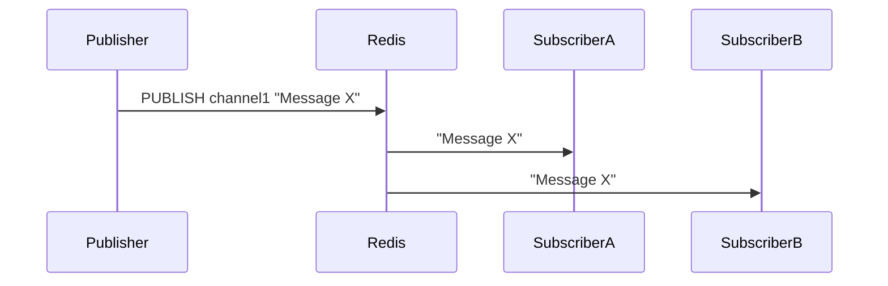

# Concepts de Redis Pub/Sub pour la diffusion d'événements en temps réel

## 1. Présentation du modèle Pub/Sub de Redis

Redis propose un système de **Publish/Subscribe (Pub/Sub)** léger et rapide, facilitant la diffusion d’événements en temps réel. Ce mécanisme découple complètement les producteurs (éditeurs) et les consommateurs (abonnés) de messages via des canaux thématiques (*channels*).

### Fonctionnements fondamentaux

- **Publisher (éditeur)** : envoie un message sur un canal sans connaître les abonnés.
- **Subscriber (abonné)** : s’abonne à un ou plusieurs canaux pour recevoir les messages publiés.
- Redis ne stocke pas les messages : la livraison est **en mode push** uniquement aux clients connectés et abonnés en temps réel.
  
---

## 2. Principaux commandements

| Commande Redis  | Description                             |
|-----------------|---------------------------------------|
| `PUBLISH channel message` | Publie un message sur un canal donné          |
| `SUBSCRIBE channel [channel ...]` | S’abonne à un ou plusieurs canaux               |
| `UNSUBSCRIBE channel` | Se désabonne d’un canal                             |
| `PSUBSCRIBE pattern` | S’abonne à des canaux selon un motif (wildcard)     |
| `PUNSUBSCRIBE pattern` | Se désabonne d’un motif                               |

---

## 3. Exemple simple en Node.js avec ioredis

Installation :

```bash
npm install ioredis
```

### Éditeur (Publisher)

```javascript
const Redis = require('ioredis');
const publisher = new Redis();

setInterval(() => {
  const message = `Event à ${new Date().toISOString()}`;
  publisher.publish('channel1', message);
  console.log(`Message publié : ${message}`);
}, 2000);
```

### Abonné (Subscriber)

```javascript
const Redis = require('ioredis');
const subscriber = new Redis();

subscriber.subscribe('channel1', (err, count) => {
  if(err) {
    console.error('Erreur subscription :', err);
    return;
  }
  console.log(`Abonné à ${count} canal(x)`);
});

subscriber.on('message', (channel, message) => {
  console.log(`Message reçu sur ${channel}: ${message}`);
});
```

---

## 4. Cas d’utilisation dans les architectures temps réel

- **Diffusion d'événements à plusieurs serveurs** : Ex. dans un cluster Socket.IO, chaque instance subscribe à Redis. Lorsqu’une instance publie un événement, toutes les autres restent synchronisées.
- **Notification instantanée** : systèmes d’alerte, mises à jour de chat, votes en temps réel.
- **Découplage** entre producteurs et consommateurs dans les microservices.

---

## 5. Limitations du Pub/Sub Redis

- Pas de persistance ni de file d’attente : les messages sont perdus si aucun abonné n’est connecté.
- Livré uniquement aux abonnés actifs au moment de la publication.
- Adapté pour les événements transitoires mais pas pour les systèmes nécessitant une garantie de délivrance.

Pour dépasser ces contraintes, Redis Streams ou des systèmes de message plus robustes (Kafka, RabbitMQ) sont utilisés.

---

## 6. Diagramme Mermaid simplifié du fonctionnement Redis Pub/Sub



---

## 7. Sources

- Documentation Redis Pub/Sub – [redis.io/topics/pubsub](https://redis.io/docs/manual/pubsub/)  
- ioredis GitHub – [luxas/ioredis](https://github.com/luin/ioredis#readme)  
- Socket.IO Scaling with Redis – [socket.io/docs/v4/redis-adapter](https://socket.io/docs/v4/redis-adapter/)  
- Redis Streams for durable message queueing – [redis.io/docs/streams/](https://redis.io/docs/data-types/streams/)

---

Redis Pub/Sub offre un canal rapide et léger pour la diffusion d’événements en temps réel, facilitant la communication entre multiples instances d’applications et services. Comprendre ses mécanismes et limites est indispensable pour concevoir des architectures distribuées répondant aux besoins spécifiques de persistance, fiabilité ou performance.