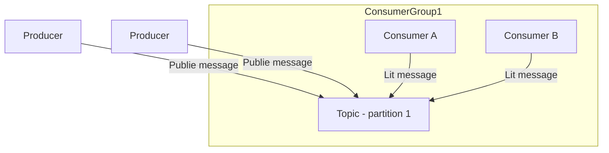
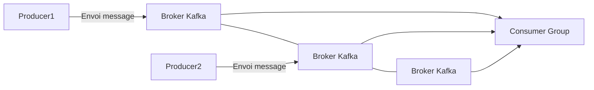

# Introduction à Apache Kafka : Topics, Producers et Consumers pour les flux de données à grande échelle

## 1. Qu'est-ce qu'Apache Kafka ?

Apache Kafka est une **plateforme de streaming distribuée**, conçue pour ingérer, stocker et traiter de grands volumes de données en temps réel. Elle est utilisée pour construire des pipelines de données robustes et des applications temps réel capables de gérer des flux massifs et continus de messages.

---

## 2. Concepts clés de Kafka

### Topics

Un **topic** est un flux de données nommé dans Kafka, divisé en partitions ordonnées. Chaque message produit est écrit dans une partition spécifique d’un topic.

- Un topic peut être divisé en plusieurs partitions, permettant la parallélisation.
- Les partitions garantissent l’ordre des messages à l’intérieur d’une partition.
- Les topics sont durables : les messages sont stockés avec une politique de rétention configurable.

### Producers

Les **producers** sont les applications ou services qui publient des messages dans un ou plusieurs topics.

- Ils peuvent choisir la partition de destination suivant des règles (ex : clé de partitionnement).
- Envoyer des messages de manière synchrone ou asynchrone.
- Kafka assure la durabilité sur disque et la réplication des partitions.

### Consumers

Les **consumers** lisent les messages des topics.

- Ils s’organisent en **groupes de consommateurs**, où chaque message est lu au maximum par un seul membre du groupe.
- Permet une répartition de la charge lors du traitement des données.
- Kafka conserve l’offset de lecture, permettant la lecture répétée ou différée.

---

## 3. Fonctionnement simplifié



---

## 4. Exemple de code avec KafkaJS (Node.js)

Installation :

```bash
npm install kafkajs
```

### Producer simple

```javascript
const { Kafka } = require('kafkajs');

const kafka = new Kafka({ clientId: 'app1', brokers: ['localhost:9092'] });

const producer = kafka.producer();

async function sendMessage() {
  await producer.connect();
  await producer.send({
    topic: 'topic-test',
    messages: [
      { key: 'key1', value: 'Hello Kafka' },
    ],
  });
  await producer.disconnect();
}

sendMessage().catch(console.error);
```

### Consumer simple

```javascript
const { Kafka } = require('kafkajs');

const kafka = new Kafka({ clientId: 'app1', brokers: ['localhost:9092'] });

const consumer = kafka.consumer({ groupId: 'group1' });

async function readMessages() {
  await consumer.connect();
  await consumer.subscribe({ topic: 'topic-test', fromBeginning: true });
  await consumer.run({
    eachMessage: async ({ topic, partition, message }) => {
      console.log(`Reçu: ${message.value.toString()}`);
    },
  });
}

readMessages().catch(console.error);
```

---

## 5. Cas d'usage de Kafka dans le temps réel

- **Ingestion de logs** à grande échelle pour traitement et surveillance.
- **Streaming de données** pour analytics et machine learning.
- **Systèmes événementiels distribués** avec tolérance aux pannes.
- **Synchronisation des états** dans des architectures microservices.

---

## 6. Avantages clés

| Caractéristique          | Détail                                    |
|-------------------------|-------------------------------------------|
| **Scalabilité**          | Partitionnement, réplication automatique.|
| **Durabilité**           | Messages stockés sur disque.               |
| **Performance**          | Faible latence, haut débit.                |
| **Tolérance aux pannes** | Réplication et reprise automatique.       |

---

## 7. Diagramme Mermaid : architecture simplifiée Kafka



---

## 8. Sources

- Apache Kafka Documentation – [https://kafka.apache.org/documentation/](https://kafka.apache.org/documentation/)  
- KafkaJS GitHub – [https://github.com/tulios/kafkajs](https://github.com/tulios/kafkajs)  
- Confluent Blog – [Introduction to Kafka Concepts](https://www.confluent.io/learn/kafka-tutorials/introduction-to-apache-kafka/)  

---

Apache Kafka permet de gérer efficacement des flux de données à grande échelle grâce à son modèle distribué, durable et hautement performant. La maîtrise des notions de topics, producers et consumers est la base pour bâtir des architectures capables d’ingérer, traiter et diffuser des informations en continu dans des systèmes modernes temps réel.