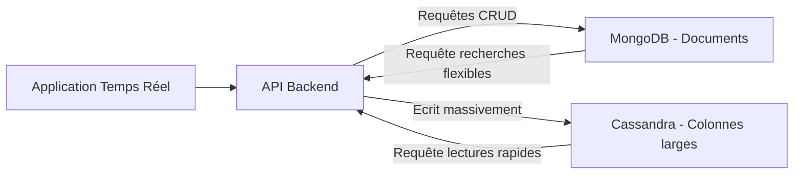

# Bases de données NoSQL (MongoDB, Cassandra) pour la flexibilité des données en temps réel

## 1. Introduction aux bases NoSQL dans le contexte temps réel

Les applications temps réel génèrent des flux de données souvent volumineux, hétérogènes, et à forte évolution schématique. Les bases de données **NoSQL** apportent la flexibilité nécessaire pour gérer ces données, en s’affranchissant du modèle relationnel strict et en offrant scalabilité et performance.

---

## 2. MongoDB : base documentaire orientée JSON

### Principes

- Stocke les données sous forme de documents JSON (BSON en interne).
- Schéma flexible : pas d’obligation de structure rigide, possible d’ajouter des champs au fil du temps.
- Indexation avancée, requêtes ad hoc, et agrégation puissante.
- Scalabilité horizontale via le sharding.

### Exemple d'insertion de message de chat

```javascript
db.messages.insertOne({
  username: "Alice",
  message: "Salut Bob !",
  timestamp: new Date()
});
```

---

## 3. Cassandra : base wide-column distribuée

### Principes

- Stockage dans des tables à colonnes larges avec des lignes flexibles.
- Optimisée pour le traitement des écritures massives et la disponibilité.
- Architecture distribuée sans point de panne unique : réplication multi-datacenter.
- Modèle de données basé sur des partitions et des clés primaires composées pour optimiser les lectures.

### Exemple de création et insertion

```cql
CREATE TABLE messages (
    chatroom text,
    message_id uuid,
    username text,
    message text,
    timestamp timestamp,
    PRIMARY KEY (chatroom, message_id)
);

INSERT INTO messages (chatroom, message_id, username, message, timestamp)
VALUES ('room1', uuid(), 'Bob', 'Salut Alice !', toTimestamp(now()));
```

---

## 4. Comparaison MongoDB vs Cassandra pour le temps réel

| Aspect                  | MongoDB                             | Cassandra                           |
|-------------------------|------------------------------------|-----------------------------------|
| **Modèle**              | Documents JSON                     | Wide-column                       |
| **Flexibilité du schéma**| Très élevée                       | Flexible mais définition table requise |
| **Scalabilité**          | Sharding horizontal               | Partitionnement distribué          |
| **Taux d’écriture**      | Bon                               | Excellente (écritures massives)   |
| **Consistance**          | Forte par défaut (éventuelle eventual) | Eventual consistency, hautement disponible |
| **Cas d’usage**          | Applications agiles, prototypes et évolutifs | Données massives, IoT, logs       |

---

## 5. Architecture basique avec MongoDB et Cassandra dans un système temps réel



---

## 6. Usage typique

- **MongoDB** : stockage de profils, configurations, données semi-structurées, historique avec requêtes complexes.
- **Cassandra** : journalisation d’événements, capteurs IoT, stockages d’historiques temporels à haute fréquence.

---

## 7. Sources

- MongoDB Official Docs – [https://docs.mongodb.com/manual/](https://docs.mongodb.com/manual/)  
- Apache Cassandra Documentation – [https://cassandra.apache.org/doc/latest/](https://cassandra.apache.org/doc/latest/)  
- DigitalOcean Tutorial – [Introduction to NoSQL Databases](https://www.digitalocean.com/community/tutorials/an-introduction-to-nosql)  
- DataStax – [Comparing MongoDB and Cassandra](https://www.datastax.com/blog/2019/04/cassandra-vs-mongodb-comparison-modern-nosql-databases)

---

## Conclusion

Pour répondre aux exigences du temps réel, les bases NoSQL comme MongoDB et Cassandra offrent des modèles adaptés respectivement à la flexibilité documentaire et au traitement massif distribué. Le choix repose sur le profil des données, le volume attendu et les besoins en disponibilité, cohérence et scalabilité. Une architecture hybride peut aussi tirer parti des forces complémentaires de ces deux systèmes.