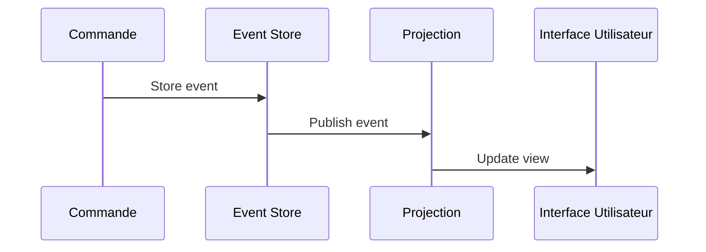

# Stratégies de stockage des événements : Introduction à l'Event Sourcing

## 1. Qu’est-ce que l’Event Sourcing ?

L’**Event Sourcing** est un modèle de persistance dans lequel l'état d'une application est déterminé non pas par l’état courant stocké directement, mais par la séquence complète des événements qui ont eu lieu. Chaque modification de l’état correspond à un événement immuable stocké de façon ordonnée.

Cette approche différencie la logique métier appliquée aux événements des données matérialisées et offre une traçabilité complète des modifications.

---

## 2. Principes clés de l’Event Sourcing

| Principe                 | Description                                            |
|--------------------------|--------------------------------------------------------|
| **Immutabilité des événements** | Les événements sont stockés tels quels, sans modification. |
| **Reconstruction de l’état**    | L’état courant est reconstitué en « rejouant » les événements. |
| **Historique complet**          | Traçabilité fine des modifications sur les données.   |
| **Séparation commandes/événements** | Commandes génèrent des événements qui seront stockés. |

---

## 3. Avantages

- **Audit natif** : historique complet des changements disponible.
- **Modélisation naturelle des flux métier** centrée autour des évènements réels.
- **Flexibilité** : possibilité de rejouer les événements pour reconstruire l'état (debug, migration).
- **Découplage** : événement capturé pour notification ou traitement par d’autres composants (CQRS).

---

## 4. Exemple rudimentaire d’implémentation en pseudocode

Imaginons la gestion d’un compte bancaire :

```pseudo
// Définition d'un événement
Event AccountCredited {
  amount: decimal
  timestamp: datetime
}

// Stockage des événements dans une liste
events = [
  AccountCredited(amount=100, timestamp=2024-06-01T10:00),
  AccountCredited(amount=50, timestamp=2024-06-02T15:00),
]

// Calcul du solde par relecture
function calculateBalance(events) {
  balance = 0
  for event in events:
    if event is AccountCredited:
      balance += event.amount
  return balance
}

balance = calculateBalance(events)
print("Solde du compte : ", balance) // 150
```

---

## 5. Diagramme Mermaid : cycle de l’Event Sourcing



---

## 6. Intégration avec CQRS (Command Query Responsibility Segregation)

L’Event Sourcing est souvent utilisé avec le pattern **CQRS**, qui sépare les modèles de lecture et d’écriture :

- **Commande** : génère un ou plusieurs événements qui sont stockés.
- **Projection** : listen les événements et met à jour les vues matérialisées (bases optimisées pour les requêtes).

---

## 7. Limitations

- Complexité accrue : besoin de bien gérer la version des événements.
- Rejouer un grand volume d’événements peut être coûteux, nécessitant des snapshots intermédiaires.
- Adaptation du modèle de développement et des outils pour gérer l’historicité.

---

## 8. Exemples d’outils et frameworks

- **EventStoreDB** — Base dédiée à l’Event Sourcing : [eventstore.com](https://eventstore.com/)
- **Axon Framework** (Java) — Framework CQRS/ES
- **Kafka** peut aussi être utilisé pour stocker les flux d’événements dans certaines architectures.

---

## 9. Sources

- Martin Fowler – [Event Sourcing](https://martinfowler.com/eaaDev/EventSourcing.html)  
- Microservices.io – [Event Sourcing Pattern](https://microservices.io/patterns/data/event-sourcing.html)  
- EventStore Documentation – [https://developers.eventstore.com/](https://developers.eventstore.com/)  
- AxonIQ – [Guide Event Sourcing](https://docs.axoniq.io/reference-guide/axon-framework/events/event-sourcing)

---

L'Event Sourcing réinvente la gestion des données par la captation intégrale des événements, ouvrant la voie à une traçabilité et une flexibilité accrues dans l’architecture temps réel. Sa mise en œuvre nécessite une bonne maîtrise conceptuelle et une organisation adaptée, mais sa puissance est particulièrement adaptée aux systèmes complexes à forte dynamique.