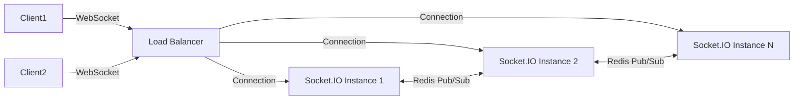

# Mise en place de plusieurs instances de serveur Socket.IO derrière un load balancer avec Redis Pub/Sub

## 1. Contexte : Scalabilité de Socket.IO

Socket.IO permet la communication bidirectionnelle en temps réel entre clients et serveurs. Cependant, pour gérer un grand nombre d’utilisateurs, une seule instance serveur ne suffit pas. Il faut déployer plusieurs instances derrière un **load balancer** pour répartir la charge.

**Problème clé** : la gestion du *state* des connexions et la diffusion d’événements dans un environnement multi-instance.

---

## 2. Pourquoi plusieurs instances de Socket.IO ?

- **Haute disponibilité** : éviter points de défaillance uniques.
- **Évolutivité horizontale** : ajouter dynamiquement des instances selon la charge.
- **Meilleure gestion de la charge** : répartir les connexions clients.

Un **load balancer** (ex : Nginx, HAProxy, AWS ELB) reçoit les connexions clients et les distribue sur différentes instances.

---

## 3. Problème de la diffusion des événements entre instances

Socket.IO utilise un **stateful connection** : chaque instance maintient l’état des sockets qui lui sont connectés.

Dans un environnement multi-instance :

- Événements ciblés sur un socket précis doivent atteindre la bonne instance.
- Emissions globales (broadcasts) doivent être propagées à toutes les instances.

---

## 4. Solution : Adapter Redis Pub/Sub avec Socket.IO Adapter

[Socket.IO-redis](https://socket.io/docs/v4/redis-adapter/) est un adaptateur qui utilise Redis Pub/Sub pour propager les événements entre instances.

### Fonctionnement

- Chaque instance Socket.IO s’abonne à un canal Redis.
- Lorsqu’une instance émet un événement, il est publié sur Redis.
- Redis diffuse cet événement aux autres instances, qui le reçoivent et transmettent aux clients concernés.

---

## 5. Exemple de mise en place Node.js

### Installation

```bash
npm install socket.io redis @socket.io/redis-adapter
```

### Serveur Socket.IO multiple instances avec Redis

```javascript
const { createServer } = require('http');
const { Server } = require('socket.io');
const { createClient } = require('redis');
const { createAdapter } = require('@socket.io/redis-adapter');

const httpServer = createServer();
const io = new Server(httpServer);

const pubClient = createClient({ url: 'redis://localhost:6379' });
const subClient = pubClient.duplicate();

Promise.all([pubClient.connect(), subClient.connect()]).then(() => {
  io.adapter(createAdapter(pubClient, subClient));

  io.on('connection', (socket) => {
    console.log(`Socket connecté : ${socket.id}`);

    socket.on('message', (msg) => {
      // Confier la diffusion à Redis adapter
      io.emit('message', msg);
    });
  });
});

httpServer.listen(3000, () => {
  console.log('Serveur Socket.IO démarré sur le port 3000');
});
```

---

## 6. Architecture simplifiée avec load balancer et Redis Pub/Sub



---

## 7. Configuration du Load Balancer

- Pour garantir la connexion persistante (sticky sessions), l’idéal est de configurer la session affinity selon le cookie ou IP client, afin que le socket reste attaché à la même instance.
- Sinon, la reconnexion automatique via Socket.IO et la synchronisation d’état via Redis permettent la continuité.

Exemple rapide pour Nginx :

```nginx
upstream socketio {
    ip_hash;  # session affinity par IP
    server 127.0.0.1:3000;
    server 127.0.0.1:3001;
}

server {
    listen 80;

    location /socket.io/ {
        proxy_pass http://socketio;
        proxy_http_version 1.1;
        proxy_set_header Upgrade $http_upgrade;
        proxy_set_header Connection "Upgrade";
        proxy_set_header Host $host;
    }
}
```

---

## 8. Résumé des points importants

- Le load balancer répartit les connexions clients sur plusieurs instances Socket.IO.
- Redis Pub/Sub synchronise les événements entre instances pour garantir le broadcast cohérent.
- L’adaptateur `socket.io-redis` est la solution standard pour cette synchronisation.
- La gestion sticky sessions améliore l’expérience client, mais la reconnection reste bien gérée grâce à Redis.

---

## 9. Sources

- Documentation officielle Socket.IO Redis Adapter – [https://socket.io/docs/v4/redis-adapter/](https://socket.io/docs/v4/redis-adapter/)  
- Redis Pub/Sub – [https://redis.io/docs/manual/pubsub/](https://redis.io/docs/manual/pubsub/)  
- Configuration Nginx WebSocket – [https://www.nginx.com/blog/websocket-nginx/](https://www.nginx.com/blog/websocket-nginx/)  
- Guide évolutivité Socket.IO – [https://socket.io/docs/v4/scaling/](https://socket.io/docs/v4/scaling/)

---

La combinaison de plusieurs serveurs Socket.IO connectés via Redis Pub/Sub et orchestrés par un load balancer est une architecture solide pour mettre à l’échelle les applications temps réel, tout en assurant la continuité et la cohérence des flux événementiels.