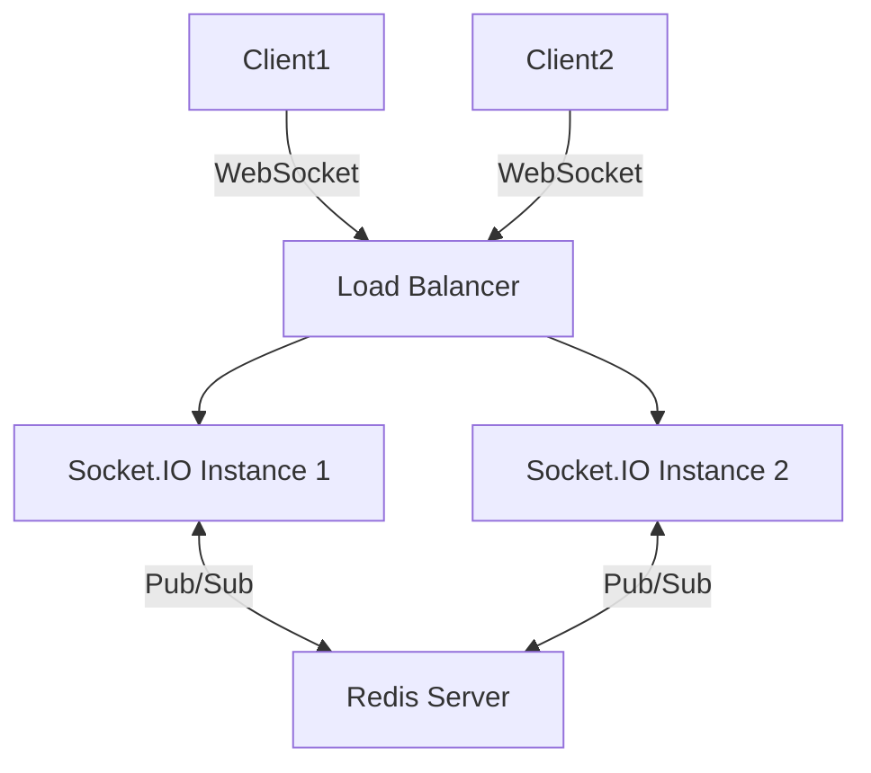

# Configuration de Redis comme adaptateur Socket.IO pour synchroniser les événements entre instances

## 1. Contexte et besoin

Dans une architecture temps réel à multiples instances Socket.IO, chaque serveur conserve localement l’état des clients connectés. Pour assurer la cohérence des événements (notamment les broadcasts, messages privés, ou rooms) à travers toutes les instances, il est indispensable de synchroniser ces messages.

Redis, via son mécanisme **Pub/Sub**, joue le rôle d’adaptateur central. Socket.IO fournit un package officiel `@socket.io/redis-adapter` pour exploiter ce canal de communication.

---

## 2. Pourquoi Redis en tant qu’adaptateur Socket.IO ?

- **Communication inter-instances** : Redis distribue les messages émis par une instance à toutes les autres.
- **Fiabilité** : Redis est performant et éprouvé, capable de gérer de fortes charges.
- **Évolutivité horizontale** : facilite l’ajout ou retrait d’instances sans perdre la synchronisation.
- **Support natif par Socket.IO** assurant une intégration transparente.

---

## 3. Mise en œuvre : Étapes clés

### a) Installer les dépendances

```bash
npm install socket.io redis @socket.io/redis-adapter
```

### b) Configurer Redis clients

Socket.IO requiert deux clients Redis : un pour publier (`pubClient`) et un autre pour souscrire (`subClient`).

```javascript
const { createClient } = require('redis');

const pubClient = createClient({ url: 'redis://localhost:6379' });
const subClient = pubClient.duplicate();

await Promise.all([pubClient.connect(), subClient.connect()]);
```

### c) Intégrer le RedisAdapter dans Socket.IO

```javascript
const { Server } = require('socket.io');
const { createAdapter } = require('@socket.io/redis-adapter');

const io = new Server(httpServer);

io.adapter(createAdapter(pubClient, subClient));
```

### d) Utilisation classique de Socket.IO

Les appels à `io.emit()`, `socket.broadcast.emit()`, ou aux rooms fonctionnent alors à travers toutes les instances automatiquement.

---

## 4. Exemple complet basique

```javascript
const http = require('http');
const { Server } = require('socket.io');
const { createClient } = require('redis');
const { createAdapter } = require('@socket.io/redis-adapter');

async function setup() {
  const httpServer = http.createServer();
  const io = new Server(httpServer);

  const pubClient = createClient({ url: 'redis://localhost:6379' });
  const subClient = pubClient.duplicate();

  await Promise.all([pubClient.connect(), subClient.connect()]);
  io.adapter(createAdapter(pubClient, subClient));

  io.on('connection', (socket) => {
    console.log('Nouvelle connexion', socket.id);

    socket.on('message', (msg) => {
      // Broadcast l'événement sur toutes les instances
      io.emit('message', msg);
    });
  });

  httpServer.listen(3000);
  console.log('Socket.IO server started on :3000');
}

setup().catch(console.error);
```

---

## 5. Architecture visuelle avec Redis Pub/Sub



---

## 6. Recommandations pratiques

- **Connexion Redis stable** : gérer la reconnexion automatique en cas de défaillance.
- **Performance** : pour un fort trafic, bénéficie de la scalabilité Redis en cluster.
- **Sécurité** : protéger l’accès Redis (auth, firewall).
- **Surveillance** : monitorer la latence de Redis car elle impacte la synchronisation.

---

## 7. Sources

- Socket.IO Redis Adapter Official Docs – [https://socket.io/docs/v4/redis-adapter/](https://socket.io/docs/v4/redis-adapter/)  
- Redis Pub/Sub Documentation – [https://redis.io/docs/manual/pubsub/](https://redis.io/docs/manual/pubsub/)  
- ioredis Library – [https://github.com/luin/ioredis](https://github.com/luin/ioredis)  
- Node.js Redis Client – [https://github.com/redis/node-redis](https://github.com/redis/node-redis)  

---

L’utilisation de Redis comme adaptateur pour Socket.IO est une pratique standard facilitant la cohérence des événements dans une architecture scalable. Elle permet de gérer de nombreuses instances tout en maintenant une communication temps réel fluide et synchrone entre tous les clients connectés.