# Tester la diffusion de messages entre clients connectés à différentes instances de serveur Socket.IO avec Redis Pub/Sub

## 1. Contexte

Dans une architecture multi-instance Socket.IO, la diffusion des messages en temps réel doit être synchronisée pour permettre la communication entre clients connectés à différentes instances. Redis Pub/Sub, utilisé comme adaptateur par Socket.IO, assure cette synchronisation.

Tester ce mécanisme garantit que les messages émis sur une instance parviennent efficacement à tous les clients, qu’ils soient connectés sur la même ou une autre instance.

---

## 2. Objectif du test

- Vérifier que deux clients connectés à des instances distinctes reçoivent bien les messages échangés.
- S’assurer que la configuration Redis Pub/Sub fonctionne correctement pour la propagation des événements.
- Valider la cohérence du broadcast sur toute la grille d’instances.

---

## 3. Mise en place rapide du test

Supposons deux instances Socket.IO fonctionnant sur deux ports distincts (3000 et 3001), utilisant le même serveur Redis en adaptateur.

### a) Code commun minimal de serveur

```javascript
const http = require('http');
const { Server } = require('socket.io');
const { createClient } = require('redis');
const { createAdapter } = require('@socket.io/redis-adapter');

async function createSocketServer(port) {
  const httpServer = http.createServer();
  const io = new Server(httpServer);

  const pubClient = createClient({ url: 'redis://localhost:6379' });
  const subClient = pubClient.duplicate();

  await Promise.all([pubClient.connect(), subClient.connect()]);
  io.adapter(createAdapter(pubClient, subClient));

  io.on('connection', (socket) => {
    console.log(`Client connecté à l'instance sur le port ${port} - socket id: ${socket.id}`);

    socket.on('message', (msg) => {
      console.log(`Message reçu sur instance ${port}:`, msg);
      io.emit('message', msg); // broadcast via Redis adapter
    });
  });

  httpServer.listen(port, () => {
    console.log(`Socket.IO server running on port ${port}`);
  });
}

createSocketServer(3000);
createSocketServer(3001);
```

---

### b) Client de test simple (exemple avec HTML/JS)

```html
<!DOCTYPE html>
<html>
<head>
  <title>Socket.IO Multi-instance Test</title>
  <script src="https://cdn.socket.io/4.5.4/socket.io.min.js"></script>
</head>
<body>
  <h2>Test Client Socket.IO</h2>
  <input id="msgInput" placeholder="Entrez un message" />
  <button onclick="sendMessage()">Envoyer</button>
  <ul id="messages"></ul>

  <script>
    // Se connecter à instance choisie (changez le port 3000 ou 3001)
    const socket = io('http://localhost:3000');

    socket.on('connect', () => {
      console.log('Connecté avec ID:', socket.id);
    });

    socket.on('message', (msg) => {
      const li = document.createElement('li');
      li.textContent = msg;
      document.getElementById('messages').appendChild(li);
    });

    function sendMessage() {
      const msg = document.getElementById('msgInput').value;
      socket.emit('message', msg);
      document.getElementById('msgInput').value = '';
    }
  </script>
</body>
</html>
```

---

## 4. Tester la communication cross-instance

1. Ouvrir simultanément deux navigateurs ou onglets, chacun connecté à une instance différente (exemple : l’un sur `http://localhost:3000` l’autre sur `http://localhost:3001`).
2. Envoyer un message dans l’un des clients.
3. Observer la réception instantanée du message sur l’autre client, preuve de la bonne diffusion via Redis Pub/Sub.

---

## 5. Diagramme Mermaid exposant la communication

```mermaid
flowchart LR
    ClientA[Client sur Instance 3000] -->|WS| InstanceA[Socket.IO Instance 3000]
    ClientB[Client sur Instance 3001] -->|WS| InstanceB[Socket.IO Instance 3001]

    InstanceA <-- Pub/Sub --> Redis[Redis Server]
    InstanceB <-- Pub/Sub --> Redis

    Redis -->|Diffuse les événements| InstanceA
    Redis -->|Diffuse les événements| InstanceB

    InstanceA -->|Emit message| ClientA
    InstanceB -->|Emit message| ClientB
```



---

## 6. Points de vigilance

- **Consolidation Redis** : assurez-vous que Redis est correctement configuré et que l’adaptateur se connecte sans erreur.
- **Latence potentielle** : en fonction de la charge, les délais entre émission et réception peuvent varier, à surveiller.
- **Gestion des erreurs** : implémentez des mécanismes pour gérer la reconnexion automatique des clients et la perte de lien avec Redis.

---

## 7. Sources

- Socket.IO Redis Adapter Documentation – [https://socket.io/docs/v4/redis-adapter/](https://socket.io/docs/v4/redis-adapter/)  
- Redis Pub/Sub official docs – [https://redis.io/docs/manual/pubsub/](https://redis.io/docs/manual/pubsub/)  
- Tutoriel Socket.IO scaling – [https://socket.io/docs/v4/scaling/](https://socket.io/docs/v4/scaling/)

---

Tester la diffusion de messages entre clients attachés à différentes instances Socket.IO via Redis Pub/Sub confirme la robustesse et la cohérence d’une architecture capable de gérer la scalabilité tout en conservant la fluidité des échanges temps réel.