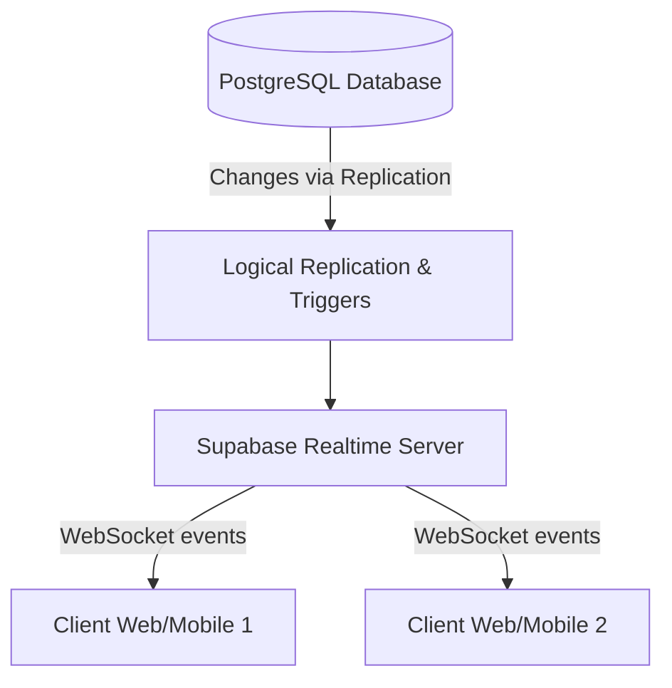
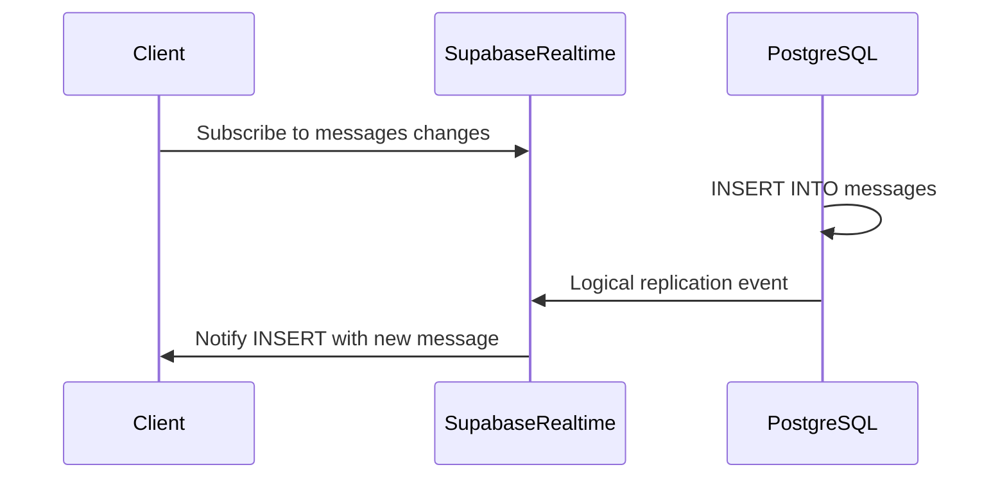

# Supabase Realtime : PostgreSQL en temps réel et écoute des changements

## 1. Présentation de Supabase Realtime

Supabase est une plateforme open source qui propose des services backend managés et une interface pour bases de données PostgreSQL. Son module **Realtime** offre une fonctionnalité clé : la capacité d'écouter en temps réel les changements dans une base PostgreSQL, et de diffuser ces événements aux clients abonnés.

Cette approche combine la robustesse de PostgreSQL avec des mécanismes de notifications en temps réel, directement utilisables dans des applications web et mobiles, évitant la gestion complexe de polling ou autres techniques classiques.

---

## 2. Fonctionnement de Supabase Realtime

Supabase exploite **PostgreSQL Logical Replication** et les **triggers** pour détecter les changements (INSERT, UPDATE, DELETE) sur des tables spécifiques.

Le serveur Realtime capte ces changements et les relaie via un canal WebSocket vers les clients abonnés aux événements.

### Architecture simplifiée



---

## 3. Cas d’usage : écoute en temps réel d’une table

Supposons une table `messages` :

```sql
CREATE TABLE messages (
  id SERIAL PRIMARY KEY,
  sender VARCHAR NOT NULL,
  content TEXT NOT NULL,
  inserted_at TIMESTAMPTZ DEFAULT NOW()
);
```

Pour recevoir les changements sur `messages`, vous pouvez utiliser la bibliothèque Supabase client en JavaScript.

---

## 4. Exemple d’écoute en temps réel avec Supabase JS SDK

```javascript
import { createClient } from '@supabase/supabase-js';

const supabaseUrl = 'https://votre-instance.supabase.co';
const supabaseKey = 'clé-publique-anonyme-ou-service-role';
const supabase = createClient(supabaseUrl, supabaseKey);

const subscription = supabase
  .channel('public:messages') // Canaux = schema:table
  .on(
    'postgres_changes',
    { event: '*', schema: 'public', table: 'messages' },
    payload => {
      console.log('Changement détecté:', payload);
      if (payload.eventType === 'INSERT') {
        console.log('Nouveau message:', payload.new);
      }
    }
  )
  .subscribe();
```

Le client s’abonne à tous les événements (INSERT, UPDATE, DELETE) sur la table `messages` et reçoit un objet `payload` détaillant le type d’événement et les données associées.

---

## 5. Avantages et caractéristiques

| Caractéristique               | Description                                               |
|------------------------------|-----------------------------------------------------------|
| **Intégration native avec PostgreSQL** | Pas besoin d’architectures externes pour la synchro.      |
| **Multiples types d’événements**       | Support INSERT, UPDATE, DELETE.                          |
| **Scalabilité**                          | Basée sur PostgreSQL et infrastructure Supabase.        |
| **Simplicité d’utilisation**            | API simple via SDK client.                               |
| **Channels personnalisés**               | Gestion fine des abonnements via les channels (schema:table).|
| **Open Source**                        | Possibilité d’auto-héberger ou de modifier le serveur Realtime. |

---

## 6. Cas pratique : notification de nouveaux messages dans un chat

- La table `messages` stocke les messages.
- Chaque client s’abonne à la table `messages`.
- Enregistrement d’un nouveau message déclenche l’envoi en temps réel aux abonnés.
- Le client peut afficher immédiatement le message reçu dans l’interface.

---

## 7. Diagramme d’interaction client-serveur



---

## 8. Sécurité et contrôle d’accès

Les abonnements Realtime respectent les politiques de sécurité PostgreSQL (RLS - Row Level Security).

Il est possible de définir des règles précises pour limiter les données reçues par chaque client en fonction de leur identité ou rôle.

---

## 9. Sources principales

- Supabase Realtime documentation – [https://supabase.com/docs/guides/realtime](https://supabase.com/docs/guides/realtime)  
- Supabase JS Library – [https://supabase.com/docs/reference/javascript/realtime-subscriptions](https://supabase.com/docs/reference/javascript/realtime-subscriptions)  
- PostgreSQL Logical Replication – [https://www.postgresql.org/docs/current/logical-replication.html](https://www.postgresql.org/docs/current/logical-replication.html)  

---

La technologie Supabase Realtime apporte une puissance unique : tirer parti d’une base relationnelle classique (PostgreSQL) enrichie d’une diffusion d’événements temps réel native, simplifiant le développement d’applications collaboratives, interactives et réactives dans un environnement familier et sécurisé.