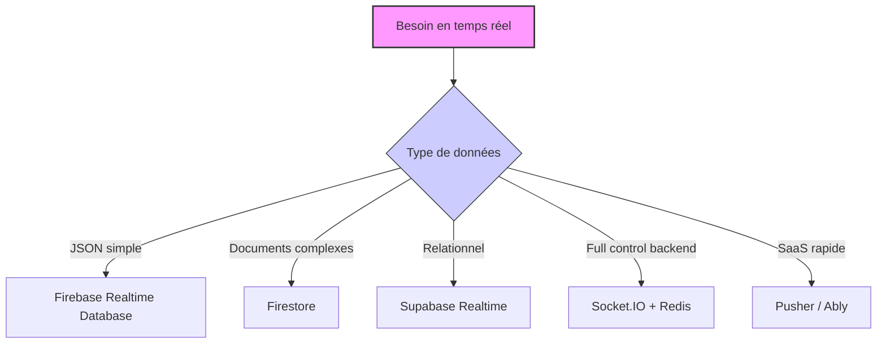

# Comparaison et cas d'usage des principales plateformes temps réel managées

## 1. Introduction

Les services temps réel managés simplifient la création d’applications collaboratives, interactives et scalables, en déléguant la gestion de l’infrastructure, de la synchronisation et de la scalabilité. Parmi les plateformes les plus utilisées figurent **Firebase Realtime Database & Firestore**, **Supabase Realtime**, **Socket.IO avec Redis Adapter** et d'autres solutions commerciales comme **Pusher** ou **Ably**.

Cet article compare ces plateformes sur leurs caractéristiques clés et propose des cas d’usage adaptés à chacune.

---

## 2. Tableau comparatif synthétique

| Plateforme                  | Type de données            | Scalabilité     | Modèle temps réel          | Sécurité & règles                  | Open Source   | Modèle de facturation          |
|----------------------------|----------------------------|-----------------|----------------------------|----------------------------------|--------------|-------------------------------|
| **Firebase Realtime Database** | JSON arborescent           | Verticale       | Synchronisation sur nœuds JSON | Règles de sécurité Firebase       | Non          | Volume données + connexions   |
| **Firestore (Firebase)**      | Documents & collections     | Horizontale     | Listeners basés sur documents | Règles avancées Firestore         | Non          | Opérations + stockage         |
| **Supabase Realtime**        | PostgreSQL relationnel      | Horizontale     | Replication log et triggers | RLS PostgreSQL                    | Oui          | Usage cloud / auto-hébergement|
| **Socket.IO + Redis Adapter**| Messages WebSocket           | Horizontale     | Events WebSocket broadcast   | Contrôle via serveur backend      | Oui          | Infrastructure propre         |
| **Pusher**                   | Events WebSocket (pub/sub)  | Horizontale     | Gestion multi-canaux         | Règles d’authentification         | Non          | Messages + connexions         |
| **Ably**                    | Events WebSocket & MQTT      | Horizontale     | Pub/Sub rapide, persistance | Contrôle d’accès avancé            | Non          | Messages + stockage           |

---

## 3. Cas d’usage et recommandations

### 3.1 Applications avec données JSON simples et collaboration basique

**Firebase Realtime Database** est adapté aux applications nécessitant une synchronisation immédiate de structures JSON peu complexes, comme un chat simple ou un tableau de bord collaboratif.

### 3.2 Applications évoluées avec besoin de requêtes complexes

**Firestore** est préférable lorsque le modèle de données dépasse un simple arbre, nécessitant nombreuses collections, requêtes multi-critères, et évolutivité importante, par ex. apps de gestion des tâches, e-commerce.

### 3.3 Applications relationnelles avec besoin de temps réel

**Supabase Realtime** tire parti de PostgreSQL, offrant une expérience temps réel tout en conservant toutes les puissantes capacités relationnelles. Utilisé pour des applications métiers, SaaS avec logique complexe et besoin de contrôle fin.

### 3.4 Applications nécessitant un contrôle total sur le backend

**Socket.IO avec Redis Adapter** est privilégié lorsque le développeur souhaite un contrôle robuste de la couche serveur avec un protocole WebSocket et la flexibilité d’implémentations custom, souvent pour jeux en ligne, systèmes temps réel très sophistiqués.

### 3.5 Solutions SaaS prêtes à l’emploi pour intégration rapide

**Pusher** ou **Ably** fournissent des APIs simples, des dashboards, des possibilités de scaling automatiques, idéaux pour prototypes rapides ou applications mobiles nécessitant la diffusion d'événements instantanée.

---

## 4. Exemple d’implémentation simple et typique

### Firestore écoute temps réel (JS) :

```javascript
import { getFirestore, collection, onSnapshot } from 'firebase/firestore';

const db = getFirestore();

const unsubscribe = onSnapshot(collection(db, "tasks"), (snapshot) => {
  snapshot.docChanges().forEach(change => {
    if(change.type === "added"){
      console.log("Nouvelle tâche : ", change.doc.data());
    }
  });
});
```

### Supabase Realtime abonnement :

```javascript
const { createClient } = require('@supabase/supabase-js');

const supabase = createClient('https://xyz.supabase.co', 'public-api-key');

supabase.channel('public:messages')
  .on('postgres_changes', { event: '*', schema: 'public', table: 'messages' }, (payload) => {
    console.log('Changement:', payload);
  })
  .subscribe();
```

---

## 5. Diagramme Mermaid synthétisant le choix selon le type d’usage



---

## 6. Sources

- Documentation Firebase Realtime Database : [https://firebase.google.com/docs/database](https://firebase.google.com/docs/database)  
- Documentation Firestore : [https://firebase.google.com/docs/firestore](https://firebase.google.com/docs/firestore)  
- Supabase Realtime docs : [https://supabase.com/docs/guides/realtime](https://supabase.com/docs/guides/realtime)  
- Socket.IO scaling guide : [https://socket.io/docs/v4/scaling/](https://socket.io/docs/v4/scaling/)  
- Pusher docs : [https://pusher.com/docs](https://pusher.com/docs)  
- Ably docs : [https://www.ably.io/documentation](https://www.ably.io/documentation)  

---

Les plateformes temps réel managées se déclinent selon les besoins fonctionnels, le modèle de données, le contrôle attendu et le budget. Bien choisir sa solution repose sur la compréhension des forces respectives de chaque système et l’adaptation à la nature de l’application à développer.