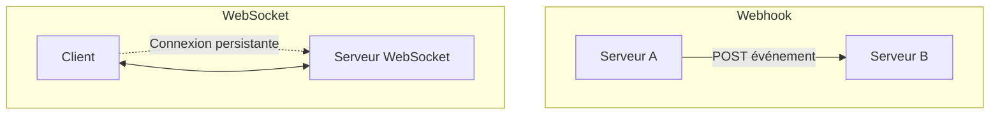

# Webhooks vs. WebSockets : quand utiliser quoi ?

## 1. Introduction

Les applications modernes rendent souvent nécessaire une communication en temps réel ou quasi temps réel entre serveurs et clients. Deux des solutions souvent proposées sont **les Webhooks** et **les WebSockets**. Comprendre leurs différences, avantages, limites et cas d’usage est primordial pour concevoir des architectures réactives et efficaces.

---

## 2. Définitions générales

- **Webhooks** : mécanisme d’**appel HTTP** (POST en général) initié par un serveur A vers un serveur B au survenue d’un événement spécifique. Le serveur B expose une URL (endpoint) pour recevoir ces notifications.  
- **WebSockets** : protocole réseau full-duplex permettant une connexion persistante et bidirectionnelle entre client et serveur via une connexion TCP initialisée par un handshake HTTP.

---

## 3. Différences clés

| Critère                | Webhooks                                          | WebSockets                                    |
|------------------------|--------------------------------------------------|-----------------------------------------------|
| **Mode de communication** | Push unidirectionnel (serveur → serveur/client) | Connexion persistante bidirectionnelle         |
| **Protocole sous-jacent** | HTTP                                            | TCP via protocole WebSocket (upgrade HTTP)     |
| **Gestion des connexions** | Pas de connexion persistante                   | Connexion persistante ouverte                   |
| **Latence**              | Variable (dépend de la réception HTTP)          | Très faible, quasi temps réel                    |
| **Déclenchement**        | Evénement serveur uniquement                     | Evénement client ou serveur                      |
| **Besoin de state sur client** | Aucun, simple écoute HTTP                    | Etat maintenu côté client et serveur            |
| **Complexité d’implémentation** | Simple (serveur HTTP reçoit les appels)     | Plus complexe (gestion état, reconnects etc.)  |

---

## 4. Cas d’usage typiques

### 4.1 Webhooks

- Notifications entre serveurs différents (exemples : paiement Stripe, CI/CD, notifications Github)
- Intégration d’événements dans des systèmes tiers
- Systèmes ne nécessitant pas de communication bidirectionnelle en continu
- Cas où les actions suivent un événement ponctuel (ex: webhook Stripe déclenché après un paiement)

### 4.2 WebSockets

- Applications interactives temps réel : chat, jeux en ligne, collaboration multi-utilisateurs
- Mise à jour instantanée des interfaces utilisateurs (ex : tableaux de bord, trading en temps réel)
- Communication bidirectionnelle à faible latence entre client et serveur
- Scénarios où le serveur peut initié des messages proactifs (push)

---

## 5. Exemple d’utilisation

### 5.1 Exemple webhook (serveur recevant paiement Stripe)

```javascript
const express = require('express');
const bodyParser = require('body-parser');

const app = express();
app.use(bodyParser.json());

app.post('/webhook-stripe', (req, res) => {
  const event = req.body;
  if(event.type === 'payment_intent.succeeded'){
    console.log('Paiement réussi:', event.data.object);
    // Traiter le paiement
  }
  res.status(200).send('OK');
});

app.listen(3000);
```

---

### 5.2 Exemple WebSocket (chat simple avec Socket.IO)

```javascript
const http = require('http');
const { Server } = require('socket.io');

const server = http.createServer();
const io = new Server(server);

io.on('connection', (socket) => {
  console.log('Client connecté:', socket.id);

  socket.on('message', (msg) => {
    // Broadcast message à tous les clients
    io.emit('message', msg);
  });

  socket.on('disconnect', () => {
    console.log('Client déconnecté:', socket.id);
  });
});

server.listen(3000);
```

---

## 6. Diagramme Mermaid : Architecture simplifiée



---

## 7. En résumé, que choisir ?

| Contexte                            | Recommandation    |
|-----------------------------------|-------------------|
| Notification ponctuelle entre serveurs | Webhooks          |
| Communication temps réel bidirectionnelle | WebSockets        |
| Simplicité d’implémentation      | Webhooks          |
| Interaction utilisateur en temps continu | WebSockets        |
| Système ressource-limitée (ex : IoT) | Webhooks ou protocoles légers type MQTT |

---

## 8. Sources

- MDN WebDocs – WebSocket API – [https://developer.mozilla.org/en-US/docs/Web/API/WebSockets_API](https://developer.mozilla.org/en-US/docs/Web/API/WebSockets_API)  
- Stripe Docs – Webhooks – [https://stripe.com/docs/webhooks](https://stripe.com/docs/webhooks)  
- Socket.IO Docs – [https://socket.io/docs/](https://socket.io/docs/)  
- Salesforce Blog – Webhooks vs WebSockets Explained – [https://developer.salesforce.com/blogs/2021/04/webhooks-vs-websockets](https://developer.salesforce.com/blogs/2021/04/webhooks-vs-websockets)  

---

Les webhooks et les WebSockets offrent des moyens complémentaires pour gérer la diffusion d’informations en temps réel. Le choix dépend principalement du besoin fonctionnel : notifications événementielles ou interactions continues et bidirectionnelles. Comprendre leurs forces permet d’architecturer des systèmes réactifs, efficaces et adaptés aux cas d’usage.