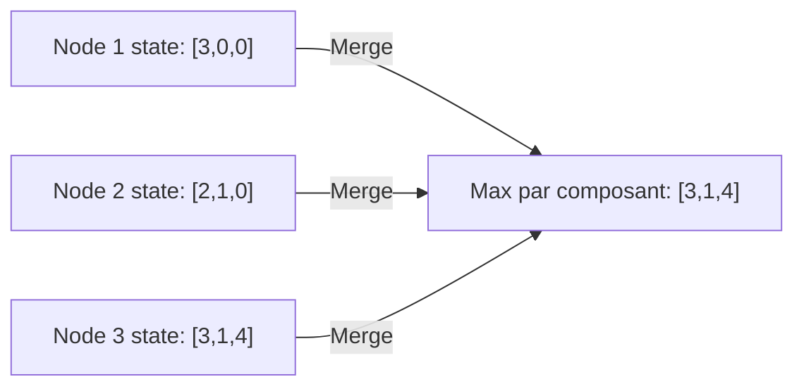
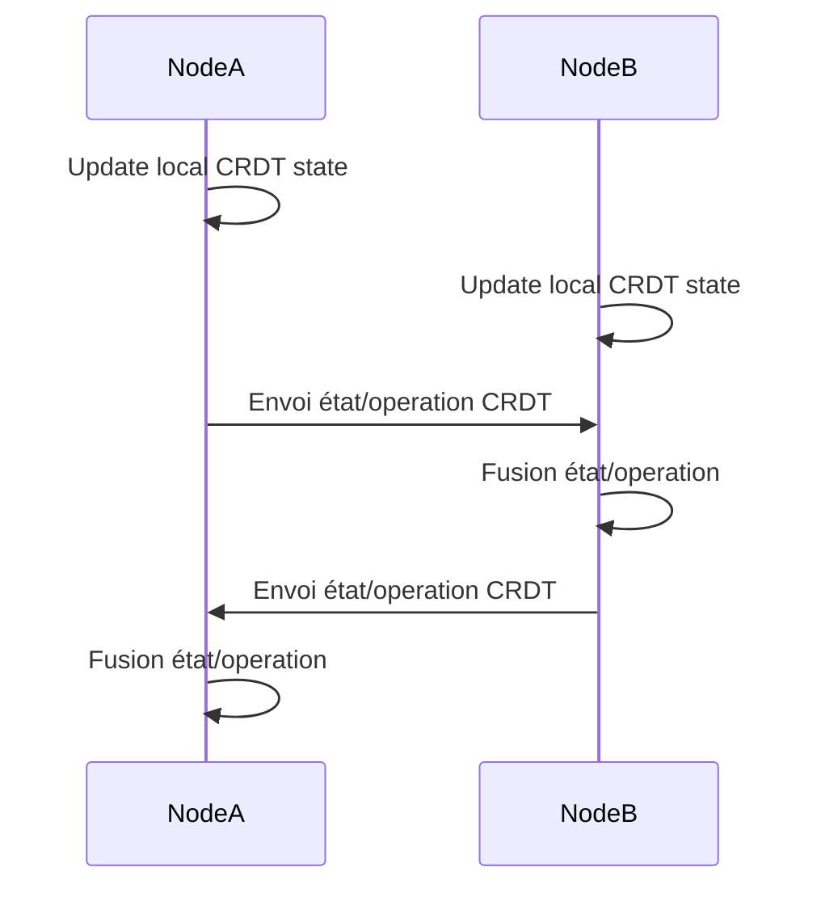

# Introduction aux CRDTs (Conflict-free Replicated Data Types) pour la collaboration

## 1. Qu'est-ce qu'un CRDT ?

Les CRDTs (Conflict-free Replicated Data Types) sont des structures de données conçues pour gérer la **réplication distribuée** sans conflits, même en cas de modifications concurrentes hors ligne. Elles garantissent que toutes les copies des données convergent naturellement vers un même état final, sans nécessiter d'arbitrage centralisé.

À l’origine, ce concept répond aux défis inhérents à la collaboration en temps réel sur des systèmes hautement distribués où les partitions réseau, latences et modifications concurrentes sont monnaie courante.

---

## 2. Principes fondamentaux des CRDTs

- **Déterminisme et convergence** : chaque modification locale se propage et les états finaux convergent quels que soient l’ordre et le délai de réception des opérations.
- **Commutativité** : les opérations sont conçues pour être **commutatives**, ce qui permet leur ré-ordonnancement sans incohérence.
- **Autonomie locale** : les noeuds peuvent opérer sans attendre une validation globale.
- **Tolérance aux partitions réseau** : les mises à jour se synchronisent dès que la connectivité est rétablie.

---

## 3. Catégories de CRDTs

**1. Opérationnels (Op-based CRDTs)** :  
Les modifications sont diffusées sous forme d’opérations, garantissant certaines propriétés (idempotence, commutativité).

**2. État (State-based CRDTs)** :  
Chaque instance partage son état complet périodiquement. Une fonction de fusion (merge) combine ces états pour une convergence.

---

## 4. Exemples de CRDTs courants

| Type                      | Description                                                  | Exemple d’usage                      |
|---------------------------|--------------------------------------------------------------|------------------------------------|
| **G-Counter**              | Compteur incrémental qui ne peut que croître                 | Nombre de "likes" dans la collaboration |
| **PN-Counter**             | Compteur qui peut s’incrémenter et se décrémenter            | Gestion de stocks distribués       |
| **G-Set**                  | Ensemble avec ajout uniquement                               | Liste d’utilisateurs connectés     |
| **2P-Set**                 | Ensemble avec ajout et suppression                           | Gestion d’inclusions/exclusions    |
| **LWW-Register (Last-Write-Wins)** | Enregistrement avec résolution selon plus récente mise à jour | Champs de documents modifiables    |
| **RGA (Replicated Growable Array)** | Tableau ou liste ordonnée supportant insertions et suppressions | Editeurs collaboratifs type texte  |

---

## 5. Exemple simplifié : un compteur G-Counter (state-based)

Chaque noeud garde un vecteur d’incréments, fusionnés par l’élément maximal :

La valeur du compteur est la somme des éléments du vecteur fusionné (ici 3+1+4=8).

---

## 6. Application des CRDTs en collaboration temps réel

- **Editeurs de texte collaboratifs** (type Google Docs, Code Together) : Maintien de documents éditables en parallèle par plusieurs utilisateurs.
- **Applications multifuturs** : synchronisation de listes de tâches, gestion d’états partagés.
- **Systèmes distribués** : bases de données répliquées, caches distribués avec tolérance réseau.

---

## 7. Avantages liés aux CRDTs

- **Pas de conflits manuels** : les conflits sont automatiquement réglés par conception.
- **Robustesse au partitionnement** : les nœuds peuvent continuer de fonctionner indépendamment.
- **Scalabilité** : absence de coordination centralisée pour résoudre les conflits.
- **Compatibilité avec les architectures offline-first** : modifications locales persistantes puis synchronisation différée.

---

## 8. Limites

- Complexité accrue dans certains cas, notamment sur les structures sophistiquées  
- Taille des données synchronisées (ex. dans les state-based CRDTs) peut croître sans contrôle  
- Nécessite une compréhension fine pour implémenter efficacement

---

## 9. Diagramme Mermaid : interaction basique entre deux nœuds

---

## 10. Ressources pour approfondir

- Article fondateur de Shapiro et al. sur les CRDTs (2011) : [https://hal.inria.fr/inria-00555588/document](https://hal.inria.fr/inria-00555588/document)  
- Guide pratique CRDTs par Martin Kleppmann : [https://martin.kleppmann.com/papers/2017-apache-crdt.pdf](https://martin.kleppmann.com/papers/2017-apache-crdt.pdf)  
- Automerge (bibliothèque JavaScript de CRDTs) : [https://github.com/automerge/automerge](https://github.com/automerge/automerge)  
- Article explicatif sur les CRDTs – O'Reilly : [https://www.oreilly.com/library/view/designing-data-intensive-applications/9781491903063/ch04.html](https://www.oreilly.com/library/view/designing-data-intensive-applications/9781491903063/ch04.html)

---

Les CRDTs représentent un paradigme puissant pour la collaboration distribuée et asynchrone, permettant de concilier performance, fiabilité et simplicité d’usage en évitant la complexité des conflits manuels. Leur adoption facilite la création d’applications collaboratives dynamiques, cohérentes et tolérantes aux défaillances réseau.