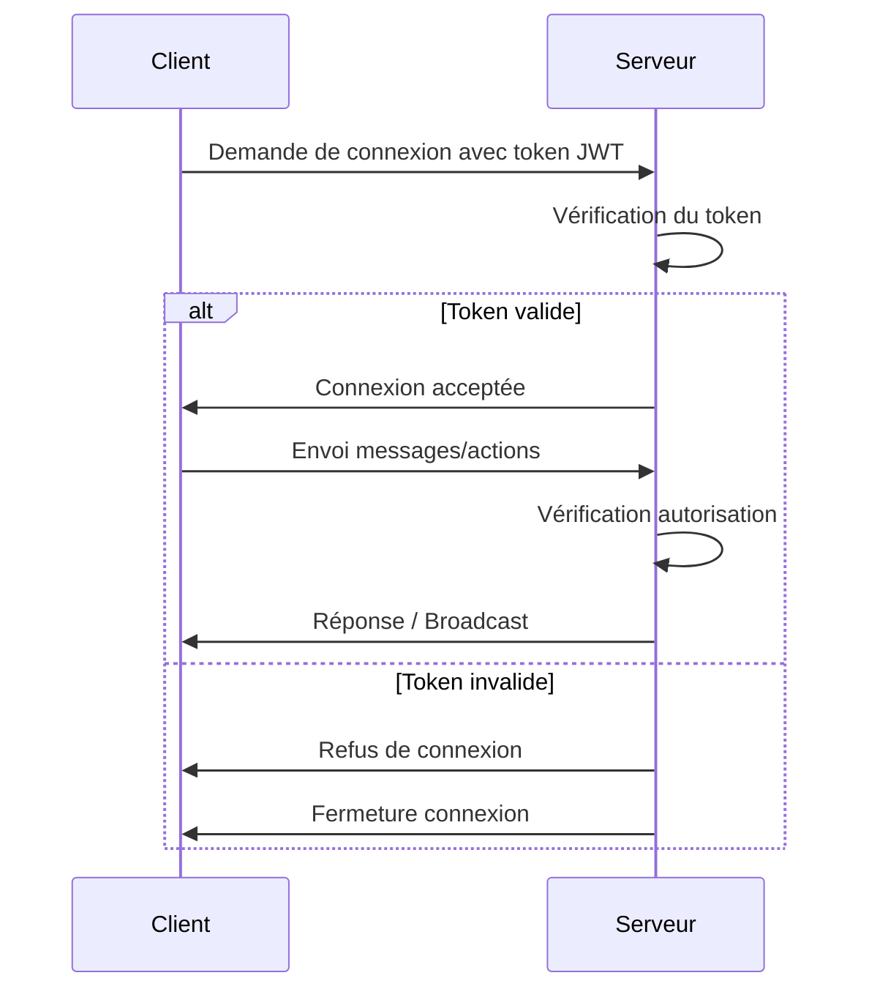

# Sécurité des applications temps réel : authentification, autorisation, DDoS, chiffrement

## 1. Introduction

Les applications temps réel (chat, collaboration, jeux, IoT) exposent des vecteurs d’attaque spécifiques liés à la nature persistante et bidirectionnelle des connexions. Assurer la confidentialité, l’intégrité et la disponibilité est fondamental pour la confiance utilisateur et la robustesse.

Cet article décrit les bonnes pratiques de sécurité essentielles : authentification, autorisation, prévention des attaques DDoS, et chiffrement.

---

## 2. Authentification : garantir l’identité des utilisateurs

### 2.1 Principes

L’authentification confirme l’identité d’un utilisateur ou d’un client. En temps réel, elle est souvent nécessaire dès l’établissement de la connexion (ex: WebSocket, MQTT).

### 2.2 Méthodes courantes

- **Token JWT (JSON Web Token)** : jeton compact, transporté lors du handshake initial ou dans chaque message, incluant des claims (informations sur l’utilisateur).
- **OAuth 2.0 / OpenID Connect** : standardisé pour déléguer l’authentification via des fournisseurs (Google, Facebook).
- **API keys** : souvent pour services serveur à serveur.

### 2.3 Exemple d’intégration JWT sur WebSocket (Node.js)

```javascript
const WebSocket = require('ws');
const jwt = require('jsonwebtoken');

const wss = new WebSocket.Server({ port: 8080 });

wss.on('connection', function connection(ws, req) {
  const token = req.url.split('token=')[1];
  try {
    const user = jwt.verify(token, 'secret_key');
    ws.user = user;
    ws.send('Authentifié');
  } catch (e) {
    ws.close(1008, 'Authentification échouée');
  }
});
```

---

## 3. Autorisation : contrôler l’accès aux ressources et actions

### 3.1 Définition

L’autorisation détermine ce qu’un utilisateur authentifié peut faire ou voir.

### 3.2 Modèles classiques adaptés au temps réel

- **Règles d’accès basées sur les rôles (RBAC)** : permissions par rôle utilisateur.
- **Contrôle en fonction du contexte** : ex. n’accepter que les modifications sur les données appartenant à l’utilisateur.
- **Règles fines côté serveur** ou middleware : filtre des messages entrants, validation.

### 3.3 Exemple simple avec Socket.IO middleware

```javascript
io.use((socket, next) => {
  const token = socket.handshake.auth.token;
  try {
    const user = jwt.verify(token, 'secret_key');
    socket.user = user;
    return next();
  } catch {
    return next(new Error('Authentification échouée'));
  }
});

io.on('connection', (socket) => {
  // Autorisation avant traitement des événements
  if (socket.user.role !== 'admin') {
    socket.disconnect();
  }
});
```

---

## 4. Prévention des attaques DDoS (Distributed Denial of Service)

### 4.1 Contexte

Les connexions persistantes, fréquentes et maintenues (ex : WebSockets) peuvent être la cible d’attaques DDoS visant à saturer serveurs et réseau.

### 4.2 Stratégies clés

- **Limitation du nombre de connexions / IP** : implémenter des quotas.
- **Rate limiting sur les messages** : contrôle du flux entrant pour éviter flood.
- **Timeouts et déconnexion automatique** : fermer les connexions inactives.
- **Utilisation de services de protection DDoS** comme Cloudflare, AWS Shield.
- **Isolation des ressources critiques** par authentification préalable.

### 4.3 Exemple : rate limiting avec express-rate-limit

```javascript
const rateLimit = require('express-rate-limit');

const limiter = rateLimit({
  windowMs: 1000, // 1 seconde
  max: 10, // max 10 requêtes par IP
  message: 'Trop de requêtes, veuillez patienter.'
});

app.use(limiter);
```

---

## 5. Chiffrement : assurer confidentialité et intégrité

### 5.1 Transport sécurisé (TLS/SSL)

- Les connexions WebSocket (WSS) ou HTTP doivent impérativement être chiffrées via TLS.
- Chiffrement natif indispensable pour empêcher l’interception (man-in-the-middle) et garantir la confidentialité.

### 5.2 Chiffrement au niveau applicatif

- Pour données sensibles, chiffrer avant envoi via la couche applicative (ex : messagerie sécurisée).
- Utilisation de protocoles sécurisés comme **Signal Protocol** pour messagerie de bout en bout.

---

## 6. Diagramme Mermaid : cycle d’authentification et autorisation en temps réel



---

## 7. Conclusion

La sécurité des applications temps réel requiert une approche multi-couches. L’authentification et l’autorisation assurent que seuls les utilisateurs légitimes accèdent et agissent, tandis que la prévention DDoS protège la disponibilité du service. Le chiffrement garantit la confidentialité des échanges, élément clef dans les architectures modernes.

---

## 8. Sources

- OWASP WebSocket Security – [https://cheatsheetseries.owasp.org/cheatsheets/WebSocket_Security_Cheat_Sheet.html](https://cheatsheetseries.owasp.org/cheatsheets/WebSocket_Security_Cheat_Sheet.html)  
- JWT Best Practices – [https://auth0.com/docs/security/tokens/json-web-tokens/json-web-token-best-practices](https://auth0.com/docs/security/tokens/json-web-tokens/json-web-token-best-practices)  
- NGINX Rate Limiting – [https://docs.nginx.com/nginx/admin-guide/security-controls/controlling-access-proxied-requests/](https://docs.nginx.com/nginx/admin-guide/security-controls/controlling-access-proxied-requests/)  
- OWASP Denial-of-Service – [https://owasp.org/www-community/attacks/Denial_of_Service](https://owasp.org/www-community/attacks/Denial_of_Service)  
- TLS Introduction – [https://tools.ietf.org/html/rfc5246](https://tools.ietf.org/html/rfc5246)  

---

Appliquer ces principes et mécanismes permet de construire des applications temps réel robustes, sûres, et conformes aux exigences actuelles de sécurité.