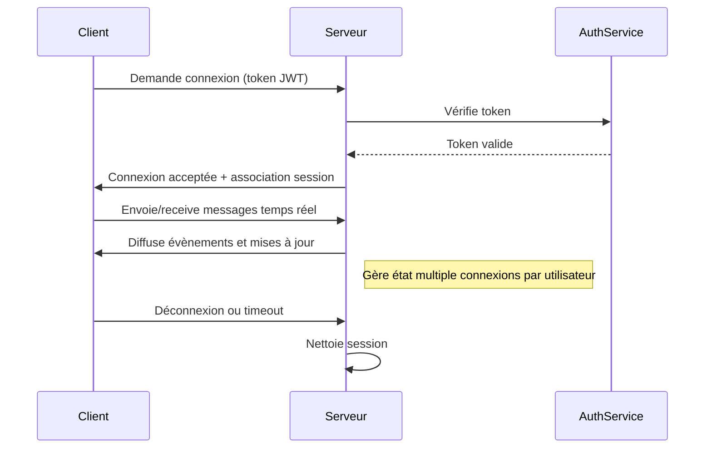

# Gestion des identités et des sessions dans un environnement temps réel

## 1. Introduction

Dans les applications temps réel, les utilisateurs interagissent souvent via des connexions persistantes (ex: WebSocket). Assurer une gestion efficace et sécurisée des identités et des sessions est indispensable pour garantir la cohérence, la sécurité et la fluidité des échanges.

Ce sujet couvre les méthodes d’authentification, la gestion des sessions et la synchronisation des états utilisateurs dans un contexte temps réel.

---

## 2. Principes clés de la gestion des identités

- **Authentification initiale** : validation des identifiants (login/mot de passe, OAuth, token JWT).
- **Gestion des tokens** : émancipation de jetons d’accès short-lived ou refresh tokens.
- **Association identité-connexion temps réel** : lier une connexion WebSocket ou session à une identité validée.
- **Validation continue** : contrôle périodique ou sur les événements des droits d’accès.
- **Provisioning/Déprovisioning dynamique** : mise à jour des accès en temps réel (ex: déconnexion forcée).

---

## 3. Gestion des sessions en temps réel

Contrairement aux connexions HTTP classiques, les sessions temps réel sont souvent persistantes et bidirectionnelles. Cela implique :

- Suivi d’état par connexion (ex: utilisateur connecté→socket id).
- Gestion des multiples connexions par utilisateur (multi-devices).
- Maintenance des données de session (permissions, préférences, contextes).
- Adaptation en cas de reconnexion ou basculement.

---

## 4. Techniques courantes d’implémentation

### 4.1 Utilisation de JSON Web Tokens (JWT)

JWT est un standard largement utilisé car il permet d’encapsuler l’identité et les claims dans un token signé (et éventuellement chiffré).

- Token transmis lors de l’initiation de la connexion (handshake WebSocket).
- Pas besoin de conserver d’état côté serveur (stateless).
- Possible revocation via liste noire ou modification du secret.

### Exemple d’authentification WebSocket avec JWT (Node.js)

```javascript
const WebSocket = require('ws');
const jwt = require('jsonwebtoken');

const wss = new WebSocket.Server({ port: 8080 });

wss.on('connection', function connection(ws, req) {
  const params = new URLSearchParams(req.url.replace('/?', ''));
  const token = params.get('token');

  try {
    const user = jwt.verify(token, 'secret_key');
    ws.user = user;
    ws.send('Connexion authentifiée');
  } catch (e) {
    ws.close(1008, 'Token invalide');
  }
});
```

### 4.2 Stockage côté serveur (stateful)

- Environnements où l’on conserve la session en mémoire (ex: Redis).
- Utile pour forcer déconnexion, gérer permissions dynamiques et suivre état précis.
- Plus consommateur en ressources, mais offre un contrôle plus fin.

---

## 5. Gestion des multiples connexions clients

Un utilisateur peut être connecté sur plusieurs appareils simultanément. Il faut :

- Maintenir un mapping utilisateur → plusieurs connexions.
- Diffuser les événements à toutes les connexions actives.
- Gérer la synchronisation des états ou messages.

---

## 6. Diagramme Mermaid : cycle de vie d’une session temps réel



---

## 7. Sécurité et bonnes pratiques

- **Expiration courte des tokens** et usage de refresh tokens pour limiter la fenêtre d’attaque.
- **Chiffrement TLS (WSS)** obligatoire pour protéger les échanges.
- **Validation côté serveur** de toutes actions, pour empêcher escalade de privilèges.
- **Reconnexion contrôlée** pour éviter surcharges ou attaques.
- **Audit et logs** pour tracer les sessions et actions critiques.

---

## 8. Sources et références

- JWT Introduction — [https://jwt.io/introduction/](https://jwt.io/introduction/)  
- WebSocket Security Cheat Sheet - OWASP — [https://cheatsheetseries.owasp.org/cheatsheets/WebSocket_Security_Cheat_Sheet.html](https://cheatsheetseries.owasp.org/cheatsheets/WebSocket_Security_Cheat_Sheet.html)  
- Real-time Session Management — Auth0 Blog [https://auth0.com/blog/angular-series-part-5/](https://auth0.com/blog/angular-series-part-5/)  
- Scaling WebSocket sessions with Redis — Socket.IO Docs [https://socket.io/docs/v4/scaling/](https://socket.io/docs/v4/scaling/)

---

Gérer les identités et les sessions dans un environnement temps réel demande de combiner authentification fiable, gestion fine des connexions multiples, et maintien de la sécurité dynamique. L’approche choisie impacte directement la robustesse, la scalabilité et la qualité de l’expérience utilisateur.