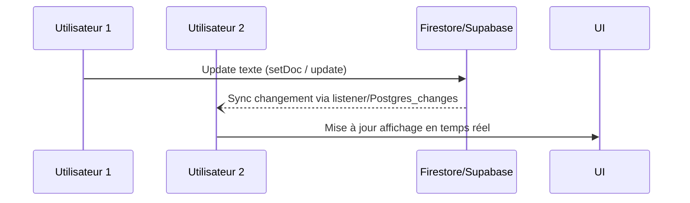

# Création d'une application collaborative simple : tableau blanc ou éditeur de texte en temps réel avec Firebase et Supabase

## 1. Introduction

Les applications de collaboration en temps réel, comme les tableaux blancs partagés ou éditeurs de texte collaboratifs, reposent sur une synchronisation instantanée entre plusieurs utilisateurs. Firebase et Supabase offrent des services managés capables de gérer cette complexité sans infrastructures lourdes.

Cet article présente un guide condensé pour créer une application collaborative simple à base de **Firebase Firestore** ou **Supabase Realtime**, en focalisant sur les mécanismes essentiels de synchronisation.

---

## 2. Architecture générale et choix technologiques

| Critère          | Firebase Firestore                      | Supabase Realtime                  |
|------------------|---------------------------------------|----------------------------------|
| Type de base     | NoSQL document-store (JSON-like)      | PostgreSQL relationnel + Realtime |
| Synchronisation  | Listeners en temps réel                | Réplication via Log PostgreSQL + WebSocket |
| Authentification | Firebase Auth                         | Supabase Auth (PostgreSQL + OAuth) |
| Gestion offline  | Support nativement                     | Gestion via Sync côté client      |

---

## 3. Cas d’usage : éditeur de texte simple

L’objectif : diffuser instantanément les modifications de texte saisies par un utilisateur vers tous les autres utilisateurs connectés.

---

## 4. Exemple minimal avec Firebase Firestore

### 4.1 Initialisation et écoute des modifications

```javascript
import { initializeApp } from 'firebase/app';
import { getFirestore, doc, onSnapshot, setDoc } from 'firebase/firestore';

const firebaseConfig = { /* configuration */ };
const app = initializeApp(firebaseConfig);
const db = getFirestore(app);

const docRef = doc(db, 'documents', 'sharedDoc');

onSnapshot(docRef, (docSnap) => {
  if(docSnap.exists()){
    const data = docSnap.data();
    console.log('Contenu reçu:', data.text);
    // Mettre à jour l'interface utilisateur
  }
});
```

### 4.2 Émission des modifications

```javascript
async function updateText(newText) {
  await setDoc(docRef, { text: newText });
}
```

---

## 5. Exemple minimal avec Supabase Realtime

### 5.1 Abonnement aux changements sur la table `documents`

```javascript
import { createClient } from '@supabase/supabase-js';

const supabase = createClient('https://xyz.supabase.co', 'public-anonymous-key');

const channel = supabase.channel('public:documents');

channel.on('postgres_changes', {
  event: '*',
  schema: 'public',
  table: 'documents'
}, (payload) => {
  console.log('Changement:', payload.new.text);
  // Mettre à jour l'interface utilisateur
}).subscribe();
```

### 5.2 Mise à jour du document

```javascript
async function updateText(id, newText) {
  const { data, error } = await supabase
    .from('documents')
    .update({ text: newText })
    .eq('id', id);
}
```

---

## 6. Gestion des conflits et performances

- Éviter les mises à jour trop fréquentes (ex: debouncing sur événements clavier).
- Pour des applications complexes, envisager les techniques comme **CRDTs** ou les **Operational Transforms** pour fusion des modifications concurrentes.
- Firebase Firestore gère certains aspects de synchronisation offline et conflits automatiquement.
- Supabase repose sur la robustesse PostgreSQL pour cohérence transactionnelle.

---

## 7. Diagramme Mermaid simplifié : synchronisation Firestore ou Supabase



---

## 8. Étapes complémentaires à envisager

- Gestion des utilisateurs (Firebase Auth, Supabase Auth).
- Stockage des métadonnées (historique, auteurs des modifications).
- Sécurisation des données via règles de sécurité Firestore / politiques PostgreSQL.
- Interface utilisateur interactive avec frameworks modernes (React, Vue).

---

## 9. Sources et documentation officielle

- Firebase Firestore Realtime Updates : [https://firebase.google.com/docs/firestore/query-data/listen](https://firebase.google.com/docs/firestore/query-data/listen)  
- Supabase Realtime : [https://supabase.com/docs/guides/realtime](https://supabase.com/docs/guides/realtime)  
- Supabase JavaScript client : [https://supabase.com/docs/reference/javascript/](https://supabase.com/docs/reference/javascript/)  
- Guide Firebase Auth : [https://firebase.google.com/docs/auth](https://firebase.google.com/docs/auth)  
- Article sur gestion des conflits temps réel : [https://martin.kleppmann.com/papers/merge-conflict/](https://martin.kleppmann.com/papers/merge-conflict/)

---

L’utilisation de Firebase ou Supabase permet de créer rapidement des applications collaboratives temps réel avec une synchronisation fluide. Bien que simples à implémenter, ces bases solides offrent un point de départ flexible vers des scénarios complexes, à mesure que les besoins évoluent.