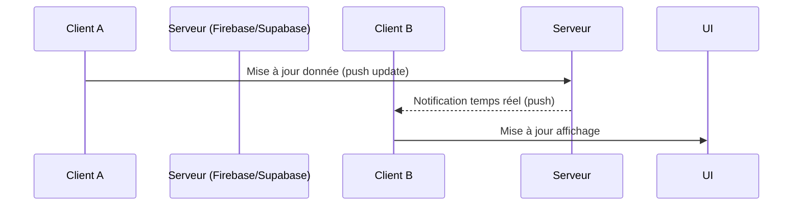

# Utilisation des fonctionnalités de synchronisation automatique de Firebase Realtime Database, Firestore et Supabase Realtime

## 1. Introduction

Les applications collaboratives modernes nécessitent une **synchronisation en temps réel** des données entre plusieurs clients. Firebase Realtime Database, Firestore et Supabase Realtime offrent des mécanismes intégrés permettant d'assurer cette synchronisation automatique avec un minimum de configuration.

Cet article détaille les concepts clés, modes d’utilisation et différences essentielles de ces services, enrichis d’exemples concrets et de diagrammes pour mieux comprendre les mécanismes.

---

## 2. Concepts de synchronisation automatique

La synchronisation automatique consiste à ce qu’une modification de données effectuée par un client soit instantanément propagée vers tous les clients abonnés à ces mêmes données, sans que ceux-ci aient besoin de recharger manuellement ou interroger le serveur.

Les trois plateformes partagent cette capacité mais reposent sur des mécanismes techniques différents :

| Service                 | Type de base       | Mode de propagation        | Gestion offline          |
|-------------------------|--------------------|----------------------------|-------------------------|
| Firebase Realtime Database | Base de données JSON (NoSQL) | WebSocket et protocole propriétaire  | Synchronisation automatique dès reconnexion |
| Firebase Firestore       | Base documentaire (NoSQL)    | Listeurs d’événements sur documents et collections | Synchronisation offline avancée avec cache local |
| Supabase Realtime        | PostgreSQL relationnelle + logique de réplication | Propagation des changements via WebSocket en SQL change feed | Support limité, dépend du client |

---

## 3. Synchronisation avec Firebase Realtime Database

### 3.1 Fonctionnement

- Données stockées sous forme d'arbre JSON.
- Les clients peuvent s’abonner à un chemin précis.
- Toute mise à jour est envoyée en temps réel aux clients abonnés.

### 3.2 Exemple d’abonnement à une donnée

```javascript
import { getDatabase, ref, onValue } from "firebase/database";

const db = getDatabase();
const messageRef = ref(db, 'chat/messages');

onValue(messageRef, (snapshot) => {
  const messages = snapshot.val();
  console.log("Nouveaux messages:", messages);
});
```

### 3.3 Mise à jour des données

```javascript
import { set } from "firebase/database";

set(ref(db, 'chat/messages/1'), {
  user: 'Alice',
  text: 'Bonjour tout le monde!'
});
```

---

## 4. Synchronisation avec Firebase Firestore

### 4.1 Fonctionnement

- Différence majeure : version plus structurée, données sous forme de documents et collections.
- Écoute en temps réel via des listeners sur documents ou collections.
- Support offline avec cache persistant.

### 4.2 Exemple d’écoute temps réel sur document Firestore

```javascript
import { getFirestore, doc, onSnapshot } from "firebase/firestore";

const db = getFirestore();
const docRef = doc(db, 'chats/chat1');

onSnapshot(docRef, (docSnap) => {
  if (docSnap.exists()) {
    console.log("Contenu chat:", docSnap.data());
  }
});
```

### 4.3 Mise à jour d’un document

```javascript
import { updateDoc } from "firebase/firestore";

await updateDoc(docRef, {
  lastMessage: "Salut à tous!"
});
```

---

## 5. Synchronisation avec Supabase Realtime

### 5.1 Fonctionnement

- Basée sur les changements de la base PostgreSQL relayés en temps réel via WebSocket.
- Permet de s’abonner à des insertions, mises à jour ou suppressions sur une table spécifique.
- Mécanisme SQL-based, puissant dans le contexte relationnel.

### 5.2 Exemple d’abonnement à la table `messages`

```javascript
import { createClient } from '@supabase/supabase-js'

const supabase = createClient('https://xxxx.supabase.co', 'public-key');

supabase.channel('public:messages')
  .on('postgres_changes', { event: '*', schema: 'public', table: 'messages' }, (payload) => {
    console.log('Changement dans messages:', payload);
  })
  .subscribe();
```

### 5.3 Mise à jour d’un enregistrement

```javascript
const { data, error } = await supabase
  .from('messages')
  .update({ text: 'Message mis à jour' })
  .eq('id', 1);
```

---

## 6. Comparatif résumé et cas d’usage

| Critère                     | Firebase Realtime Database | Firestore                  | Supabase Realtime            |
|-----------------------------|----------------------------|----------------------------|------------------------------|
| Complexité des données       | Simple (JSON tree)          | Documents structurés        | Relationnelle PostgreSQL     |
| Support offline              | Oui                         | Oui, avec cache             | Partiel, dépend du client    |
| Scalabilité                 | Excellente sur petits flux  | Plus scalable, requêtes complexes | Très scalable, mais dépend du schéma PostgreSQL  |
| Contrôle sur requêtes       | Limité                      | Avancé (requêtes complexes) | SQL complet                  |

---

## 7. Diagramme Mermaid : flux de synchronisation temps réel



---

## 8. Conseils pratiques

- **Minimiser la fréquence d’envoi** : pour réduire charge réseau et coûts.
- **Éviter conflits** : bien choisir la granularité des documents ou lignes synchronisées.
- **Faire des tests en conditions réelles** : latence réseau, concurrence utilisateur.
- **Sécuriser les accès** : règles de sécurité Firebase ou politiques RLS PostgreSQL.
- **Exploiter le cache offline** : pour offrir une expérience fluide même en cas de coupures réseau.

---

## 9. Sources et documentation officielle

- Firebase Realtime Database : [https://firebase.google.com/docs/database/web/read-and-write](https://firebase.google.com/docs/database/web/read-and-write)  
- Firebase Firestore : [https://firebase.google.com/docs/firestore/query-data/listen](https://firebase.google.com/docs/firestore/query-data/listen)  
- Supabase Realtime : [https://supabase.com/docs/guides/realtime](https://supabase.com/docs/guides/realtime)  
- Supabase JavaScript SDK : [https://supabase.com/docs/reference/javascript/](https://supabase.com/docs/reference/javascript/)  

---

Les fonctionnalités de synchronisation automatique offertes par Firebase et Supabase permettent de réduire drastiquement la complexité du développement temps réel, tout en offrant robustesse, scalabilité et flexibilité. Leur compréhension permet de concevoir des applications collaboratives réactives et performantes rapidement.