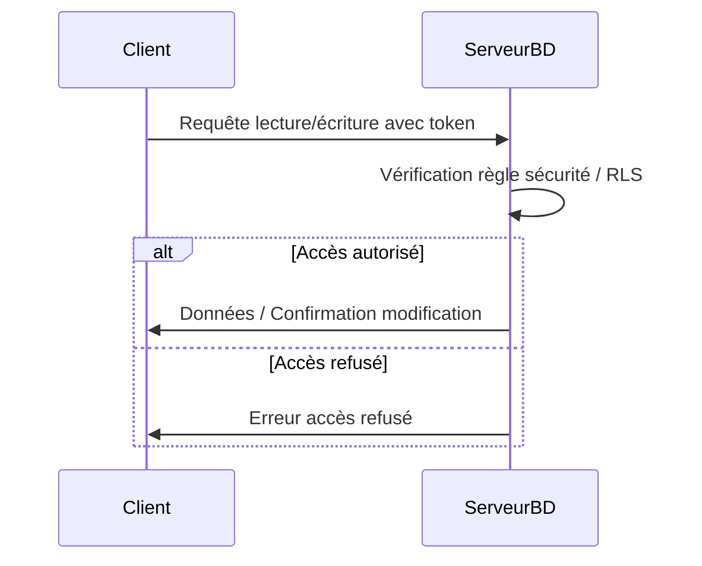

# Gestion des droits d'accès : règles de sécurité Firebase et Row Level Security (RLS) Supabase

## 1. Introduction

Dans les applications collaboratives temps réel, contrôler précisément l’accès aux données est fondamental pour garantir la confidentialité, l’intégrité et la sécurité. Deux solutions couramment utilisées dans les environnements Cloud sont les **règles de sécurité Firebase** et la **Row Level Security (RLS)** de Supabase (PostgreSQL).

Cet article décrit les principes, mécanismes et bonnes pratiques de la gestion des droits d’accès, illustrés par des exemples concrets.

---

## 2. Sécurité dans Firebase : les règles de sécurité

### 2.1 Principes

- Les règles de sécurité Firebase définissent qui peut lire ou écrire sur quelle portion de la base (Realtime Database ou Firestore).
- Elles s’appliquent côté serveur, avant chaque opération.
- Utilisation du contexte utilisateur (`auth`), des données existantes (`resource`), ou des données en entrée (`request.resource`) pour décider l’autorisation.

### 2.2 Exemple simple de règle Firestore

Autoriser uniquement un utilisateur à lire/écrire son propre document :

```firebase
service cloud.firestore {
  match /databases/{database}/documents {
    match /users/{userId} {
      allow read, write: if request.auth != null && request.auth.uid == userId;
    }
  }
}
```

### 2.3 Exemple pour un tableau blanc collaboratif

Autoriser lecture à tous, écriture uniquement aux membres du projet :

```firebase
service cloud.firestore {
  match /projects/{projectId} {
    allow read: if request.auth != null;
    allow write: if request.auth != null && exists(/databases/$(database)/documents/projects/$(projectId)/members/$(request.auth.uid));
  }
}
```

---

## 3. Row Level Security (RLS) dans Supabase / PostgreSQL

### 3.1 Principe

La RLS applique des politiques d’accès au niveau des lignes de tables SQL en fonction du contexte de l’utilisateur courant (ex : utilisateur authentifié via JWT) et des valeurs dans les lignes.

### 3.2 Activation de la RLS

```sql
ALTER TABLE documents ENABLE ROW LEVEL SECURITY;
```

### 3.3 Exemple de politique permettant à un utilisateur d’accéder uniquement à ses documents

```sql
CREATE POLICY "Accès documents utilisateur" ON documents
  FOR SELECT, UPDATE, DELETE USING (user_id = auth.uid());
```

- `auth.uid()` est une fonction intégrée à Supabase extrayant l’identifiant de l’utilisateur courant depuis le JWT.

### 3.4 RLS et requêtes en temps réel

Grâce à l’intégration avec Supabase Realtime, les notifications respectent automatiquement la RLS, garantissant un filtrage des données dès la phase de synchronisation.

---

## 4. Comparaison Firebase Règles de Sécurité et Supabase RLS

| Aspect                       | Firebase Règles de Sécurité                  | Supabase RLS (PostgreSQL)                   |
|-----------------------------|---------------------------------------------|---------------------------------------------|
| Niveau de contrôle           | Document/clé dans NoSQL Database            | Ligne dans table relationnelle              |
| Langage / Syntaxe            | DSL dédié, déclaratif                        | SQL déclaratif                              |
| Intégration avec Auth        | Utilise `request.auth`                       | Utilise `auth.uid()` via JWT                 |
| Complexité gestion politique | Moyenne, adaptée données arbitraires        | Très puissante, manipule requêtes complexes |
| Gestion temps réel           | Intégrée directement                         | Assurée via WebSocket et notifications       |

---

## 5. Exemple Mermaid : checking access policy flow



---

## 6. Bonnes pratiques pour la gestion des droits d’accès

- **Principe du moindre privilège** : autoriser le minimum nécessaire.
- **Tester et valider les règles/politiques** via outils Firebase ou requêtes SQL.
- **Versionner et documenter les règles** pour suivi et audit.
- **Utiliser les contextes utilisateurs** (uid, rôles, groupements) efficacement.
- **Combiner RLS avec Row Permission Functions** pour des règles dynamiques complexes.

---

## 7. Sources et documentation officielle

- Firebase Security Rules Documentation :  
  [https://firebase.google.com/docs/rules](https://firebase.google.com/docs/rules)  
- Firestore rules examples :  
  [https://firebase.google.com/docs/firestore/security/get-started](https://firebase.google.com/docs/firestore/security/get-started)  
- Supabase RLS Guide :  
  [https://supabase.com/docs/guides/auth/row-level-security](https://supabase.com/docs/guides/auth/row-level-security)  
- PostgreSQL RLS Documentation :  
  [https://www.postgresql.org/docs/current/ddl-rowsecurity.html](https://www.postgresql.org/docs/current/ddl-rowsecurity.html)  

---

La gestion des droits d’accès fine et performante repose sur des règles applicables directement au niveau base de données, associées à une authentification fiable. En maîtrisant Firebase Rules ou Supabase RLS, on sécurise efficacement l’accès aux données sensibles en environnement collaboratif temps réel.