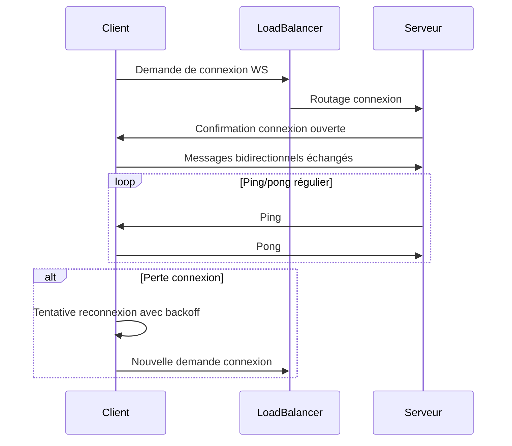

# Gestion des connexions persistantes sur des infrastructures cloud

## 1. Introduction

La gestion des connexions persistantes est un enjeu majeur pour les applications en temps réel, notamment dans des architectures cloud où les réseaux, la scalabilité, et la haute disponibilité sont complexes à maîtriser. Une connexion persistante maintient un canal de communication ouvert entre client et serveur pendant une durée prolongée, permettant des échanges bidirectionnels efficaces.

Cet article explique les défis, mécanismes et bonnes pratiques pour gérer ces connexions sur les infrastructures cloud actuelles.

---

## 2. Défis des connexions persistantes en environnement cloud

- **Scalabilité horizontale** : une connexion ouverte doit être routée vers le bon serveur ou service.
- **Load balancing** : les équilibreurs doivent supporter des protocoles persistants (ex : WebSocket).
- **Gestion des timeouts** : éviter la fermeture intempestive des connexions par firewalls ou proxy.
- **Reconnexion & tolérance à la défaillance** : assurer la reprise après coupure réseau ou bascule serveur.
- **Consommation ressources** : maintien de chaque connexion occupe de la mémoire et des threads/sockets.

---

## 3. Technologies courantes utilisées

### 3.1 Protocoles

- **WebSocket** : protocole standard permettant une communication full duplex persistante sur TCP.
- **HTTP/2 et HTTP/3 (QUIC)** : multiplexage de flux persistants sur une même connexion, réduit overhead.
- **Long Polling / Server-Sent Events** : alternatives plus simples mais moins performantes.

### 3.2 Infrastructure cloud compatible

- **Load balancers avec support WebSocket ou HTTP/2** (AWS ELB, Google Cloud Load Balancer, Azure Application Gateway).
- **Services managés** spécialisés (ex : AWS AppSync, Firebase Realtime Database).
- **Clusters avec sessions sticky (affinité)** pour maintenir la même connexion client-serveur.
- **Proxy reverse configurés pour persistance** (NGINX, Envoy).

---

## 4. Gestion des connexions persistantes : meilleures pratiques

### 4.1 Load balancing adapté

- **Support explicite des connexions persistantes** : Par exemple, ALB d’AWS supporte WebSocket nativement.
- **Sticky sessions** : maintien sur un même serveur pour éviter perte de contexte.
- Exemple configuration NGINX pour WebSocket :

```nginx
map $http_upgrade $connection_upgrade {
    default upgrade;
    ''      close;
}

server {
  listen 80;

  location /ws/ {
    proxy_pass http://backend_servers;
    proxy_http_version 1.1;
    proxy_set_header Upgrade $http_upgrade;
    proxy_set_header Connection $connection_upgrade;
    proxy_set_header Host $host;
    proxy_cache_bypass $http_upgrade;
  }
}
```

### 4.2 Gestion des timeouts et heartbeats

- Maintenir la connexion active via des **ping/pong** périodiques côté client et serveur.
- Configurer les timeouts d’inactivité du load balancer et proxies en conséquence (ex : > 60s).

### 4.3 Répartition et scalabilité

- Architecture basée sur **broker/message queue** (ex : Redis Pub/Sub, Kafka) pour synchroniser multiples serveurs.
- Services serverless ou managés offrant la scalabilité horizontale automatique (ex : Firebase, AWS AppSync).

### 4.4 Reconnexion automatique

- Implémenter une logique client robuste qui tente la reconnexion avec délais croissants (exponential backoff).
- Gestion du cache local pour reprise des états (ex : Firebase offline).

---

## 5. Exemple de gestion WebSocket simple avec reconnexion (JavaScript client)

```javascript
function connect() {
  let socket = new WebSocket("wss://example.com/ws");
  
  socket.onopen = () => console.log("Connecté");
  
  socket.onmessage = (event) => console.log("Message reçu : ", event.data);
  
  socket.onerror = (error) => console.error("Erreur WebSocket", error);
  
  socket.onclose = (event) => {
    console.log("Connexion fermée, tentative de reconnexion...");
    setTimeout(connect, 2000);  // reconnexion après 2 secondes
  };
}

connect();
```

---

## 6. Diagramme Mermaid : cycle de gestion d’une connexion persistante



---

## 7. Sources et références

- AWS Elastic Load Balancing & WebSocket support — [https://docs.aws.amazon.com/elasticloadbalancing/latest/application/load-balancer-listeners.html](https://docs.aws.amazon.com/elasticloadbalancing/latest/application/load-balancer-listeners.html)  
- NGINX WebSocket proxy — [https://www.nginx.com/blog/websocket-nginx/](https://www.nginx.com/blog/websocket-nginx/)  
- Google Cloud Load Balancer WebSocket support — [https://cloud.google.com/load-balancing/docs/https/ext-load-balancer#websockets](https://cloud.google.com/load-balancing/docs/https/ext-load-balancer#websockets)  
- Best Practices for Managing WebSocket Connections — [https://ably.com/concepts/websockets-best-practice](https://ably.com/concepts/websockets-best-practice)

---

La gestion des connexions persistantes sur le cloud nécessite un pilotage précis du transport, des équipements réseau et des stratégies client-serveur pour garantir la continuité du service, la scalabilité et la réactivité des applications temps réel.