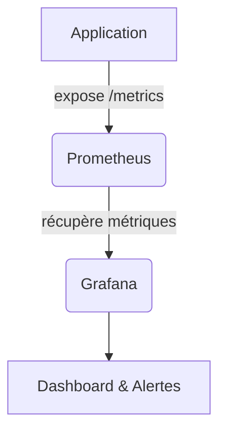
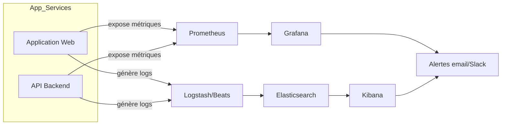

# Monitoring des applications cloud : métriques clés et outils (Prometheus, Grafana, ELK Stack)

## 1. Introduction

Le monitoring est une composante essentielle des opérations DevOps, garantissant la santé, la performance et la fiabilité des systèmes déployés en production. Il repose sur la collecte et l’analyse de métriques critiques, ainsi que d’outils adaptés pour visualiser, alerter et diagnostiquer.

Cet article présente les principales métriques à suivre, puis détaille les solutions open-source Prometheus, Grafana et ELK Stack dans leur rôle respectif.

---

## 2. Métriques clés à monitorer

### 2.1 Connexions

- Nombre de connexions actives (WebSocket, TCP, HTTP sessions).
- Taux d’ouverture/fermeture de connexions.
- Connexions refusées ou échouées.

### 2.2 Latence

- Temps de réponse moyen, médian, percentiles (p90, p99).
- Latence des requêtes entrantes.
- Latence au démarrage des composants et des services.

### 2.3 Erreurs

- Taux d’erreur par type (500, 404, timeout...).
- Erreurs applicatives et exceptions.
- Pannes ou indisponibilités (health checks).

---

## 3. Prometheus : collecte et stockage de métriques

### 3.1 Description

Prometheus est un système de monitoring et une base de données open source orientée séries temporelles. Il permet la collecte par **pull** de métriques exposées par les applications (via HTTP).

### 3.2 Exemple d’instrumentation simple en Node.js

```javascript
const client = require('prom-client');
const express = require('express');
const app = express();

const collectDefaultMetrics = client.collectDefaultMetrics;
collectDefaultMetrics();

const httpRequestDurationMicroseconds = new client.Histogram({
  name: 'http_request_duration_ms',
  help: 'Duration of HTTP requests in ms',
  labelNames: ['method', 'route', 'code'],
  buckets: [50, 100, 300, 500, 1000, 3000],
});

app.use((req, res, next) => {
  const end = httpRequestDurationMicroseconds.startTimer();
  res.on('finish', () => {
    end({ method: req.method, route: req.path, code: res.statusCode });
  });
  next();
});

app.get('/metrics', (req, res) => {
  res.set('Content-Type', client.register.contentType);
  res.end(client.register.metrics());
});

app.listen(3000);
```

---

## 4. Grafana : visualisation et alerting

Grafana est une plateforme open source permettant de créer des tableaux de bord interactifs exploitant les données issues de Prometheus et autres bases.

### 4.1 Fonctionnalités

- Visualisation en temps réel (graphes, jauges, heatmaps).
- Configuration d’alertes envoyées par e-mail, Slack, etc.
- Multiples sources de données (Prometheus, Elasticsearch, Graphite...).

### 4.2 Exemple d’architecture



---

## 5. ELK Stack : logs et analyses

ELK (Elasticsearch, Logstash, Kibana) est une suite orientée collecte, indexation et exploration des logs et traces.

### 5.1 Composants

- **Elasticsearch** : base de données NoSQL pour stocker et rechercher les logs.
- **Logstash** (ou Beats) : collecte et transformation des données de logs.
- **Kibana** : interface pour requêter, visualiser et créer des alertes sur les logs.

### 5.2 Usage

- Corrélation des logs avec les métriques pour diagnostiquer.
- Analyse des erreurs, journaux d’accès, traces de requêtes.
- Investigation des incidents.

---

## 6. Bonnes pratiques de monitoring combiné

- **Coupler métriques et logs** pour une vue complète de la santé de l’application.
- **Automatiser les alertes** sur seuils critiques pour intervention rapide.
- **Surveiller les ressources systèmes** (CPU, RAM, disque) en plus des métriques applicatives.
- **Mettre en place une politique de rétention** des données pour stockage optimisé.

---

## 7. Diagramme Mermaid illustrant un circuit complet de monitoring



---

## 8. Sources et ressources

- Prometheus Documentation : [https://prometheus.io/docs/introduction/overview/](https://prometheus.io/docs/introduction/overview/)  
- Grafana Documentation : [https://grafana.com/docs/grafana/latest/](https://grafana.com/docs/grafana/latest/)  
- ELK Stack Guide : [https://www.elastic.co/what-is/elk-stack](https://www.elastic.co/what-is/elk-stack)  
- Article sur monitoring combiné métriques & logs : [https://www.datadoghq.com/blog/metrics-vs-logs-vs-traces/](https://www.datadoghq.com/blog/metrics-vs-logs-vs-traces/)  

---

Un monitoring efficace repose sur la collecte ciblée de métriques clés, combinée à la gestion des logs, pour assurer visibilité et réactivité. Prometheus et Grafana forment un duo performant autour des données temps réel, tandis que l’ELK Stack optimise l’analyse des logs détaillés.