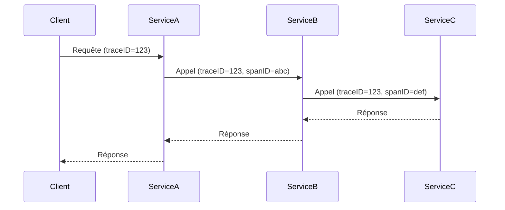

# Gestion des logs et traçabilité des événements en temps réel

## 1. Introduction

La gestion des logs et la traçabilité des événements sont des piliers fondamentaux pour la supervision, le diagnostic, et la maintenance des applications modernes, en particulier celles fonctionnant en temps réel. Elles permettent de comprendre le comportement des systèmes, d’identifier rapidement les anomalies et de reconstituer le fil des actions.

Cet article présente les concepts clés, les outils et bonnes pratiques pour collecter, analyser et exploiter efficacement les logs et événements en temps réel.

---

## 2. Concepts clés

- **Logs** : enregistrements séquentiels des activités ou événements produits par des logiciels ou systèmes. Ils contiennent des informations brutes (ex : erreurs, accès, actions utilisateurs).
- **Traçabilité (tracing)** : suivi des flux d’exécution des requêtes ou transactions au travers des différents composants d’un système.
- **Événements en temps réel** : remontée immédiate des logs/traces pour une analyse et réaction rapide.

---

## 3. Architecture courante de gestion des logs en temps réel

1. **Collection** des logs auprès des applications, serveurs, conteneurs (ex : via agents Beats, Fluentd).
2. **Centralisation** dans un système de stockage performant et indexé (ex : Elasticsearch).
3. **Analyse et visualisation** via des interfaces spécialisées (ex : Kibana).
4. **Alerting** automatisé sur patterns d’erreurs ou seuils.

### Exemple simplifié d’architecture

```mermaid
graph TD
  A[Applications & serveurs] --> B[Agents (Fluentd, Beats)]
  B --> C[Elasticsearch]
  C --> D[Kibana dashboards]
  C --> E[Alerting (Email, Slack)]
```

---

## 4. Outils populaires pour la gestion des logs et traçabilité

### 4.1 ELK Stack (Elasticsearch, Logstash, Kibana)

- **Logstash** : collecte, filtre, transforme et achemine les logs.
- **Elasticsearch** : moteur de recherche et d’analyse des données.
- **Kibana** : interface de visualisation et exploration.

### 4.2 Beats

Agents légers installés sur les sources de données, transmettent les logs à Logstash ou Elasticsearch.

### 4.3 Jaeger / OpenTelemetry

Solutions open source pour la traçabilité distribuée, basées sur la collecte systématique des spans représentant les opérations d’une requête dans un système microservices.

---

## 5. Exemples concrets

### 5.1 Configuration simple Filebeat (Beats) pour collecter logs Apache

```yaml
filebeat.inputs:
- type: log
  paths:
    - /var/log/apache2/access.log
output.elasticsearch:
  hosts: ["http://localhost:9200"]
```

### 5.2 Exemple de visualization simple avec Kibana

- Visualiser le nombre de requêtes par minute.
- Création d’alertes sur les erreurs 5xx.

---

## 6. Traçabilité distribuée en microservices

### 6.1 Principe

Chaque service injecte un *trace ID* et un *span ID* dans le contexte de la requête. Cela permet d’assembler la séquence des appels inter-services.

### 6.2 Illustration Mermaid du flow de trace



---

## 7. Bonnes pratiques

- **Centraliser les logs** pour éviter la dispersion.
- Utiliser un **format structuré (JSON)** pour faciliter l’analyse automatisée.
- Mettre en place des **niveau de logs (info, warn, error)** adaptés.
- S’assurer de la **sécurité et confidentialité** des logs (données sensibles, agrément RGPD...).
- Configurer l’**alerting en temps réel** sur dysfonctionnements critiques.
- Coupler logging et tracing pour une **analyse profonde** des causes racines.

---

## 8. Sources et documentation officielle

- Elastic Stack (ELK) Documentation : [https://www.elastic.co/guide/index.html](https://www.elastic.co/guide/index.html)  
- OpenTelemetry : [https://opentelemetry.io/](https://opentelemetry.io/)  
- Jaeger Tracing : [https://www.jaegertracing.io/docs/](https://www.jaegertracing.io/docs/)  
- Guide pratique Filebeat : [https://www.elastic.co/guide/en/beats/filebeat/current/filebeat-overview.html](https://www.elastic.co/guide/en/beats/filebeat/current/filebeat-overview.html)  

---

Le traitement intelligent des logs et la traçabilité des événements en temps réel apportent une visibilité indispensable pour maintenir des systèmes fiables et réactifs, tout en facilitant la recherche et la résolution des incidents.