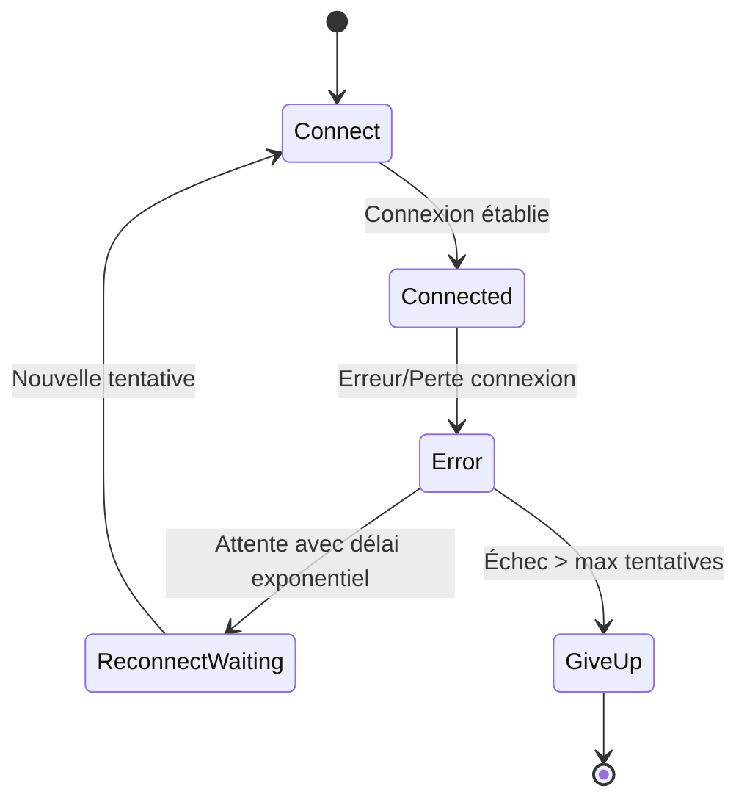

# Gestion des erreurs et des reconnexions côté client et serveur

## 1. Introduction

Dans les architectures applicatives modernes, garantir la robustesse d’une connexion réseau entre client et serveur est primordial, notamment en contexte temps réel ou microservices. Les erreurs peuvent survenir pour diverses raisons (pertes réseau, surcharge serveur, bugs), d’où l’importance d’implémenter une gestion efficace des erreurs et des stratégies de reconnexion.

Cet article détaille les pratiques recommandées pour gérer ces problématiques de manière fiable tant côté client que serveur.

---

## 2. Principes de gestion d’erreurs

### 2.1 Types d’erreurs courants

- Erreurs réseau (timeout, perte de paquets).
- Erreurs serveur (5xx, surcharge).
- Erreurs applicatives (mauvaise requête, données invalides).
- Erreurs de protocole (ex : déconnexions brutales WebSocket).

### 2.2 Approche côté client

- Surveiller constamment l'état de la connexion.
- Traiter les erreurs de manière granulaire (ex: différencier échec de connexion initiale et perte post-connexion).
- Implémenter des délais progressifs avant de tenter une reconnexion (exponential backoff).
- Limiter le nombre de tentatives pour éviter la surcharge réseau ou serveur.
- Notifier l’utilisateur de la perte de connexion et de la tentative de récupération.

### 2.3 Approche côté serveur

- Valider toutes les requêtes reçues et encapsuler les erreurs dans des réponses explicites.
- Gérer les erreurs asynchrones et ne pas laisser le serveur planter à cause d’une exception non interceptée.
- Maintenir le contexte client autant que possible (ex: sessions, authentification persistante).
- Implémenter des mécanismes pour détecter la déconnexion client afin de libérer des ressources.

---

## 3. Techniques avancées de reconnexion

### 3.1 Exponential Backoff

Augmentation progressive du délai entre les tentatives de reconnexion, souvent combiné avec un facteur aléatoire pour éviter l’effet “syncro de foule” (thundering herd).

```javascript
function reconnect(attempt) {
  const delay = Math.min(60000, 1000 * Math.pow(2, attempt)); // max 60s
  const jitter = delay * 0.5 * Math.random(); // ±50%
  setTimeout(() => {
    // tentative reconnexion
    connectWebSocket();
  }, delay + jitter);
}
```

### 3.2 Circuit Breaker

Technique serveur/client qui coupe temporairement les tentatives de connexion en cas de surcharge ou d’échec répété, avant de réessayer.

---

## 4. Exemple complet : gestion WebSocket côté client

```javascript
class ReconnectingWebSocket {
  constructor(url) {
    this.url = url;
    this.attempt = 0;
    this.connect();
  }

  connect() {
    this.ws = new WebSocket(this.url);

    this.ws.onopen = () => {
      console.log('Connecté');
      this.attempt = 0; // reset tentatives
    };

    this.ws.onmessage = (event) => {
      console.log('Message reçu:', event.data);
    };

    this.ws.onerror = (error) => {
      console.error('Erreur WebSocket', error);
    };

    this.ws.onclose = () => {
      console.log('Connexion perdue. Tentative de reconnexion...');
      this.reconnect();
    };
  }

  reconnect() {
    this.attempt++;
    const delay = Math.min(60000, 1000 * Math.pow(2, this.attempt));
    const jitter = delay * 0.5 * Math.random();
    setTimeout(() => this.connect(), delay + jitter);
  }

  send(data) {
    if(this.ws.readyState === WebSocket.OPEN) {
      this.ws.send(data);
    } else {
      console.warn('Connexion fermée, message non envoyé');
    }
  }
}

const socket = new ReconnectingWebSocket('wss://example.com/ws');
```

---

## 5. Diagramme Mermaid : flux de gestion d’erreur et reconnexion côté client



---

## 6. Bonnes pratiques complémentaires

- **Logging exhaustif** côté client et serveur pour diagnostic.
- **Surveillance temps réel** pour détecter pics d’erreur.
- Utilisation de **protocoles robustes** (avec ACK, heartbeats).
- Prévoir un mécanisme de **synchronisation/ressources résiliantes** pour ne pas perdre les messages importants lors d’une reconnexion.

---

## 7. Sources et références

- MDN Web Docs - WebSocket API : https://developer.mozilla.org/en-US/docs/Web/API/WebSocket  
- Article sur Exponential Backoff : https://aws.amazon.com/blogs/architecture/exponential-backoff-and-jitter/  
- Netflix Tech Blog - Hystrix (Circuit Breaker) : https://netflix.github.io/Hystrix/  
- Guide sur gestion WebSocket reconnexion : https://ably.com/concepts/reconnection  

---

Adapter la gestion d’erreurs et de reconnexions selon le contexte technique, la criticité de l’application et l’expérience utilisateur garantit des systèmes plus résilients capables de supporter les interruptions sans dégrader le service ou perdre les données.