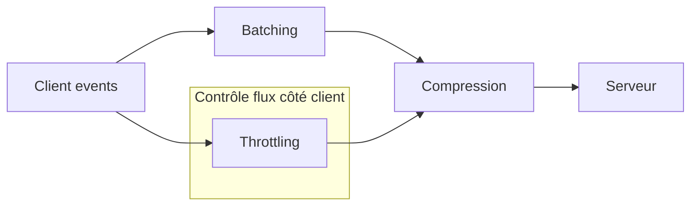

# Optimisation des performances : compression, batching et throttling

## 1. Introduction

L’optimisation des performances joue un rôle clé dans la conception d’applications réactives et scalables. Trois techniques simples mais puissantes sont fréquemment utilisées : la **compression** des données, le **batching** des requêtes et le **throttling** du flux d’événements. Ces approches permettent de réduire la latence, diminuer la charge réseau et maîtriser l'utilisation des ressources.

Cet article expose ces trois méthodes avec des exemples concrets et bonnes pratiques.

---

## 2. Compression des données

### 2.1 Principe

La compression réduit la taille des données échangées entre client et serveur, accélérant ainsi les transferts et économisant la bande passante.

### 2.2 Protocoles et formats répandus

- **HTTP Compression** : gzip, Brotli (avec support HTTP/2).
- **Compression WebSocket** : permessage-deflate extension.
- **Formats compressés** : JSON compressé (ex : MessagePack), Protobuf.

### 2.3 Exemple d’activation de compression gzip dans un serveur Node.js avec Express

```javascript
const express = require('express');
const compression = require('compression');
const app = express();

app.use(compression());

app.get('/data', (req, res) => {
  res.json({ message: "Données compressées avec gzip" });
});

app.listen(3000);
```

---

## 3. Batching (regroupement de traitements ou requêtes)

### 3.1 Principe

Le batching consiste à accumuler plusieurs opérations ou messages avant de les traiter ou les transmettre ensemble, réduisant le nombre d’appels réseau et le overhead associé.

### 3.2 Cas d’usage

- Regroupement des requêtes API ou commandes.
- Regroupement d’événements en temps réel (ex : événements utilisateur).

### 3.3 Exemple simple de batching côté client

```javascript
// Accumuler les messages et les envoyer toutes les 200ms
let batch = [];
setInterval(() => {
  if(batch.length > 0) {
    sendBatch(batch);
    batch = [];
  }
}, 200);

function addToBatch(message) {
  batch.push(message);
}

function sendBatch(messages) {
  fetch('/api/batch', {
    method: 'POST',
    body: JSON.stringify(messages),
    headers: { 'Content-Type': 'application/json' }
  });
}
```

---

## 4. Throttling (limitation du débit)

### 4.1 Principe

Le throttling limite volontairement la fréquence d’exécution d’une fonction ou l’envoi de messages pour éviter surcharge serveur ou goulots d’étranglement.

### 4.2 Différence avec debounce

- **Throttle** : permet l’exécution régulière avec intervalle défini.
- **Debounce** : exécute uniquement après une période d’inactivité.

### 4.3 Exemple JavaScript de throttling

```javascript
function throttle(fn, limit) {
  let lastCall = 0;
  return function(...args) {
    const now = Date.now();
    if (now - lastCall >= limit) {
      lastCall = now;
      fn.apply(this, args);
    }
  };
}

// Usage : limite les appels à une fois par seconde
window.addEventListener('resize', throttle(() => {
  console.log('Redimensionnement traité');
}, 1000));
```

---

## 5. Diagramme Mermaid : synthèse des optimisations côté communication



---

## 6. Bonnes pratiques associées

- Toujours tester l’impact de la compression sur la latence : la compression améliore les temps transfert mais consomme CPU.
- Adapter la taille du batch pour éviter latences excessives ou surcharge serveur.
- Employer le throttling pour les événements à haute fréquence comme le scroll, redimensionnements, ou frappes clavier.
- Combiner batching et compression pour un gain maximal.
- Surveiller via monitoring l’efficacité des optimisations (latence, débit, erreurs).

---

## 7. Sources et documentation

- MDN Web Docs - Compression HTTP : https://developer.mozilla.org/en-US/docs/Web/HTTP/Compression  
- Blog Mozilla - comprendre throttle, debounce : https://developer.mozilla.org/en-US/docs/Web/API/Document/scroll_event#debouncing_and_throttling  
- Node.js compression middleware : https://www.npmjs.com/package/compression  
- Article sur batching dans GraphQL : https://graphql.org/blog/batching/  

---

L’intégration combinée de la compression, du batching et du throttling optimise significativement la performance globale des systèmes distribués, réduisant les coûts réseaux et améliorant l’expérience utilisateur finale.