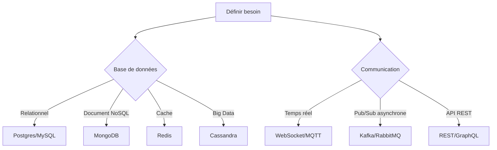

# Recommandations pour le choix des technologies en fonction des besoins

## 1. Introduction

Le choix des technologies dans un projet informatique conditionne directement sa réussite, sa scalabilité, sa maintenabilité et sa performance. Identifier les besoins métier, les contraintes techniques et les caractéristiques de chaque technologie permet de prendre des décisions éclairées.

Cet article présente des critères clés, des recommandations et des exemples pour guider le choix technologique adapté à différents cas d’usage.

---

## 2. Identifier les besoins métier et techniques

Avant toute sélection technologique, il est impératif de clarifier :

- La nature des données (structurées, semi-structurées, volumineuses).
- Les contraintes de latence et de débit.
- Le modèle d’architecture (monolithe, microservices, serverless).
- La nécessité de temps réel ou quasi temps réel.
- Le niveau de tolérance aux pannes.
- Le volume attendu d’utilisateurs.
- Les compétences disponibles dans l'équipe.

---

## 3. Choix liés aux bases de données

| Besoins                       | Technologie recommandée             | Exemple de cas                             |
|------------------------------|-----------------------------------|-------------------------------------------|
| Données relationnelles, ACID | Bases relationnelles SQL           | Postgres, MySQL pour gestion financière  |
| Données semi-structurées      | Bases NoSQL Document               | MongoDB pour données JSON flexibles       |
| Données clé/valeur rapide     | Bases NoSQL Key-Value             | Redis pour cache, sessions, files d'attente |
| Grande volumétrie, scalabilité horizontale | Bases orientées colonnes      | Cassandra pour très gros volumes           |

---

## 4. Communication et interopérabilité

| Besoins                        | Technologie recommandée              | Exemple                                   |
|-------------------------------|------------------------------------|-------------------------------------------|
| API Web simples, REST          | HTTP REST + JSON                   | API publique, intégration mobile           |
| APIs performantes, flexibles   | GraphQL                          | Interfaces clients dynamiques              |
| Pub/Sub asynchrone             | Kafka, RabbitMQ                    | Event sourcing, microservices découplés   |
| Communication temps réel       | WebSocket, MQTT                    | Applications chat, IoT                      |

---

## 5. Traitement des données en temps réel vs batch

| Besoins                       | Technologie recommandée             | Exemple                  |
|------------------------------|-----------------------------------|--------------------------|
| Traitement en temps réel      | Apache Flink, Apache Kafka Streams | Monitoring, alerting      |
| Traitement batch             | Apache Spark, Hadoop               | Analyse Big Data journalière   |

---

## 6. Exemple décisionnel simple

---

## 7. Bonnes pratiques

- Ne pas surdimensionner la pile technologique dès le démarrage.
- Privilégier les technologies stables et bien documentées avec une large communauté.
- Considérer les coûts d’exploitation (licences, infrastructure, support).
- Prévoir la montée en charge et faciliter la scalabilité.
- Documenter le choix technologique et ses critères pour faciliter la maintenance.

---

## 8. Sources et ressources

- State of Developer Ecosystem 2023 (JetBrains) – https://www.jetbrains.com/lp/devecosystem-2023/  
- Guide Tech Radar ThoughtWorks – https://www.thoughtworks.com/radar  
- MongoDB Use Cases – https://www.mongodb.com/use-cases  
- Apache Kafka Documentation – https://kafka.apache.org/documentation/  

---

Le choix technologique n’est pas une fin en soi, mais un moyen d’atteindre efficacement les objectifs métier et techniques. Une analyse pragmatique et contextualisée optimise les chances de succès d’un projet.