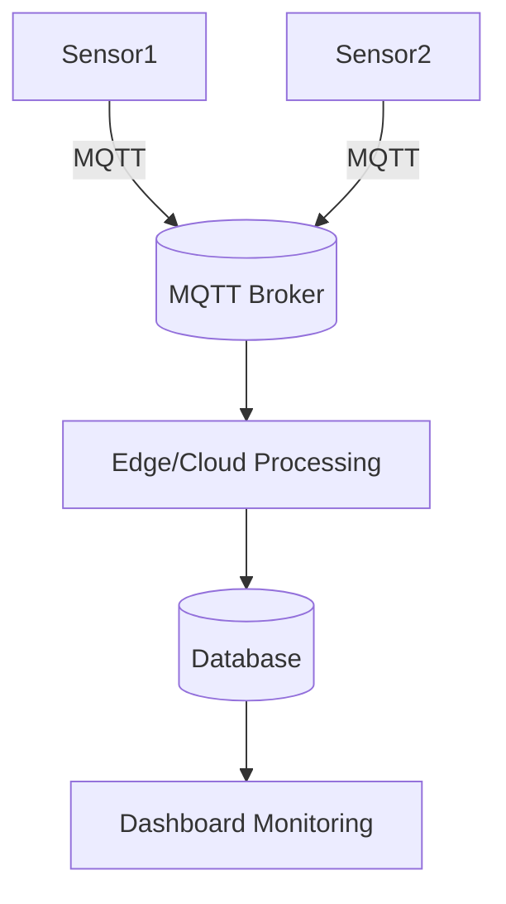
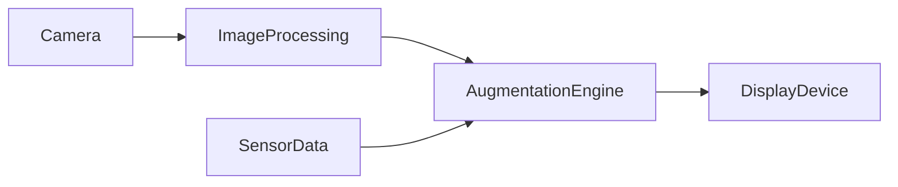

# Cas d’usage avancés : IoT, streaming vidéo et réalité augmentée en temps réel

## 1. Introduction

Les applications en temps réel dans les domaines de l’IoT, du streaming vidéo et de la réalité augmentée (RA) imposent des exigences techniques fortes en termes de latence, scalabilité, et résilience. Comprendre les spécificités de chaque cas d’usage et les solutions techniques adaptées permet d’optimiser conception et performance.

Ce guide synthétise les contraintes et bonnes pratiques associées à ces trois domaines.

---

## 2. Internet des Objets (IoT) : collecte et traitement en temps réel

### 2.1 Spécificités

- Nombre massif d’appareils connectés générant des flux continus de données.
- Contraintes de bande passante, puissance et autonomie.
- Besoin d’architectures distribuées et capables de traiter les données en périphérie (edge computing).

### 2.2 Technologies et protocoles

- **MQTT** : protocole léger pub/sub adapté aux objets peu puissants.
- **CoAP** : protocole RESTful pour IoT avec faible overhead.
- Plateformes cloud comme AWS IoT, Azure IoT Hub pour gestion et traitement.

### 2.3 Exemple d’architecture IoT basique



---

## 3. Streaming vidéo en temps réel

### 3.1 Spécificités

- Transmission continue de flux volumineux avec faible latence.
- Adaptation dynamique à la bande passante (ex : ABR – Adaptive Bit Rate).
- Synchronisation entre producteurs et nombreux consommateurs.

### 3.2 Protocoles/Démarches courants

- Protocoles : **RTMP**, **HLS**, **DASH**, **WebRTC** (pour faible latence).
- Utilisation de réseaux CDN pour la distribution.
- Traitement par serveurs spécialisés (ex : Wowza, Nginx RTMP).

### 3.3 Exemple simplifié du flux WebRTC

```mermaid
sequenceDiagram
  participant ClientA
  participant SignalingServer
  participant ClientB

  ClientA->>SignalingServer: Offre SDP
  SignalingServer->>ClientB: Offre SDP
  ClientB->>SignalingServer: Réponse SDP
  SignalingServer->>ClientA: Réponse SDP
  ClientA<->>ClientB: Streaming en P2P
```

---

## 4. Réalité augmentée (RA) en temps réel

### 4.1 Spécificités

- Calculs intensifs pour superposition d’éléments virtuels sur vidéo live.
- Besoin d’une latence ultra faible pour une expérience fluide.
- Intégration de capteurs, caméras, GPS pour contexte en temps réel.

### 4.2 Technologies

- SDKs : ARKit (iOS), ARCore (Android).
- Moteurs graphiques : Unity3D, Unreal Engine.
- Utilisation d’Edge Computing pour réduire la latence des calculs.

### 4.3 Exemple de workflow RA



---

## 5. Recommandations générales

- **Optimiser la gestion de la latence** via protocoles adaptés et edge computing.
- **Assurer la scalabilité** par architectures cloud/hybrides pour absorber pics de charge.
- **Garantir la résilience** avec monitoring, retry et gestion proactive des erreurs.
- **Utiliser les standards ouverts** pour interopérabilité.
- **Penser à la sécurité** : authentification forte, chiffrement des flux.

---

## 6. Sources et références

- MQTT Protocol Overview : https://mqtt.org/  
- WebRTC Primer - HTML5 Rocks : https://webrtc.org/getting-started/overview  
- Apple ARKit Developer Guide : https://developer.apple.com/augmented-reality/arkit/  
- Google ARCore Documentation : https://developers.google.com/ar  
- Wowza Streaming Engine Documentation : https://www.wowza.com/docs  

---

La convergence des technologies temps réel dans ces domaines impose un équilibre subtil entre performances, scalabilité et expérience utilisateur. Choisir des protocoles adaptés et concevoir une architecture cohérente reste au cœur de la réussite de ces cas d’usage avancés.