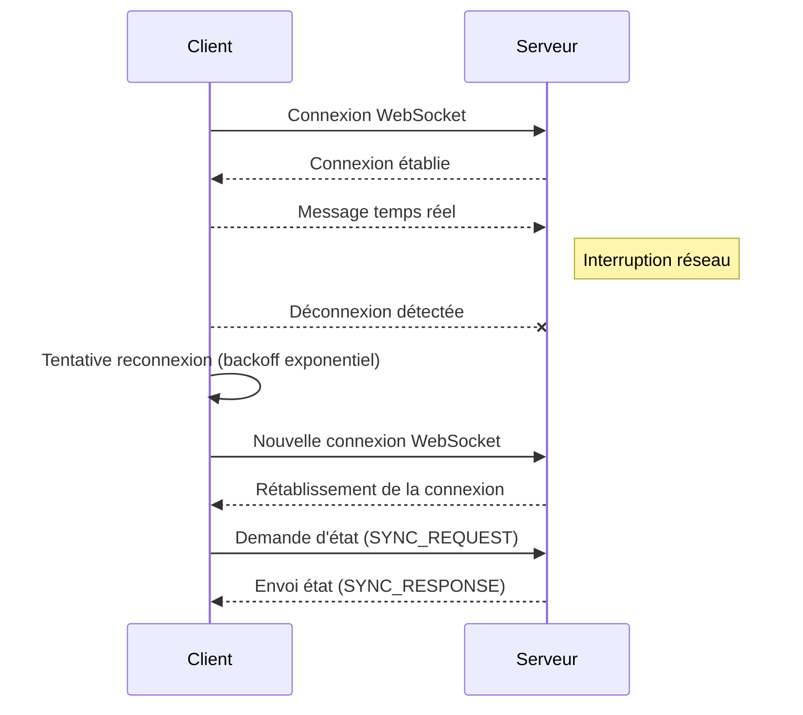

# Test de résilience d'une application temps réel face aux déconnexions et reconnexions simulées

## 1. Introduction

Les applications temps réel, notamment celles basées sur WebSocket ou WebRTC, doivent gérer efficacement les déconnexions intempestives et les reconnexions pour garantir une expérience utilisateur fluide. Tester ces scénarios est indispensable pour valider la robustesse et la résilience de l’application face aux aléas réseau fréquents.

Cet article détaille les méthodes et bonnes pratiques pour simuler ces conditions, mesurer la résilience et améliorer la gestion des connexions.

---

## 2. Concepts clés de résilience dans les applications temps réel

- **Déconnexion / reconnexion** : interruption temporaire des connexions réseau dues à des problèmes passagers ou mouvements des utilisateurs.
- **Réinitialisation d’état** : l’application doit pouvoir restaurer ou synchroniser l’état après reconnexion.
- **Gestion des files d’attente** : bufferiser ou rejouer les événements manqués pendant la coupure.
- **Backoff exponentiel** : éviter de surcharger le serveur en cas de reconnexions répétées immédiates.

---

## 3. Simulation des déconnexions/reconnexions

### 3.1 Mise en place manuelle

- **Déconnecter et reconnecter le client** via :
  - Déconnexion réseau (mode avion).
  - Outils de développement réseau (DevTools Chrome : désactivation du réseau).
  - Forcer la fermeture/réouverture de la connexion WebSocket via console.

### 3.2 Automatisation par script

Exemple de client WebSocket JavaScript simulant une reconnexion avec backoff exponentiel :

```javascript
const url = "wss://example.com/socket";
let socket;
let attempts = 0;

function connect() {
  socket = new WebSocket(url);

  socket.onopen = () => {
    console.log("Connecté");
    attempts = 0; // reset
  };

  socket.onclose = () => {
    attempts++;
    let delay = Math.min(1000 * 2 ** attempts, 30000);
    console.log(`Déconnecté, reconnexion dans ${delay}ms`);
    setTimeout(connect, delay);
  };

  socket.onerror = (err) => {
    console.error("Erreur WebSocket", err);
    socket.close();
  };

  socket.onmessage = (msg) => {
    // traitement message
  };
}

connect();
```

---

## 4. Test de synchronisation d’état après reconnexion

Pour une application collaborative, il est recommandé de recharger l’état auprès du serveur au moment de la reconnexion.

### Exemple simple :

```javascript
socket.onopen = () => {
  // Demander l'état actuel
  socket.send(JSON.stringify({ type: 'SYNC_REQUEST' }));
};

socket.onmessage = (msg) => {
  let data = JSON.parse(msg.data);
  if(data.type === 'SYNC_RESPONSE') {
    restoreState(data.state);
  }
};
```

---

## 5. Monitoring des événements de connexion/déconnexion

Intégrer des logs spécifiques sur événements WebSocket facilite le diagnostic :

```javascript
socket.onopen = () => {
  logger.info("WebSocket connecté");
};

socket.onclose = (event) => {
  logger.warn(`WebSocket déconnecté, code=${event.code}, raison=${event.reason}`);
};
```

---

## 6. Diagramme Mermaid : gestion des reconnexions WebSocket



---

## 7. Bonnes pratiques

- Implanter un mécanisme de reconnexion automatique avec backoff exponentiel.
- Prévoir la synchronisation d’état après reconnexion pour éviter incohérences.
- Logger clairement chaque événement de connexion/déconnexion.
- Tester régulièrement en condition réelle (tests manuels et automatisés).
- Surveiller les métriques réseau afin d’anticiper problèmes récurrents.

---

## 8. Sources et références

- MDN WebSocket API : https://developer.mozilla.org/en-US/docs/Web/API/WebSocket  
- Article "Robust WebSocket Connections" (Smashing Magazine) : https://www.smashingmagazine.com/2020/06/robust-websockets-connection/  
- Exemples backoff exponentiel : https://www.npmjs.com/package/retry  
- Best Practices for Real-Time Applications (Auth0) : https://auth0.com/blog/best-practices-for-real-time-web-applications/

---

Tester et renforcer la résistance aux interruptions réseau garantit que les applications temps réel restent fiables et fluides, offrant un service stable malgré la variabilité des conditions de connexion des utilisateurs.