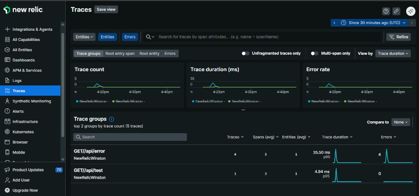

#  **Correction détaillée — TP New Relic & Winston**

## 1. Mise en place de l’application Express

### Code attendu `index.js`

```js
require('newrelic');                 // ⚠️ Toujours en premier
const express = require('express');
const logger = require('./logger');

const app = express();

app.get('/ping', (req, res) => {
  logger.info('Ping received', { route: '/ping' });
  res.json({ message: 'pong' });
});

app.listen(3000, () => logger.info('Server running on port 3000'));
```

✅ Serveur fonctionnel sur [http://localhost:3000/ping](http://localhost:3000/ping)
✅ Winston loggue dans la console et dans `app.log`.

---

## 2. Configuration New Relic

Le fichier `newrelic.js` doit avoir :

```js
app_name: ['tp-realtime-demo'],
license_key: 'VOTRE_CLE'
```

### Erreurs fréquentes

| Symptôme                     | Cause                                                |
| ---------------------------- | ---------------------------------------------------- |
| l’agent ne remonte rien      | License key incorrecte                               |
| l’application n’apparaît pas | Pas assez de trafic                                  |
| erreurs silencieuses         | L’import `require('newrelic')` n’est pas **premier** |

✅ Le trafic simulé (`for i in {1..50}; do curl ...`) fait remonter des transactions dans la section **APM → Transactions**.

---

## 3. Winston — Fichier `logger.js`

```js
const { createLogger, format, transports } = require('winston');

module.exports = createLogger({
  level: 'info',
  format: format.combine(
    format.timestamp(),
    format.json()
  ),
  transports: [
    new transports.Console(),
    new transports.File({ filename: 'app.log' })
  ]
});
```

### Vérifications

Dans le terminal :

```
{"level":"info","message":"Ping received","route":"/ping","timestamp":"2025-11-05T12:21:14.402Z"}
```

Dans `app.log`, même contenu (persisté).

✅ Logs structurés, JSON, horodatage, clé/valeur.

---

## 4. Route lente `/slow`

```js
app.get('/slow', async (req, res) => {
  logger.warn('Slow endpoint triggered');
  await new Promise(resolve => setTimeout(resolve, 2000));
  res.json({ status: 'ok' });
});
```

### Comportement attendu

* Réponse en **~2000ms**
* Winston produit un log WARN
* New Relic indique :

  * Avg response time ↑
  * Spikes dans APM

✅ Dans New Relic, la page Transactions doit montrer `/slow` dans le top des lenteurs.

---

## 5. Route erreur `/error`

```js
app.get('/error', (req, res) => {
  logger.error('Unexpected error occurred');
  throw new Error('Boom!');
});
```

### Résultat attendu

Terminal :

```
Error: Boom!
    at ...
```

Dans New Relic → **Errors** :

* Une nouvelle classe d’erreur `Error`
* Stacktrace
* Route impactée `/error`

✅ Corrélation *erreur visible → temps APM affecté, logs présents*.

---

## 6. Corrélation logs / monitoring

Points attendus lors du débrief :

* Winston cadre le contexte (route, timestamp)
* New Relic donne la métrique globale
* Ensemble → diagnostic plus rapide

Exemple :

Comparaison :

| Winston                             | New Relic                               |
| ----------------------------------- | --------------------------------------- |
| Idéal pour le détail d’un événement | Idéal pour vue globale du service       |
| Contextualisé (route, metadata)     | Agrégé, statistiques, slopes, anomalies |


## Le code minimal :

```js
// index.js
require('newrelic');

const logger = require('./logger');
const express = require('express');
const app = express();

const PORT = process.env.PORT || 3000;

// Middleware pour logger chaque requête entrante
app.use((req, res, next) => {
  logger.info(`Requête entrante: ${req.method} ${req.url}`);
  next();
});

// route racine
app.get('/', (req, res) => {
  logger.info('Route / appelée');
  res.send('Bonjour depuis Express + Winston !');
});

// route JSON d'exemple
app.get('/api/hello', (req, res) => {
  logger.info('Route /api/hello appelée');
  res.json({ message: 'Hello API', time: new Date().toISOString() });
});

app.get('/api/test', (req, res) => {
  logger.info('Route /api/test appelée pour test New Relic');
  const newrelic = require('newrelic');

  newrelic.addCustomAttributes({
    routeTestTime: new Date().toISOString()
  });

  res.json({ msg: 'Route instrumentée !' });
});

app.get('/api/error', (req, res) => {
  logger.error('Erreur simulée !');
  throw new Error('Erreur de test New Relic !');
});


app.listen(PORT, () => {
  console.log(`Serveur démarré -> http://localhost:${PORT}`);
});

```

```js

// logger.js
const { createLogger, format, transports } = require('winston');

const logger = createLogger({
  level: 'info',
  format: format.combine(
    format.timestamp(),
    format.json() // format lisible par des outils / stockage
  ),
  transports: [
    // Affiche dans la console
    new transports.Console(),

    // Stocke dans un fichier (log applicatif)
    new transports.File({ filename: 'app.log' })
  ]
});

module.exports = logger;

```




# Compréhensions attendues

### Q1 — Pourquoi `require('newrelic')` en premier ?

> Pour permettre à l’agent d’instrumenter les modules Node.js avant leur chargement.


### Q2 — Pourquoi JSON pour les logs ?

Attendus :

* parseable par machines
* compatible Elastic / Loki / CLF
* facile à indexer


### Q3 — Limite du monitoring sans logs ?

Attendus :

* on voit un symptôme (latence) mais pas la cause
* pas de contexte métier
* pas de trace de paramètres


### Q4 — Scalabilité en production ?

Attendus :

* rotation de log
* export vers syslog / cloud
* observabilité distribuée
* corrélation traceId

# ✅ Critères de réussite

| Critère                            | OK si                        |
| ---------------------------------- | ---------------------------- |
| New Relic remonte des transactions | Dashboard actif après trafic |
| Logs JSON                          | Format structuré présent     |
| Latence mesurée                    | `/slow` identifié comme lent |
| Erreurs reportées                  | `/error` visible dans Errors |
